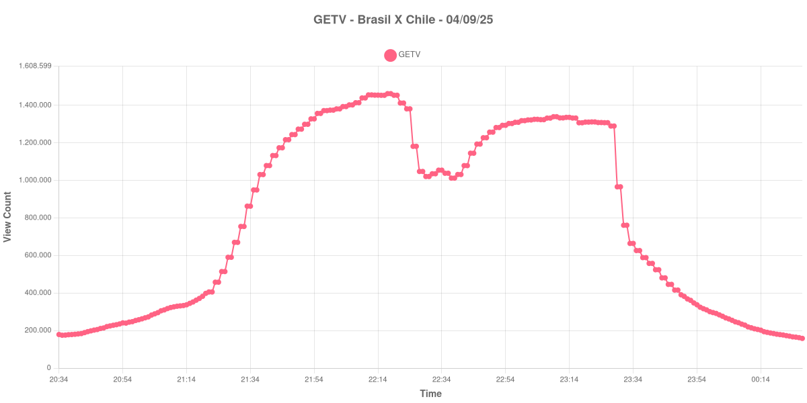
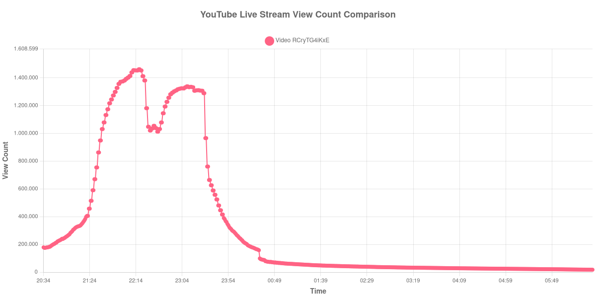

+++
date = '2025-09-07T09:46:03-04:00'
draft = false
title = 'Audiência da Estreia da GETV - Brasil X Chile (04-09-2025)'
author = 'Instituto Cambacica de Audiência'
summary = 'Veja como ficou a audiência na estreia da GETV em 04/09/2025.'
tags = ['YouTube', 'Analytics', 'GETV', 'Seleção Brasileira', 'Eliminatórias']
categories = ['Audiência']
+++

Neste texto, vamos informar os resultados da audiência em tempo real obtidos pela GETV, em sua noite de estreia, em que transmitiu o jogo Brasil X Chile, válido pela penúltima rodada das Eliminatórias para a Copa do Mundo de 2026.

A audiência começou a ser medida às 20h33 (Horário de Brasília), antes do início da partida. Os principais pontos da audiência são (em aparelhos conectados):
* **Início da Medição (20h33): 178.233**
* 20h45: 202.346
* 21h00: 262.474
* Início do Show da Ivete Sangalo (21h09): 322.634
* 21h15: 344.923
* Jogadores entram em campo (21h22): 405.609
* **Início do primeiro tempo (21h30): 669.983**
* Após o gol anulado do Casemiro (21h35): 949.214
* Após 15 minutos de primeiro tempo (21h45): 1.217.081
* Após 30 minutos de primeiro tempo (22h00): 1.374.622
* Após o primeiro gol do Brasil (22h08): 1.414.070
* Após 45 minutos de primeiro tempo (22h15): 1.453.656
* **Final do primeiro tempo (22h22): 1.412.392**
* Durante o primeiro comercial (22h25): 1.181.708
* Após o retorno do comercial (22h27): 1.047.826
* **Após o início do segundo tempo (22h40): 1.031.643**
* Após 15 minutos de segundo tempo (22h55): 1.303.332
* Após o segundo gol do Brasil (23h06): 1.323.856
* Após o terceiro gol do Brasil, aos 30 minutos (23h10): 1.339.459
* Após 45 minutos de segundo tempo (23h25): 1.307.649
* **Final da partida (23h28): 1.289.829**
* Um minuto depois do final da partida (23h29): 965.967
* Dez minutos depois do final da partida (23h38): 588.714
* Vinte minutos depois do final da partida (23h48): 415.609
* **Final da transmissão (00h26): 162.149**

No gráfico a seguir, mostramos a evolução da audiência entre o horário do início da medição e o final da live:

Neste gráfico podemos verificar que o pico de audiência ocorreu entre as 22h17 e as 22h18, com a audiência de 1.462.362 aparelhos conectados neste momento.

Como bônus, apresentamos o gráfico total da medição, que considerou até as 06h33 do dia seguinte. Ao final da live a GETV redirecionou aqueles usuários que tinham o autoplay ativado para a live do dia seguinte, que seria a transmissão da partida da NFL no Brasil, entre Kansas City Chiefs e o time do Los Angeles Charges. Durante a madurugada, foi registrado mais de 70 mil aparelhos "aguardando" o ínicio da transmissão, que seria por volta das 19h00 do dia 05.

Para você verificar os metadados desta medição, você pode consultar o [repositório contendo o CSV com os dados e com os prints do minuto a minuto da medição](https://github.com/institutocambacica/2025-09-05-Estreia-GETV).

---

*Para mais informações sobre nossa metodologia, visite nossa página [Sobre](/sobre).*
