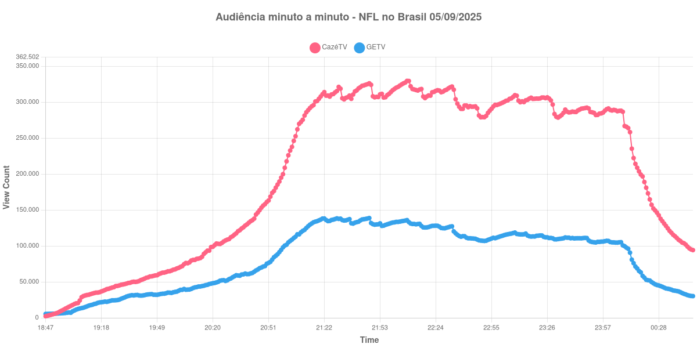
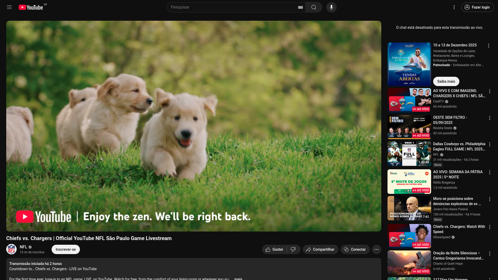

+++
date = '2025-09-07T09:46:43-04:00'
draft = false
title = 'Veja como foi a evolução da audiência da GETV e CazéTV no jogo da NFL no Brasil (05-09-2025)'
author = 'Instituto Cambacica de Audiência'
summary = 'Veja quem ganhou na audiência no minuto a minuto no primeiro embate entre GETV e CazéTV.'
tags = ['YouTube', 'Analytics', 'Audiência', 'GETV', 'CazéTV', 'NFL']
categories = ['Audiência']
+++

Neste texto, vamos informar os resultados da audiência em tempo real obtidos pelos canais GETV e CazéTV, durante a partida entre Los Angeles Chargers vs. Kansas City Chiefs, jogo realizado na Neo Química Arena válido pela Semana 1 da NFL em 05/09/2025.

A audiência começou a ser medida às 18h42 (Horário de Brasília), antes do início da partida. Segue o gráfico que mostra a evolução da audiência de aparelhos conectados no minuto a minuto entre o início da medição até as 00h47 do dia seguinte, quando a CazéTV encerrou a sua transmissão, antes da GETV.

Como pode ser visto, a GETV liderou por alguns minutos no ínicio da medição, mas a partir das 18h53, a CazéTV assumiu a liderança e abriu vantagem durante todo o restante do período da medição. Alguns destaques da medição:

* Pico de audiência da CazéTV: 22h08 com 329.547 aparelhos conectados simultâneos (durante o segundo quarto).
* Pico de audiência da GETV: 21h47 com 138.788 aparelhos conectados simultâneos (fim do primeiro quarto).
* Horário da maior vantagem da CazéTV: 22h34 com 197.095 aparelhos conectados simultâneos a mais do que o concorrente (317.342 X 120.247 - durante o intervalo)
* Audiência no encerramento da partida (00h12), CazéTV: 258.266, GETV: 90.659.
* Um minuto depois do encerramento, CazéTV: 235.271, GETV: 80.931.
* Dez minutos depois do encerramento, CazéTV: 1730.88, GETV: 52.293.

Algumas considerações devem ser tecidas com base neste resultado:
* Enquanto que a live da GETV possivelmente foi restrito ao território nacional, a live da CazéTV, por ter os direitos obtidos junto ao YouTube, detentor global dos direitos, pode transmitir para todos os países do mundo.
* Houve um favorecimento e promoção por parte da plataforma a respeito da live da CazéTV, por ser uma live oficial do Youtube. Uma pessoa que nunca acessou o Youtube via a propaganda para a live da CazéTV na primeira página, enquanto que a GETV estava escondido no feed. Além disso, TVs com AndroidTV tiveram propagandas do YouTube direcionando para a live da CazéTV.
* Contudo, é importante mencionar que mídia é hábito, e a CazéTV já havia transmitido a partida de São Paulo no ano passado e tem mais de 2 anos de experiência. Enquanto que a GETV estava na sua segunda transmissão ao vivo da sua história.

## NFL e Google não permitiram medição global da audiência

Infelizmente, ao contrário das lives brasileiras do jogo, as demais lives oficiais realizadas pelo Youtube - a qual repetimos, foi o detentor exclusivo dos direitos de transmissão da partida no restante do mundo, não tiveram a estatística de aparelhos conectados vísivel ao público. É uma pena, pois seria uma grande propaganda do lado do Youtube, que teve neste dia o seu primeiro grande evento esportivo transmitido no mundo inteiro exclusivo em sua plataforma. 

Além da CazéTV e do canal oficial da liga, o Youtube promoveu lives de react ao jogo com os criadores: Skabeche, Robegrill, Tom Grossi e Speed. Todos tiveram suas estatísticas de visualização ocultados ao público.

## Como acessar os metadados da medição para verificação

Os metadados para verificação podem ser acessados neste [link](https://github.com/institutocambacica/2025-09-05-NFL-no-Brasil-GETV-X-Caz-TV).

---

*Para mais informações sobre nossa metodologia, visite nossa página [Sobre](/sobre).*
