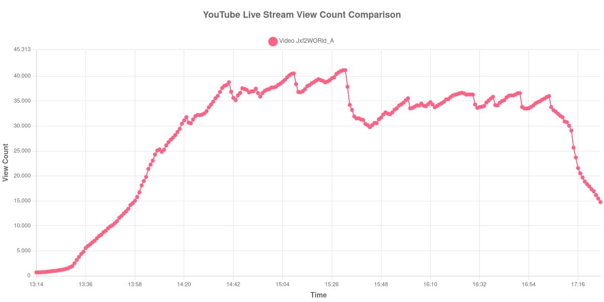

+++
date = '2025-09-08T09:16:43-04:00'
draft = false
title = 'Veja como foi a evolução da audiência da GETV na Semana 1 da NFL (07-09-2025)'
author = 'Instituto Cambacica de Audiência'
summary = 'Veja como ficou a audiência da partida entre Giants e Commanders no último domingo.'
tags = ['YouTube', 'Analytics', 'Audiência', 'GETV', 'NFL']
categories = ['Audiência']
+++

Neste texto, vamos informar os resultados da audiência em tempo real obtido pelo canal GETV durante a transmissão da partida dominical entre New York Giants e Washington Commanders válido na Semana 1 da NFL, disputado no dia 07/09/2025.

A audiência começou a ser medida às 13h09 (Horário de Brasília), antes do início da partida. Segue o gráfico que mostra a evolução da audiência de aparelhos conectados no minuto a minuto entre o início da medição até as 17h31, após o encerramento da transmissão.

Alguns destaques da medição:

* Audiência no início da partida (14h03): 19.815 aparelhos conectados.
* Pico de audiência: Às 15h31, com 41.193 aparelhos simultâneos (Próximo do encerramento do segundo quarto)
* Audiência no encerramento da partida (17h14): 25.668.
* Um minuto depois do encerramento: 23.693.
* Dez minutos depois do encerramento: 16.165.

## Como acessar os metadados da medição para verificação

Os metadados para verificação podem ser acessados neste [link](https://github.com/institutocambacica/2025-09-07-Audiencia-NFL-GETV-S1).

---

*Para mais informações sobre nossa metodologia, visite nossa página [Sobre](/sobre).*
