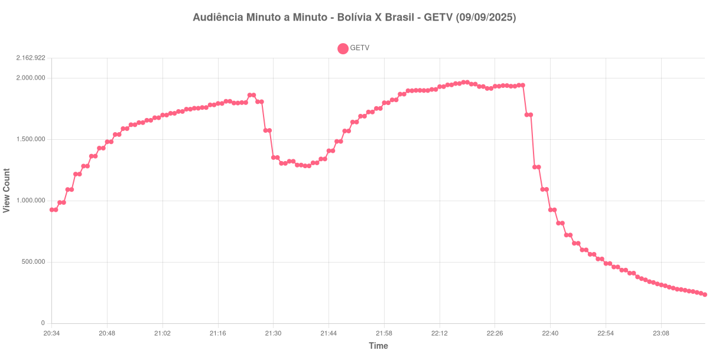

+++
date = '2025-09-10T08:46:03-04:00'
draft = false
title = 'Audiência da Transmissão da GETV - Bolívia X Brasil (09-09-2025)'
author = 'Instituto Cambacica de Audiência'
summary = 'Veja como ficou a audiência do jogo Bolívia 1 X O Brasil na GETV em 09/09/2025.'
tags = ['YouTube', 'Analytics', 'Audiência', 'GETV', 'Seleção Brasileira', 'Eliminatórias']
categories = ['Audiência']
+++

Neste texto, vamos informar os resultados da audiência em tempo real obtidos pela GETV, durante a transmissão do jogo Bolívia x Brasil, válido pela última rodada das Eliminatórias para a Copa do Mundo de 2026.

A audiência começou a ser medida às 20h33 (Horário de Brasília), momentos antes do início da partida. Os principais pontos da audiência são (em aparelhos conectados):

* **Início da Medição (20h33): 926.277**
* **Início do primeiro tempo (20h35): 926.277**
* Após 15 minutos de primeiro tempo (20h50): 1.540.370
* Após 30 minutos de primeiro tempo (21h05): 1.713.056
* Após 45 minutos de primeiro tempo (21h20): 1.797.094
* Após o Gol da Bolívia (21h24): 1.862.000
* **Final do primeiro tempo (21h26): 1.807.521**
* Durante o primeiro comercial (21h35): 1.321.719
* **Após o início do segundo tempo (21h43): 1.340.805**
* Após 15 minutos de segundo tempo (21h58): 1.799.255
* Após 30 minutos de segundo tempo (22h13): 1.930.776
* Após 45 minutos de segundo tempo (22h28): 1.939.398
* **Final da partida (22h33): 1.942.407**
* Um minuto depois do final da partida (22h34): 1.701.226
* Dez minutos depois do final da partida (22h43): 817.223
* Vinte minutos depois do final da partida (22h53): 524.924
* **Final da transmissão (23h19): 234.184**

O pico de audiência foi às 22h18, durante o segundo tempo, com 1.966.292 aparelhos simultâneos, constatando um crescimento da audiência em relação [a noite de estreia do canal](/posts/2025-09-04-estreia-getv).

No gráfico a seguir, mostramos a evolução da audiência entre o horário do início da medição e o final da live:

Para você verificar os metadados desta medição, você pode consultar o [repositório contendo o CSV com os dados e com os prints do minuto a minuto da medição](https://github.com/institutocambacica/2025-09-09_Brasil_X_Bolivia_GETV).

---

*Para mais informações sobre nossa metodologia, visite nossa página [Sobre](/sobre).*
