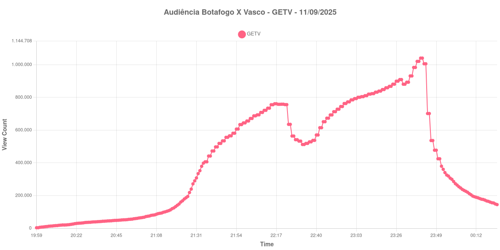

+++
date = '2025-09-12T08:46:03-04:00'
draft = false
title = 'Audiência da Transmissão da GETV - Botafogo X Vasco (11-09-2025)'
author = 'Instituto Cambacica de Audiência'
summary = 'Veja como ficou a audiência do jogo Botafogo X Vasco na GETV em 11/09/2025.'
tags = ['YouTube', 'Analytics', 'Audiência', 'GETV', 'Botafogo', 'Vasco', 'Copa do Brasil']
categories = ['Audiência']
+++

Neste texto, vamos informar os resultados da audiência em tempo real obtidos pela GETV, durante a transmissão do jogo Botafogo X Vasco, válido pela volta das quartas de final da Copa do Brasil, em 11/09/2025.

A audiência começou a ser medida às 19:59 (Horário de Brasília), no ínicio da live. Os principais pontos da audiência são (em aparelhos conectados):

* **Início da Medição (20h00): 3.834**
* Entrada dos Times (21h26): 195.049
* **Início do primeiro tempo (21h32): 334.577**
* Após 15 minutos de primeiro tempo (21h47): 534.699
* Gol do Vasco (21h53): 581.318
* Após 30 minutos de primeiro tempo (22h02): 671.639
* Gol do Botafogo (22h15): 755.690
* Após 45 minutos de primeiro tempo (22h17): 761.523
* **Após o início do segundo tempo (22h39): 537.758**
* Após 15 minutos de segundo tempo (22h54): 744.598
* Após 30 minutos de segundo tempo (23h09): 811.030
* Após 45 minutos de segundo tempo (23h24): 881.342
* **Final do tempo normal (23h28): 909.391**
* **Ínicio dos pênaltis (23h33): 893.302**
* **Fim dos pênaltis e do jogo (23h41): 1.040.643 - PICO DA AUDIÊNCIA NA PARTIDA**
* Um minuto depois do final da partida (23h42): 1.005.886
* Dez minutos depois do final da partida (23h51): 425.219
* Vinte minutos depois do final da partida (00h01): 264.338
* **Final da transmissão (00h24): 145.182**

No gráfico a seguir, mostramos a evolução da audiência entre o horário do início da medição e o final da live:

Para você verificar os metadados desta medição, você pode consultar o [repositório contendo o CSV com os dados e com os prints do minuto a minuto da medição](https://github.com/institutocambacica/2025-09-11_BotafogoXVasco_GETV).

---

*Para mais informações sobre nossa metodologia, visite nossa página [Sobre](/sobre).*
