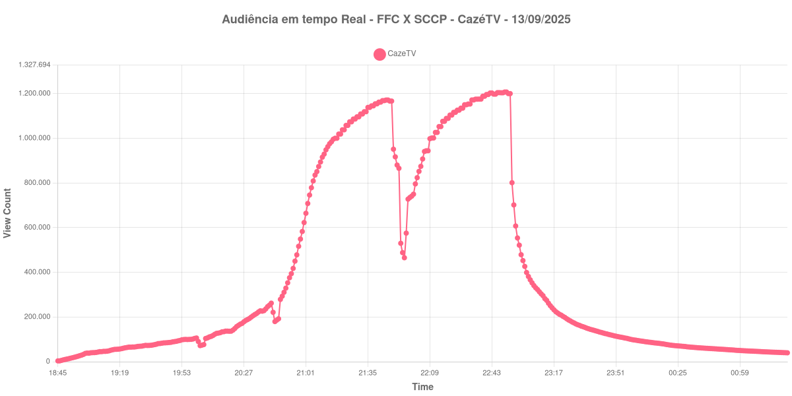

+++
date = 2025-09-15T11:08:43-03:00
draft = false
title = "Veja como foi a audiência da partida entre Fluminense X Corinthians na CazéTV - 13-09-2025"
author = 'Instituto Cambacica de Audiência'
summary = "Veja como foi a audiência na última partida do Brasileirão transmitida pela CazéTV"
tags = ['YouTube', 'Analytics', 'CazeTV', 'Fluminense', 'Corinthians', 'Brasileirão']
categories = ['Audiência']
+++

Neste texto, vamos informar os resultados da audiência em tempo real obtidos pela CazéTV, obtidos durante a transmissão do jogo Fluminense X Corinthians, válido pela Rodada 23 do Brasileirão, em 13/09/2025.

A audiência começou a ser medida às 13/09/2025 19:45:55 (Horário de Brasília), no início da live. Os principais pontos da audiência são (em aparelhos conectados):

* **Início da Medição (13/09/2025 19:45:55): 3.565**
* **Pico de audiência (13/09/2025 23:50:55): 1.206.994**
* **Final da Medição (14/09/2025 02:25:55): 39.733**

No gráfico a seguir, mostramos a evolução da audiência entre o horário do início da medição e o final da live:

Para você verificar os metadados desta medição, você pode consultar o [repositório contendo o CSV com os dados e com os prints do minuto a minuto da medição](https://github.com/institutocambacica/2025-09-13_FluminenseXCorinthians_CazeTV).

---

*Para mais informações sobre nossa metodologia, visite nossa página [Sobre](/sobre).*