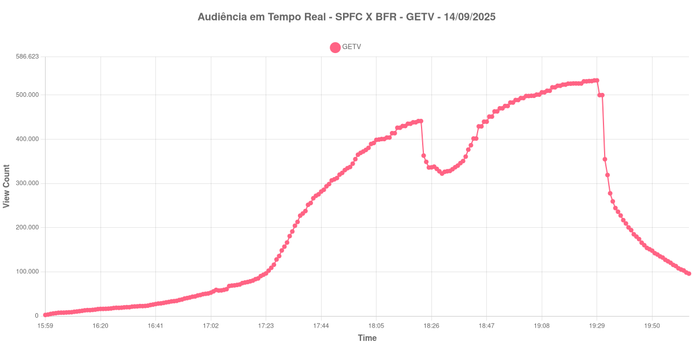

+++
date = 2025-09-15T11:20:18-03:00
draft = false
title = "Veja como foi a audiência da GETV no jogo entre São Paulo X Botafogo - 14-09-2025"
author = 'Instituto Cambacica de Audiência'
summary = "Veja como ficou a evolução da audiência no último jogo da GETV"
tags = ['YouTube', 'Analytics', 'Audiência', 'GETV', 'Botafogo', 'São Paulo', 'Brasileirão']
categories = ['Audiência']
+++

Neste texto, vamos informar os resultados da audiência em tempo real obtidos pela CazéTV, obtidos durante a transmissão do jogo São Paulo X Botafogo, válido pela Rodada 23 do Brasileirão, em 14/09/2025.

A audiência começou a ser medida às 14/09/2025 16:59:55 (Horário de Brasília), no início da live. Os principais pontos da audiência são (em aparelhos conectados):

* **Início da Medição (14/09/2025 16:59:55): 2.411**
* **Pico de audiência (14/09/2025 20:28:55): 533.293**
* **Final da Medição (14/09/2025 21:04:55): 95.956**

No gráfico a seguir, mostramos a evolução da audiência entre o horário do início da medição e o final da live:

Para você verificar os metadados desta medição, você pode consultar o [repositório contendo o CSV com os dados e com os prints do minuto a minuto da medição](https://github.com/institutocambacica/2025-09-14_SPFCXBFR_GETV).

---

*Para mais informações sobre nossa metodologia, visite nossa página [Sobre](/sobre).*