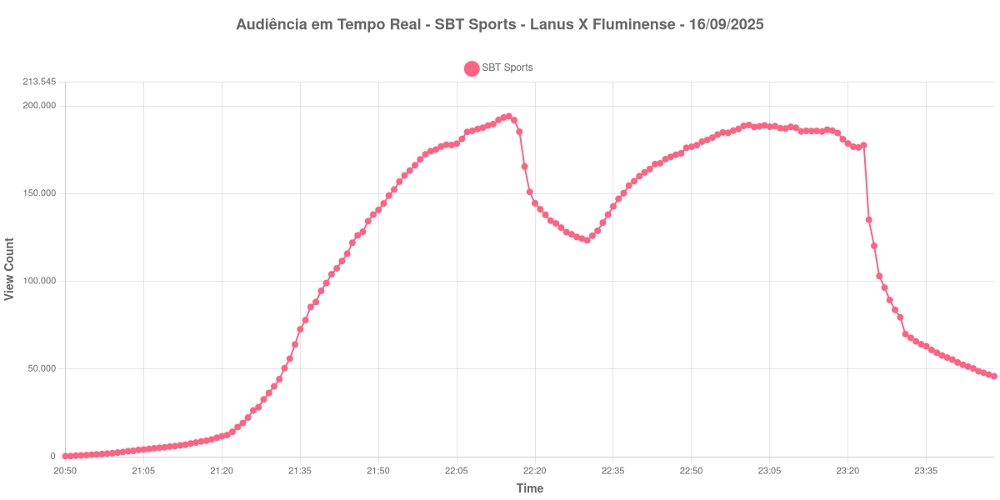

+++
date = 2025-09-19T09:12:37-03:00
draft = false
title = "Confira como foi a audiência do SBT Sports durante Lanús X Fluminense (16-09-2025)"
author = 'Instituto Cambacica de Audiência'
summary = "Neste post vamos informar a audiência obtida pelo canal SBT Sports durante a transmissão alternativa entre Lanús X Fluminense, em 16/09/2025."
tags = ['YouTube', 'Analytics', 'Audiência', 'SBT Sports', 'Lanus', 'Fluminense', 'Sulamericana']
categories = ['Audiência']
+++

Neste post vamos informar a audiência obtida pelo canal SBT Sports durante a transmissão alternativa entre Lanús X Fluminense, em 16/09/2025.

A audiência começou a ser medida às 16/09/2025 21:50:55 (Horário de Brasília), no início da live. Os principais pontos da audiência são (em aparelhos conectados):

* **Início da Medição (16/09/2025 21:50:55): 286**
* **Pico de audiência (16/09/2025 23:15:55): 194.131**
* **Final da Medição (17/09/2025 00:48:55): 45.838**

No gráfico a seguir, mostramos a evolução da audiência entre o horário do início da medição e o final da live:

Para você verificar os metadados desta medição, você pode consultar o [repositório contendo o CSV com os dados e com os prints do minuto a minuto da medição](https://github.com/institutocambacica/2025_09_16-18_GETV_CazeTV_Conmebol/tree/main/2025-09-16_18-22-14). Na raiz deste repositório, também se encontram as medições das transmissões dos highlights da CazéTV.

---

*Para mais informações sobre nossa metodologia, visite nossa página [Sobre](/sobre).*