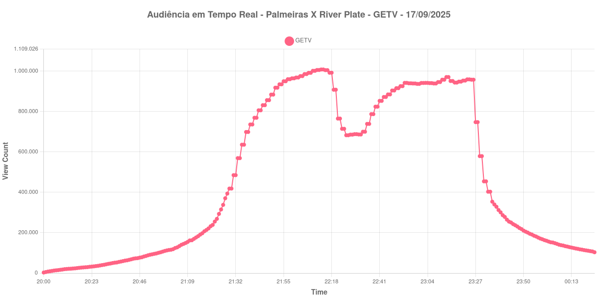

+++
date = 2025-09-19T09:20:44-03:00
draft = false
title = "Confira como foi a audiência de River Plate X Palmeiras na GETV - 17-09-2025"
author = 'Instituto Cambacica de Audiência'
summary = "Veja como foi a audiência da primeira partida da Libertadores transmitida pela GETV"
tags = ['YouTube', 'Analytics', 'Audiência', 'GETV', 'Palmeiras', 'River Plate', 'Libertadores']
categories = ['Audiência']
+++

Nesse post, vamos publicar os resultados obtidos pela GETV durante a transmissão de River Plate X Palmeiras, válido pela ida das Quartas de Final da Libertadores em 17/09/2025.

A audiência começou a ser medida às 17/09/2025 21:00:55 (Horário de Brasília), no início da live. Os principais pontos da audiência são (em aparelhos conectados):

* **Início da Medição (17/09/2025 21:00:55): 2.852**
* **Pico de audiência (17/09/2025 23:13:55): 1.008.205**
* **Final da Medição (18/09/2025 01:24:55): 103.150**

No gráfico a seguir, mostramos a evolução da audiência entre o horário do início da medição e o final da live:

Para você verificar os metadados desta medição, você pode consultar o [repositório contendo o CSV com os dados e com os prints do minuto a minuto da medição](https://github.com/institutocambacica/2025_09_16-18_GETV_CazeTV_Conmebol/tree/main/2025-09-17_19-27-06). Na raiz deste repositório, também se encontram as medições das transmissões dos highlights da CazéTV.

---

*Para mais informações sobre nossa metodologia, visite nossa página [Sobre](/sobre).*