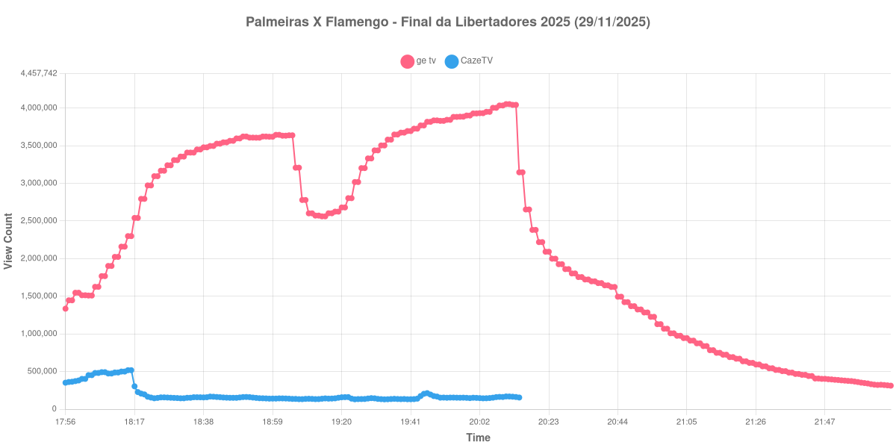

+++
date = 2026-07-17T09:10:00-03:00
draft = false
title = "Confira como foi a audiência de Palmeiras X Flamengo na GETV e na CazéTV - 29-11-2025"
author = 'Instituto Cambacica de Audiência'
summary = "Veja como foi a audiência da final da Libertadores de 2025 na ge tv e na CazéTV, no dia do tetracampeonato do Flamengo em Lima"
tags = ['YouTube', 'Analytics', 'Audiência', 'GETV', 'CazeTV', 'Palmeiras', 'Flamengo', 'Libertadores']
categories = ['Audiência']
canais = ['GETV', 'CazeTV']
campeonatos = ['Libertadores 2025']
data_evento = 2025-11-29
+++

*Esta medição foi realizada em 29/11/2025 e só está sendo publicada agora, em razão dos problemas pessoais que relatamos em [Nossas sinceras desculpas](/posts/2026-07-13-nossas-sinceras-desculpas/). Os dados são os originais, coletados na data da transmissão.*

Neste texto, vamos informar os resultados da audiência em tempo real obtidos pela ge tv e pela CazéTV, durante a transmissão de Palmeiras X Flamengo, a final da Copa Libertadores da América de 2025, disputada no Estádio Monumental "U", em Lima, no Peru, em 29/11/2025. O Flamengo venceu por 1 a 0, com gol de Danilo no segundo tempo, e conquistou o tetracampeonato continental.

Registramos uma diferença importante entre as duas transmissões: a ge tv exibiu a partida completa, enquanto a live da CazéTV acompanhou apenas os lances em tempo real, sem as imagens do jogo. A comparação entre as duas curvas, portanto, não é entre transmissões equivalentes, e é justamente essa assimetria que torna o resultado interessante.

A audiência começou a ser medida às 29/11/2025 17:56:55 (Horário de Brasília). Como a transmissão começou menos de duas horas antes do apito inicial, o gráfico e os números abaixo utilizam o primeiro registro disponível da medição como ponto de partida. Os principais pontos da audiência são (em aparelhos conectados):

* **Início da Medição (17:56:55): 1.335.043 na ge tv e 351.737 na CazéTV**
* **Início da partida (18:15:55): 2.299.032 na ge tv e 517.686 na CazéTV**
* **Final do primeiro tempo (19:02:55): 3.633.151 na ge tv e 142.885 na CazéTV**
* Durante o intervalo (19:12:55): 2.571.848 na ge tv e 133.705 na CazéTV
* **Início do segundo tempo (19:17:55): 2.602.487 na ge tv e 141.024 na CazéTV**
* Após o gol de Danilo, aos 67 minutos (19:39:55): 3.673.661 na ge tv e 135.022 na CazéTV
* **Apito final (20:07:55): 4.003.471 na ge tv e 160.355 na CazéTV**
* **Encerramento da live da CazéTV (20:14:55): 154.915**
* **Final da janela medida (22:07:55): 312.191 na ge tv**

O pico de audiência da ge tv foi às 20:10:55, três minutos depois do apito final, com **4.052.492** aparelhos conectados simultâneos. Na CazéTV, o pico ocorreu bem antes, às 18:15:55, exatamente no apito inicial, com **517.686** aparelhos conectados.

O dado mais eloquente desta medição está na curva da CazéTV. Ela atingiu seu máximo justamente no momento em que a bola rolou e desabou em seguida: caiu de 517.686 para 195.968 aparelhos conectados em cinco minutos. O público que aguardava o começo do jogo migrou para onde havia imagens, e a transmissão de lances em tempo real estabilizou-se em um patamar próximo de 140 mil aparelhos até encerrar, às 20:14:55.

Na ge tv, a curva seguiu o desenho de uma decisão disputada. A queda no intervalo foi de 1.061.303 aparelhos conectados — de 3.633.151 para 2.571.848 —, seguida de recuperação integral ao longo do segundo tempo: no apito final, a transmissão marcava mais do que havia marcado em qualquer momento do primeiro tempo. O pico veio depois do jogo encerrado, já durante a premiação, o mesmo comportamento que voltaríamos a observar em outras decisões que medimos.

No gráfico a seguir, mostramos a evolução da audiência entre o início da medição e duas horas após o encerramento da partida:

Para você verificar os metadados desta medição, você pode consultar o [repositório contendo o CSV com os dados e com os prints do minuto a minuto da medição](https://github.com/institutocambacica/ultimas_audiencias_2025).

---

*Para mais informações sobre nossa metodologia, visite nossa página [Sobre](/sobre).*
