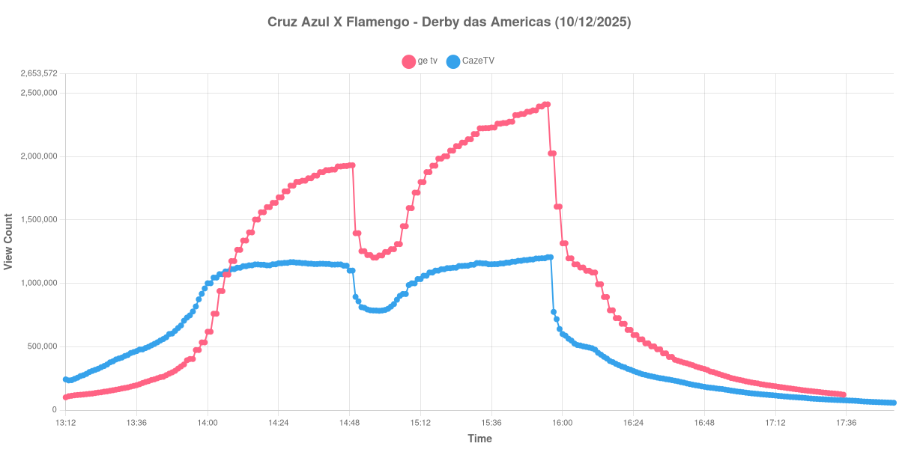

+++
date = 2026-07-17T09:20:00-03:00
draft = false
title = "Confira como foi a audiência de Cruz Azul X Flamengo na GETV e na CazéTV - 10-12-2025"
author = 'Instituto Cambacica de Audiência'
summary = "Veja como foi a audiência do Derby das Américas na ge tv e na CazéTV, com a virada de liderança entre os dois canais ainda no primeiro tempo"
tags = ['YouTube', 'Analytics', 'Audiência', 'GETV', 'CazeTV', 'Flamengo', 'Cruz Azul', 'Mundial de Clubes']
categories = ['Audiência']
campeonatos = ['Mundial de Clubes 2025']
data_evento = 2025-12-10
+++

*Esta medição foi realizada em 10/12/2025 e só está sendo publicada agora, em razão dos problemas pessoais que relatamos em [Nossas sinceras desculpas](/posts/2026-07-13-nossas-sinceras-desculpas/). Os dados são os originais, coletados na data da transmissão.*

Neste texto, vamos informar os resultados da audiência em tempo real obtidos pela ge tv e pela CazéTV, durante a transmissão de Cruz Azul X Flamengo, o Derby das Américas, válido pela segunda rodada da Copa Intercontinental da FIFA de 2025, disputado no Ahmad bin Ali Stadium, em Al Rayyan, no Catar, em 10/12/2025. O Flamengo venceu por 2 a 1, com dois gols de Arrascaeta, e avançou na competição.

A audiência começou a ser medida às 10/12/2025 13:12:55 (Horário de Brasília). Como a transmissão começou menos de duas horas antes do apito inicial, o gráfico e os números abaixo utilizam o primeiro registro disponível da medição como ponto de partida. Os principais pontos da audiência são (em aparelhos conectados):

* **Início da Medição (13:12:55): 100.603 na ge tv e 242.123 na CazéTV**
* **Início da partida (14:00:55): 618.415 na ge tv e 1.000.840 na CazéTV**
* Após o gol de Arrascaeta, aos 15 minutos (14:15:55): 1.402.053 na ge tv e 1.142.168 na CazéTV
* Após o gol de Jorge Sánchez, aos 44 minutos (14:44:55): 1.922.178 na ge tv e 1.149.075 na CazéTV
* **Final do primeiro tempo (14:47:55): 1.925.484 na ge tv e 1.139.310 na CazéTV**
* Durante o intervalo (14:56:55): 1.203.248 na ge tv e 785.909 na CazéTV
* **Início do segundo tempo (15:02:55): 1.269.525 na ge tv e 816.785 na CazéTV**
* Após o segundo gol de Arrascaeta, aos 71 minutos (15:28:55): 2.137.233 na ge tv e 1.139.042 na CazéTV
* **Apito final (15:52:55): 2.395.128 na ge tv e 1.195.962 na CazéTV**
* **Final da janela medida (17:52:55): 57.685 na CazéTV**

O pico de audiência da ge tv foi às 15:54:55, logo após o apito final, com **2.412.338** aparelhos conectados simultâneos. Na CazéTV, o pico veio um minuto depois, às 15:55:55, com **1.206.349** aparelhos conectados.

A curva mais interessante desta medição é a da disputa entre os dois canais. No apito inicial, a CazéTV liderava com folga: 1.000.840 aparelhos conectados contra 618.415 da ge tv. A posição se inverteu ainda nos primeiros quinze minutos de jogo e nunca mais voltou atrás — no fim do primeiro tempo, a ge tv já marcava 1.925.484 contra 1.139.310 da CazéTV, e encerrou a partida com o dobro da audiência da concorrente. Vale notar também que a CazéTV chegou ao intervalo praticamente estável desde os quinze minutos de jogo, enquanto a ge tv seguiu crescendo ao longo de todo o primeiro tempo.

O intervalo produziu quedas proporcionalmente semelhantes nos dois canais — 37,5% na ge tv e 31,0% na CazéTV —, e ambos recuperaram o patamar anterior até o fim da partida. A audiência da ge tv registrada nesta medição — pouco acima de 2,4 milhões de aparelhos — ficou bem abaixo do que o mesmo canal marcaria uma semana depois, na final da competição.

Registramos ainda que a série da ge tv apresenta lacunas de coleta na cauda da medição e seu último registro válido é o das 17:35:55, com 121.258 aparelhos conectados; por isso, o último ponto da lista acima traz apenas a CazéTV.

No gráfico a seguir, mostramos a evolução da audiência entre o início da medição e duas horas após o encerramento da partida:

Para você verificar os metadados desta medição, você pode consultar o [repositório contendo o CSV com os dados e com os prints do minuto a minuto da medição](https://github.com/institutocambacica/ultimas_audiencias_2025).

---

*Para mais informações sobre nossa metodologia, visite nossa página [Sobre](/sobre).*
