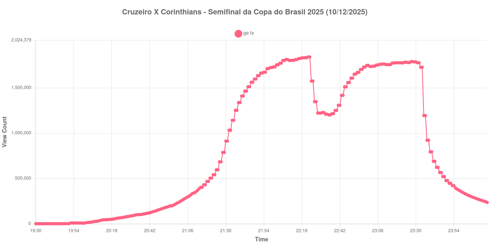

+++
date = 2026-07-17T09:30:00-03:00
draft = false
title = "Confira como foi a audiência de Cruzeiro X Corinthians na GETV - 10-12-2025"
author = 'Instituto Cambacica de Audiência'
summary = "Veja como foi a audiência da ida da semifinal da Copa do Brasil de 2025 na ge tv, em um Mineirão lotado"
tags = ['YouTube', 'Analytics', 'Audiência', 'GETV', 'Cruzeiro', 'Corinthians', 'Copa do Brasil']
categories = ['Audiência']
canais = ['GETV']
campeonatos = ['Copa do Brasil 2025']
data_evento = 2025-12-10
+++

*Esta medição foi realizada em 10/12/2025 e só está sendo publicada agora, em razão dos problemas pessoais que relatamos em [Nossas sinceras desculpas](/posts/2026-07-13-nossas-sinceras-desculpas/). Os dados são os originais, coletados na data da transmissão.*

Neste texto, vamos informar os resultados da audiência em tempo real obtidos pela ge tv, durante a transmissão de Cruzeiro X Corinthians, jogo de ida da semifinal da Copa do Brasil de 2025, disputado no Mineirão, em Belo Horizonte, em 10/12/2025. O Corinthians venceu por 1 a 0, com gol de Memphis Depay no primeiro tempo, diante de 59.052 pagantes.

A audiência começou a ser medida às 10/12/2025 19:23:55 (Horário de Brasília), pouco mais de duas horas antes do apito inicial. A live havia acabado de entrar no ar e ainda registrava números de três dígitos. A medição foi encerrada antes de completar duas horas após o apito final, de modo que o gráfico e os números abaixo utilizam o último registro disponível como ponto de chegada. Os principais pontos da audiência são (em aparelhos conectados):

* **Duas horas antes do apito inicial (19:30:55): 691**
* **Início da partida (21:30:55): 911.771**
* Após o gol de Memphis Depay, aos 21 minutos (21:51:55): 1.633.792
* **Final do primeiro tempo (22:17:55): 1.822.740**
* Durante o intervalo (22:28:55): 1.221.336
* **Início do segundo tempo (22:32:55): 1.227.265**
* **Apito final (23:22:55): 1.775.283**
* **Final da Medição (00:15:55): 235.299**

O pico de audiência foi às 22:22:55, no encerramento do primeiro tempo, com **1.840.344** aparelhos conectados simultâneos.

O que distingue esta curva das outras que medimos é a posição do pico. Nas decisões, o máximo costuma aparecer no apito final ou logo depois, durante a premiação. Aqui ele apareceu no fim do primeiro tempo, com o Corinthians já em vantagem, e o segundo tempo não conseguiu retomá-lo: no apito final, a transmissão marcava 1.775.283 aparelhos conectados, 65.061 abaixo do pico. É um desenho compatível com um jogo de ida — a decisão do confronto ainda estava por vir, e de fato veio, quatro dias depois, quando o Corinthians se classificou nos pênaltis na Neo Química Arena.

O intervalo provocou uma queda de 33,0% na audiência, de 1.822.740 para 1.221.336 aparelhos conectados, recuperada de forma contínua ao longo de toda a etapa final. Vale registrar que esta transmissão ocorreu na mesma noite em que a ge tv exibiu, à tarde, o Derby das Américas entre Cruz Azul e Flamengo, [que também medimos](/posts/2025-12-10-cruz-azul-x-flamengo-getv-cazetv/): o jogo da Copa do Brasil ficou abaixo do pico daquela transmissão, ainda que tenha sido acompanhado por um público expressivo.

No gráfico a seguir, mostramos a evolução da audiência entre duas horas antes do início da partida e o encerramento da medição:

Para você verificar os metadados desta medição, você pode consultar o [repositório contendo o CSV com os dados e com os prints do minuto a minuto da medição](https://github.com/institutocambacica/ultimas_audiencias_2025).

---

*Para mais informações sobre nossa metodologia, visite nossa página [Sobre](/sobre).*
