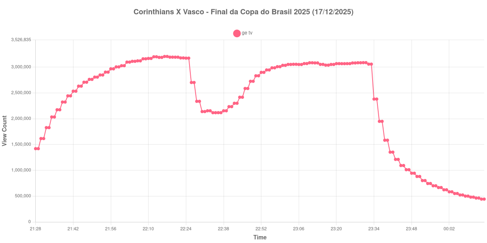

+++
date = 2026-07-17T09:50:00-03:00
draft = false
title = "Confira como foi a audiência de Corinthians X Vasco na GETV - 17-12-2025"
author = 'Instituto Cambacica de Audiência'
summary = "Veja como foi a audiência da ida da final da Copa do Brasil de 2025 na ge tv, em um jogo sem gols na Neo Química Arena"
tags = ['YouTube', 'Analytics', 'Audiência', 'GETV', 'Corinthians', 'Vasco', 'Copa do Brasil']
categories = ['Audiência']
campeonatos = ['Copa do Brasil 2025']
data_evento = 2025-12-17
+++

*Esta medição foi realizada em 17/12/2025 e só está sendo publicada agora, em razão dos problemas pessoais que relatamos em [Nossas sinceras desculpas](/posts/2026-07-13-nossas-sinceras-desculpas/). Os dados são os originais, coletados na data da transmissão.*

Neste texto, vamos informar os resultados da audiência em tempo real obtidos pela ge tv, durante a transmissão de Corinthians X Vasco, jogo de ida da final da Copa do Brasil de 2025, disputado na Neo Química Arena, em São Paulo, em 17/12/2025. A partida terminou empatada em 0 a 0, com dois gols anulados por impedimento.

A audiência começou a ser medida às 17/12/2025 21:28:55 (Horário de Brasília), dois minutos antes do apito inicial, e foi encerrada antes de completar duas horas após o apito final. O gráfico e os números abaixo utilizam, portanto, o primeiro e o último registros disponíveis da medição como pontos de partida e de chegada. Os principais pontos da audiência são (em aparelhos conectados):

* **Início da Medição (21:28:55): 1.419.969**
* **Início da partida (21:30:55): 1.615.744**
* **Final do primeiro tempo (22:17:55): 3.206.213**
* Durante o intervalo (22:28:55): 2.337.215
* **Início do segundo tempo (22:32:55): 2.153.718**
* **Apito final (23:22:55): 3.066.723**
* **Final da Medição (00:15:55): 442.446**

O pico de audiência foi às 22:16:55, nos minutos finais do primeiro tempo, com **3.206.213** aparelhos conectados simultâneos — o mesmo valor que o contador ainda registrava no apito que encerrou a etapa inicial.

Esta é a segunda medição da série em que o pico de uma partida da Copa do Brasil aparece no fim do primeiro tempo, e não no apito final. A mesma coisa havia acontecido uma semana antes, em [Cruzeiro X Corinthians](/posts/2025-12-10-cruzeiro-x-corinthians-getv/), também um jogo de ida. Aqui o segundo tempo chegou perto de recuperar o patamar, mas não o alcançou: no apito final, a transmissão marcava 3.066.723 aparelhos conectados, 139.490 abaixo do pico. A queda no intervalo foi de 32,8%, de 3.206.213 para 2.153.718 aparelhos no reinício.

Vale registrar a escala em relação à outra medição do mesmo dia. Na tarde de 17/12, a ge tv transmitiu a [final da Copa Intercontinental da FIFA entre PSG e Flamengo](/posts/2025-12-17-psg-x-flamengo-getv-cazetv/), que atingiu 5.004.475 aparelhos conectados. À noite, a final da Copa do Brasil ficou em pouco menos de dois terços disso — um número expressivo para uma partida sem gols, e que ajuda a dimensionar o peso de cada competição na audiência do canal.

No gráfico a seguir, mostramos a evolução da audiência entre o início e o final da medição:

Para você verificar os metadados desta medição, você pode consultar o [repositório contendo o CSV com os dados e com os prints do minuto a minuto da medição](https://github.com/institutocambacica/ultimas_audiencias_2025).

---

*Para mais informações sobre nossa metodologia, visite nossa página [Sobre](/sobre).*
