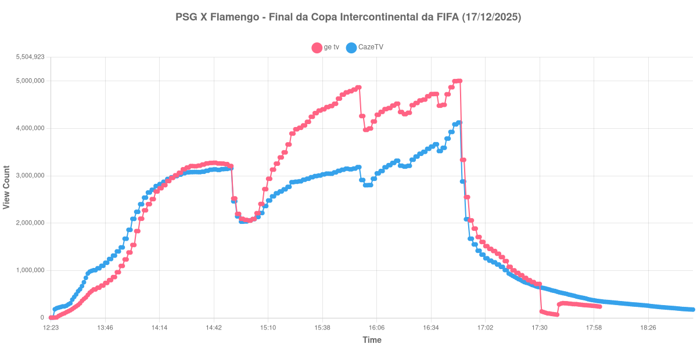

+++
date = 2026-07-17T09:40:00-03:00
draft = false
title = "Confira como foi a audiência da final do Mundial de Clubes na GETV e na CazéTV - PSG X Flamengo (17-12-2025)"
author = 'Instituto Cambacica de Audiência'
summary = "Veja como foi a audiência da final da Copa Intercontinental da FIFA de 2025 na ge tv e na CazéTV, decidida nos pênaltis"
tags = ['YouTube', 'Analytics', 'Audiência', 'GETV', 'CazeTV', 'PSG', 'Flamengo', 'Mundial de Clubes']
categories = ['Audiência']
canais = ['GETV', 'CazeTV']
campeonatos = ['Mundial de Clubes 2025']
data_evento = 2025-12-17
+++

*Esta medição foi realizada em 17/12/2025 e só está sendo publicada agora, em razão dos problemas pessoais que relatamos em [Nossas sinceras desculpas](/posts/2026-07-13-nossas-sinceras-desculpas/). Os dados são os originais, coletados na data da transmissão.*

Neste texto, vamos informar os resultados da audiência em tempo real obtidos pela ge tv e pela CazéTV, durante a transmissão de PSG X Flamengo, a final da Copa Intercontinental da FIFA de 2025, disputada no Ahmad bin Ali Stadium, em Al Rayyan, no Catar, em 17/12/2025. A partida terminou empatada em 1 a 1 no tempo normal, com gols de Kvaratskhelia e de Jorginho, de pênalti, e o PSG venceu a disputa por pênaltis por 2 a 1.

A audiência começou a ser medida às 17/12/2025 12:18:55 (Horário de Brasília), com os primeiros registros válidos às 12:23:55. Como a transmissão começou menos de duas horas antes do apito inicial, o gráfico e os números abaixo utilizam o primeiro registro disponível da medição como ponto de partida. Os principais pontos da audiência são (em aparelhos conectados):

* **Início da Medição (12:23:55): 4.982 na ge tv e 4.513 na CazéTV**
* **Início da partida (14:00:55): 1.539.059 na ge tv e 2.090.078 na CazéTV**
* Após o gol de Kvaratskhelia, aos 38 minutos (14:38:55): 3.261.499 na ge tv e 3.106.348 na CazéTV
* **Final do primeiro tempo (14:47:55): 3.258.054 na ge tv e 3.140.331 na CazéTV**
* Durante o intervalo (14:57:55): 2.091.722 na ge tv e 2.031.135 na CazéTV
* **Início do segundo tempo (15:02:55): 2.088.400 na ge tv e 2.084.909 na CazéTV**
* Após o gol de Jorginho, de pênalti, aos 62 minutos (15:19:55): 3.494.636 na ge tv e 2.713.924 na CazéTV
* **Final do tempo normal, com 1 a 1 no placar (15:52:55): 4.786.434 na ge tv e 3.137.913 na CazéTV**
* **Início da prorrogação (15:57:55): 4.867.741 na ge tv e 3.183.204 na CazéTV**
* **Final da prorrogação (16:37:55): 4.728.152 na ge tv e 3.666.161 na CazéTV**
* Durante a disputa de pênaltis (16:48:55): 5.004.475 na ge tv e 4.124.888 na CazéTV
* **Final da janela medida (18:49:55): 174.741 na CazéTV**

O pico de audiência dos dois canais aconteceu no mesmo minuto, às 16:48:55, durante a disputa de pênaltis: **5.004.475** aparelhos conectados simultâneos na ge tv e **4.124.888** na CazéTV. É a maior audiência registrada nas cinco medições que fizemos em novembro e dezembro de 2025.

O comportamento dos dois canais na reta final é o dado mais relevante desta medição. Entre o fim do tempo normal e o pico nos pênaltis, a ge tv cresceu 4,6% — de 4.786.434 para 5.004.475 aparelhos conectados —, enquanto a CazéTV cresceu 31,5%, de 3.137.913 para 4.124.888. A prorrogação e a decisão por pênaltis atraíram público novo para as duas transmissões, mas a CazéTV, que estava mais atrás, foi quem mais encurtou a distância: a diferença entre os canais caiu de 1.648.521 para 879.587 aparelhos conectados.

Também se repetiu aqui o padrão que havíamos observado no Derby das Américas, uma semana antes: a CazéTV liderava no apito inicial, com 2.090.078 contra 1.539.059 da ge tv, e foi ultrapassada ainda no primeiro tempo. O intervalo, por sua vez, custou praticamente o mesmo aos dois canais, 35,8% na ge tv e 35,3% na CazéTV, o que sugere que o esvaziamento no intervalo depende mais do jogo do que da transmissão.

Registramos duas limitações desta medição, ambas na série da ge tv. A primeira são lacunas de coleta ao longo da transmissão, cujo último registro válido é o das 18:01:55, com 236.859 aparelhos conectados; por isso, o último ponto da lista acima traz apenas a CazéTV. A segunda é a descontinuidade visível no gráfico entre 17:31 e 17:39, já bem depois do fim da partida, quando o valor coletado caiu de 716.315 para 135.428 aparelhos conectados e em seguida retornou ao patamar da curva. Trata-se de uma falha da nossa coleta, e não de uma variação real de audiência. Nenhum dos números citados acima está nesse trecho.

No gráfico a seguir, mostramos a evolução da audiência entre o início da medição e duas horas após o encerramento da disputa de pênaltis:

Para você verificar os metadados desta medição, você pode consultar o [repositório contendo o CSV com os dados e com os prints do minuto a minuto da medição](https://github.com/institutocambacica/ultimas_audiencias_2025).

---

*Para mais informações sobre nossa metodologia, visite nossa página [Sobre](/sobre).*
