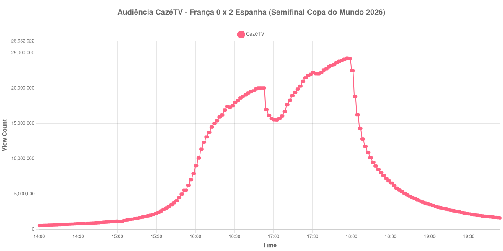

+++
date = 2026-07-20T09:10:00-03:00
draft = false
title = "Confira como foi a audiência de França X Espanha na CazéTV - 14-07-2026"
author = 'Instituto Cambacica de Audiência'
summary = "Veja como foi a audiência da primeira semifinal da Copa do Mundo de 2026, transmitida pela CazéTV"
tags = ['YouTube', 'Analytics', 'Audiência', 'CazeTV', 'França', 'Espanha', 'Copa do Mundo']
categories = ['Audiência']
campeonatos = ['Copa do Mundo 2026']
data_evento = 2026-07-14
+++

Neste texto, vamos informar os resultados da audiência em tempo real obtidos pela CazéTV, durante a transmissão de França X Espanha, válido pela primeira semifinal da Copa do Mundo de 2026, disputada no AT&T Stadium, em Dallas, em 14/07/2026. A partida terminou com vitória da Espanha por 2 a 0.

A audiência começou a ser medida às 14/07/2026 14:00:55 (Horário de Brasília), quase duas horas antes do apito inicial. Os principais pontos da audiência são (em aparelhos conectados):

* **Início da Medição (14:00:55): 523.838**
* **Início da partida (16:00:55): 8.988.554**
* Após 15 minutos de primeiro tempo (16:15:55): 15.004.694
* Após o gol de Oyarzabal, de pênalti, aos 22 minutos (16:22:55): 16.895.602
* Após 30 minutos de primeiro tempo (16:30:55): 17.956.105
* **Final do primeiro tempo (16:47:55): 19.878.990**
* Durante o intervalo (17:00:55): 15.499.282
* **Início do segundo tempo (17:02:55): 15.481.311**
* Após o gol de Pedro Porro, aos 59 minutos (17:16:55): 19.402.527
* **Final da partida (17:52:55): 23.942.165**
* Dez minutos depois do final da partida (18:02:55): 18.798.350
* Vinte minutos depois do final da partida (18:12:55): 10.885.027
* **Final da Medição (19:54:55): 1.598.756**

O pico de audiência foi às 17:56:55, poucos minutos após o apito final, com **24.229.929** aparelhos conectados simultâneos — a maior marca já registrada pelo Instituto Cambacica em todas as suas medições, superando inclusive o pico da final da competição, cinco dias depois.

Chama atenção o comportamento da curva no intervalo: a audiência caiu de 19.878.990 para 15.499.282 aparelhos em pouco mais de dez minutos, uma perda de cerca de 22%, integralmente recuperada nos primeiros minutos da etapa final.

No gráfico a seguir, mostramos a evolução da audiência entre duas horas antes do início da partida e duas horas após o seu encerramento:

Para você verificar os metadados desta medição, você pode consultar o [repositório contendo o CSV com os dados e com os prints do minuto a minuto da medição](https://github.com/institutocambacica/audiencia_cazetv_13_a_19_07_2026).

---

*Para mais informações sobre nossa metodologia, visite nossa página [Sobre](/sobre).*
