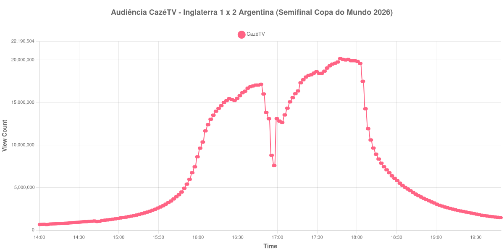

+++
date = 2026-07-20T09:20:00-03:00
draft = false
title = "Confira como foi a audiência de Inglaterra X Argentina na CazéTV - 15-07-2026"
author = 'Instituto Cambacica de Audiência'
summary = "Veja como foi a audiência da segunda semifinal da Copa do Mundo de 2026, decidida nos acréscimos"
tags = ['YouTube', 'Analytics', 'Audiência', 'CazeTV', 'Inglaterra', 'Argentina', 'Copa do Mundo']
categories = ['Audiência']
canais = ['CazeTV']
campeonatos = ['Copa do Mundo 2026']
data_evento = 2026-07-15
+++

Neste texto, vamos informar os resultados da audiência em tempo real obtidos pela CazéTV, durante a transmissão de Inglaterra X Argentina, válido pela segunda semifinal da Copa do Mundo de 2026, disputada em Atlanta, em 15/07/2026. A Argentina venceu por 2 a 1, de virada, com o gol da classificação nos acréscimos.

A audiência começou a ser medida às 15/07/2026 14:00:55 (Horário de Brasília), quase duas horas antes do apito inicial. Os principais pontos da audiência são (em aparelhos conectados):

* **Início da Medição (14:00:55): 665.378**
* **Início da partida (16:00:55): 8.625.787**
* Após 30 minutos de primeiro tempo (16:30:55): 15.485.897
* **Final do primeiro tempo (16:47:55): 17.150.518**
* Durante o intervalo (17:00:55): 13.107.860
* **Início do segundo tempo (17:02:55): 12.821.447**
* Após o gol de Anthony Gordon, aos 55 minutos (17:12:55): 15.581.955
* Após o gol de empate de Enzo Fernández, aos 85 minutos (17:42:55): 19.520.695
* Após o gol de Lautaro Martínez, aos 90+2 minutos (17:49:55): 20.071.025
* **Final da partida (17:52:55): 20.011.738**
* Dez minutos depois do final da partida (18:02:55): 19.605.613
* Vinte minutos depois do final da partida (18:12:55): 9.651.326
* **Final da Medição (19:49:55): 1.471.939**

O pico de audiência foi às 17:47:55, com **20.173.185** aparelhos conectados simultâneos. Vale registrar que o pico ocorreu nos minutos finais da partida, com o placar ainda empatado em 1 a 1 — ou seja, antes do gol da virada argentina, e não depois dele.

Outro dado que merece destaque é a retenção do público após o apito final: dez minutos depois do encerramento, a CazéTV ainda mantinha 19.605.613 aparelhos conectados, praticamente o mesmo patamar do fim do jogo. A queda acentuada só veio a seguir, entre os dez e os vinte minutos seguintes, quando a audiência caiu pela metade.

No gráfico a seguir, mostramos a evolução da audiência entre duas horas antes do início da partida e duas horas após o seu encerramento:

Para você verificar os metadados desta medição, você pode consultar o [repositório contendo o CSV com os dados e com os prints do minuto a minuto da medição](https://github.com/institutocambacica/audiencia_cazetv_13_a_19_07_2026).

---

*Para mais informações sobre nossa metodologia, visite nossa página [Sobre](/sobre).*
