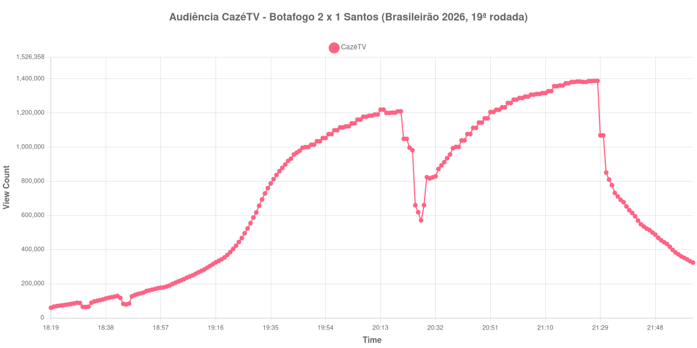

+++
date = 2026-07-20T09:30:00-03:00
draft = false
title = "Confira como foi a audiência de Botafogo X Santos na CazéTV - 16-07-2026"
author = 'Instituto Cambacica de Audiência'
summary = "Veja como foi a audiência da 19ª rodada do Brasileirão na CazéTV, um dia depois das semifinais da Copa"
tags = ['YouTube', 'Analytics', 'Audiência', 'CazeTV', 'Botafogo', 'Santos', 'Brasileirão']
categories = ['Audiência']
+++

Neste texto, vamos informar os resultados da audiência em tempo real obtidos pela CazéTV, durante a transmissão de Botafogo X Santos, válido pela 19ª rodada do Brasileirão de 2026, disputada no Estádio Nilton Santos, no Rio de Janeiro, em 16/07/2026. O Botafogo venceu por 2 a 1, com o gol da vitória nos acréscimos.

A audiência começou a ser medida às 16/07/2026 18:19:55 (Horário de Brasília), no início da live. Como a transmissão começou menos de duas horas antes do apito inicial e foi encerrada antes de completar duas horas do apito final, o gráfico e os números abaixo utilizam o primeiro e o último registro disponíveis da medição. Os principais pontos da audiência são (em aparelhos conectados):

* **Início da Medição (18:19:55): 58.763**
* **Início da partida (19:30:55): 617.028**
* Após o gol de Lucas Emanuel, aos 40 minutos do primeiro tempo (20:10:55): 1.183.503
* **Final do primeiro tempo (20:17:55): 1.201.659**
* Durante o intervalo (20:30:55): 816.381
* **Início do segundo tempo (20:32:55): 828.614**
* Após o gol de Barreal, aos 11 minutos do segundo tempo (20:43:55): 1.076.474
* Após o gol de Kadir Barría, aos 45 minutos do segundo tempo (21:20:55): 1.381.440
* **Final da partida (21:25:55): 1.386.378**
* Dez minutos depois do final da partida (21:35:55): 710.629
* **Final da Medição (22:01:55): 323.528**

O pico de audiência foi às 21:27:55, logo após o apito final, com **1.387.598** aparelhos conectados simultâneos.

Este jogo oferece uma referência útil de escala. Realizado um dia depois da segunda semifinal da Copa do Mundo, no mesmo canal, o confronto entre Botafogo e Santos atingiu um pico cerca de 15 vezes menor do que o de Inglaterra X Argentina, medido na véspera. É um lembrete de que os números da Copa não devem ser lidos como o patamar habitual da CazéTV, e sim como uma exceção.

No gráfico a seguir, mostramos a evolução da audiência entre o horário do início da medição e o final da live:

Para você verificar os metadados desta medição, você pode consultar o [repositório contendo o CSV com os dados e com os prints do minuto a minuto da medição](https://github.com/institutocambacica/audiencia_cazetv_13_a_19_07_2026).

---

*Para mais informações sobre nossa metodologia, visite nossa página [Sobre](/sobre).*
