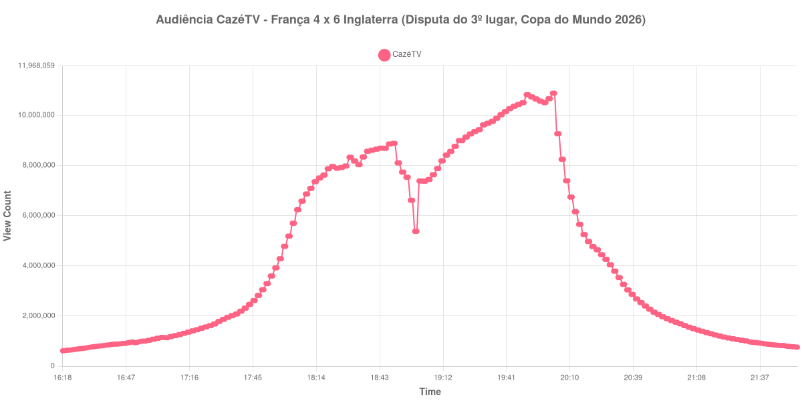

+++
date = 2026-07-20T09:40:00-03:00
draft = false
title = "Confira como foi a audiência de França X Inglaterra na CazéTV - 18-07-2026"
author = 'Instituto Cambacica de Audiência'
summary = "Veja como foi a audiência da disputa do terceiro lugar da Copa do Mundo de 2026, um jogo de dez gols"
tags = ['YouTube', 'Analytics', 'Audiência', 'CazeTV', 'França', 'Inglaterra', 'Copa do Mundo']
categories = ['Audiência']
canais = ['CazeTV']
campeonatos = ['Copa do Mundo 2026']
data_evento = 2026-07-18
+++

Neste texto, vamos informar os resultados da audiência em tempo real obtidos pela CazéTV, durante a transmissão de França X Inglaterra, válido pela disputa do terceiro lugar da Copa do Mundo de 2026, realizada no Hard Rock Stadium, em Miami, em 18/07/2026. A Inglaterra venceu por 6 a 4, em uma partida com dez gols.

A audiência começou a ser medida às 18/07/2026 16:18:55 (Horário de Brasília). Como a transmissão começou menos de duas horas antes do apito inicial, o gráfico e os números abaixo utilizam o primeiro registro disponível da medição como ponto de partida. Os principais pontos da audiência são (em aparelhos conectados):

* **Início da Medição (16:18:55): 614.860**
* **Início da partida (18:00:55): 4.778.605**
* Após o gol de Declan Rice, ao 1 minuto (18:01:55): 5.184.306
* Após o gol de Ezri Konsa, aos 18 minutos (18:18:55): 7.616.721
* Após o gol de Bukayo Saka, aos 36 minutos (18:36:55): 8.338.911
* Após o segundo gol de Saka, aos 45+1 minutos (18:46:55): 8.685.772
* **Final do primeiro tempo, com 4 a 0 para a Inglaterra (18:47:55): 8.856.896**
* Durante o intervalo (19:00:55): 5.374.509
* **Início do segundo tempo (19:02:55): 7.382.964**
* Após o gol de Mbappé, aos 46 minutos (19:03:55): 7.373.436
* Após o gol de Barcola, aos 54 minutos (19:11:55): 8.183.423
* Após o segundo gol de Mbappé, aos 66 minutos (19:23:55): 9.131.934
* Após o gol de Saka, de pênalti, aos 84 minutos (19:41:55): 10.146.943
* Após o gol de Dembélé, nos acréscimos (19:49:55): 10.501.785
* Após o gol de Bellingham, nos acréscimos (19:52:55): 10.733.740
* **Final da partida (19:55:55): 10.651.169**
* **Final da Medição (21:54:55): 762.024**

O pico de audiência foi às 20:02:55, logo após o apito final, com **10.880.053** aparelhos conectados simultâneos.

O comportamento da curva neste jogo é o mais interessante das cinco medições da semana. Mesmo com a Inglaterra abrindo 4 a 0 ainda no primeiro tempo — um placar que costuma esvaziar transmissões —, a audiência não recuou: cresceu de forma contínua durante toda a etapa final, acompanhando a reação francesa, e passou de 7.382.964 no reinício para 10.733.740 aparelhos após o décimo gol. Ou seja, a partida ganhou público justamente quando o resultado parecia definido.

Vale notar também que a disputa do terceiro lugar registrou menos da metade do pico da semifinal de 14/07 (24.229.929 aparelhos), o que dá uma medida do peso que a fase decisiva tem sobre a audiência.

No gráfico a seguir, mostramos a evolução da audiência entre o início da medição e duas horas após o encerramento da partida:

Para você verificar os metadados desta medição, você pode consultar o [repositório contendo o CSV com os dados e com os prints do minuto a minuto da medição](https://github.com/institutocambacica/audiencia_cazetv_13_a_19_07_2026).

---

*Para mais informações sobre nossa metodologia, visite nossa página [Sobre](/sobre).*
