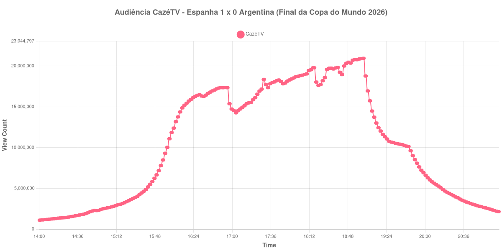

+++
date = 2026-07-20T09:50:00-03:00
draft = false
title = "Confira como foi a audiência da final da Copa do Mundo na CazéTV - Espanha X Argentina (19-07-2026)"
author = 'Instituto Cambacica de Audiência'
summary = "Veja como foi a audiência da final da Copa do Mundo de 2026 na CazéTV, decidida na prorrogação"
tags = ['YouTube', 'Analytics', 'Audiência', 'CazeTV', 'Espanha', 'Argentina', 'Copa do Mundo']
categories = ['Audiência']
canais = ['CazeTV']
campeonatos = ['Copa do Mundo 2026']
data_evento = 2026-07-19
+++

Neste texto, vamos informar os resultados da audiência em tempo real obtidos pela CazéTV, durante a transmissão de Espanha X Argentina, a final da Copa do Mundo de 2026, disputada no MetLife Stadium, em East Rutherford, em 19/07/2026. A Espanha venceu por 1 a 0, com gol de Ferran Torres na prorrogação, e conquistou o bicampeonato mundial.

A audiência começou a ser medida às 19/07/2026 14:00:55 (Horário de Brasília), duas horas antes do apito inicial. Os principais pontos da audiência são (em aparelhos conectados):

* **Início da Medição (14:00:55): 1.114.059**
* **Início da partida (16:00:55): 10.039.002**
* **Final do primeiro tempo (16:47:55): 17.309.800**
* Durante o intervalo (17:00:55): 14.736.995
* **Início do segundo tempo (17:02:55): 14.551.652**
* **Final do tempo normal, com 0 a 0 no placar (17:52:55): 18.156.233**
* **Início da prorrogação (18:00:55): 18.699.470**
* Durante o intervalo da prorrogação (18:20:55): 17.633.642
* Após o gol de Ferran Torres, aos 106 minutos (18:22:55): 17.736.013
* **Final da prorrogação (18:38:55): 19.837.340**
* **Final da Medição (21:09:55): 2.162.433**

O pico de audiência foi às 19:02:55, com **20.949.815** aparelhos conectados simultâneos. O dado mais relevante desta medição é justamente onde esse pico aparece: cerca de vinte minutos **depois** do apito final, durante a cerimônia de premiação. A audiência continuou subindo com o jogo já decidido e só despencou às 19:03, caindo de 20.949.815 para 13.737.278 aparelhos em dez minutos — o que sugere que a entrega da taça reteve, e até atraiu, público que não estava assistindo à partida.

Um segundo ponto chama atenção: apesar de ser a final, o pico da decisão (20.949.815) ficou **abaixo** do pico da semifinal entre França e Espanha, medido em 14/07, que chegou a 24.229.929 aparelhos conectados. A final foi transmitida também pela TV aberta, o que pode ajudar a explicar a diferença, mas registramos aqui apenas o que foi medido na CazéTV.

No gráfico a seguir, mostramos a evolução da audiência entre duas horas antes do início da partida e duas horas após o seu encerramento:

Para você verificar os metadados desta medição, você pode consultar o [repositório contendo o CSV com os dados e com os prints do minuto a minuto da medição](https://github.com/institutocambacica/audiencia_cazetv_13_a_19_07_2026).

---

*Para mais informações sobre nossa metodologia, visite nossa página [Sobre](/sobre).*
