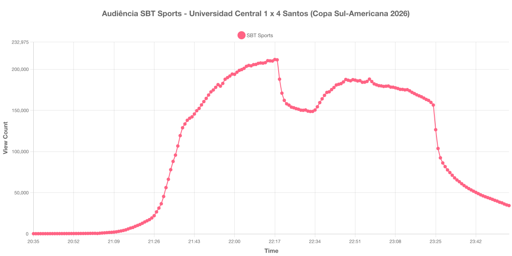

+++
date = 2026-07-26T19:00:00-03:00
draft = false
title = "Confira como foi a audiência de Universidad Central X Santos no SBT Sports - 21-07-2026"
author = 'Instituto Cambacica de Audiência'
summary = "Veja como foi a audiência da ida do playoff da Copa Sul-Americana no SBT Sports, com goleada do Santos na Venezuela"
tags = ['YouTube', 'Analytics', 'Audiência', 'SBT Sports', 'Universidad Central', 'Santos', 'Sul-Americana']
categories = ['Audiência']
+++

Neste texto, vamos informar os resultados da audiência em tempo real obtidos pelo SBT Sports, durante a transmissão de Universidad Central X Santos, jogo de ida do playoff da Copa Sul-Americana de 2026, disputado no Estádio Misael Delgado, em Valencia, na Venezuela, em 21/07/2026. O Santos venceu por 4 a 1, com gols de Gabriel Bontempo, Gabriel Menino, Thaciano e Rony, e encaminhou a classificação para as oitavas de final.

A audiência começou a ser medida às 21/07/2026 20:35:55 (Horário de Brasília), no início da live. Como a transmissão começou menos de duas horas antes do apito inicial, o gráfico e os números abaixo utilizam o primeiro registro disponível da medição. Na outra ponta, a coleta prosseguiu depois do encerramento da live: a partir das 23:57:55 o contador do YouTube despenca para valores de um dígito e deixa de refletir audiência, de modo que descartamos esses registros e encerramos a janela no último dado válido. Os principais pontos da audiência são (em aparelhos conectados):

* **Início da Medição (20:35:55): 145**
* **Início da partida (21:30:55): 45.366**
* Após o gol de Gabriel Bontempo, aos 34 minutos do primeiro tempo (22:04:55): 201.044
* **Final do primeiro tempo (22:17:55): 211.795**
* Durante o intervalo (22:25:55): 153.177
* **Início do segundo tempo (22:32:55): 148.633**
* Após o gol de Gabriel Menino, aos 11 minutos do segundo tempo (22:43:55): 180.833
* Após o gol de Thaciano, aos 21 minutos do segundo tempo (22:53:55): 186.122
* Após os gols de Rony e de Maicol Ruiz, já nos minutos finais (23:13:55): 175.137
* **Final da partida (23:22:55): 162.069**
* **Final da Medição (23:56:55): 34.316**

O pico de audiência foi às 22:17:55, no encerramento do primeiro tempo, com **211.795** aparelhos conectados simultâneos.

A curva desta medição tem um formato pouco comum: o pico chegou ainda no primeiro tempo e nunca mais foi alcançado, mesmo com o Santos marcando outros três gols depois do intervalo. A audiência caiu 30% entre o apito que encerrou a etapa inicial e o recomeço do jogo — de 211.795 para 148.633 aparelhos conectados, que é também o ponto mais baixo do intervalo — e o segundo tempo se estabilizou em um patamar em torno de 180 mil, sem devolver o público que havia saído. Os gols recuperaram parte da audiência, mas não o suficiente para superar a marca do primeiro tempo.

Vale também registrar o ritmo de formação do público: a live abriu com apenas 145 aparelhos conectados às 20:35 e passou de 45 mil no apito inicial, quase uma hora depois. Em escala, o resultado é próximo do que medimos na transmissão anterior do SBT Sports na mesma competição, [Lanús X Fluminense, em 16/09/2025](/posts/2025-09-16-sbt-lanus-x-fluminense/), que teve pico de 194.131 aparelhos conectados.

No gráfico a seguir, mostramos a evolução da audiência entre o horário do início da medição e o encerramento da live:

Para você verificar os metadados desta medição, você pode consultar o [repositório contendo o CSV com os dados e com os prints do minuto a minuto da medição](https://github.com/institutocambacica/audiencias_20_26_jul_2026).

---

*Para mais informações sobre nossa metodologia, visite nossa página [Sobre](/sobre).*
