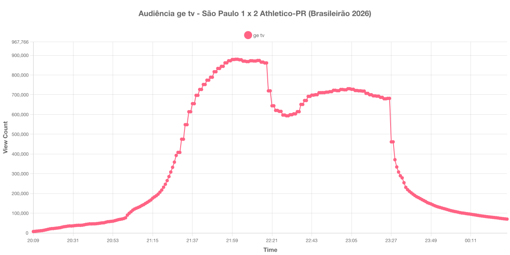

+++
date = 2026-07-26T19:10:00-03:00
draft = false
title = "Confira como foi a audiência de São Paulo X Athletico-PR na ge tv - 22-07-2026"
author = 'Instituto Cambacica de Audiência'
summary = "Veja como foi a audiência da 19ª rodada do Brasileirão na ge tv, em um jogo virado pelo Athletico-PR no início do segundo tempo"
tags = ['YouTube', 'Analytics', 'Audiência', 'GETV', 'Sao Paulo', 'Athletico-PR', 'Brasileirão']
categories = ['Audiência']
+++

Neste texto, vamos informar os resultados da audiência em tempo real obtidos pela ge tv, durante a transmissão de São Paulo X Athletico-PR, válido pela 19ª rodada do Brasileirão de 2026, disputado no Estádio Cícero de Souza Marques, em Bragança Paulista, em 22/07/2026. O Athletico-PR venceu por 2 a 1, de virada: Artur abriu o placar para o São Paulo em cobrança de falta no primeiro tempo e Leozinho marcou duas vezes no início da etapa final.

A audiência começou a ser medida às 22/07/2026 20:09:55 (Horário de Brasília), no início da live. Como a transmissão começou menos de duas horas antes do apito inicial, o gráfico e os números abaixo utilizam o primeiro registro disponível da medição. Na outra ponta, a coleta prosseguiu depois do encerramento da live: a partir das 00:32:55 o contador do YouTube despenca para valores de um dígito e deixa de refletir audiência, de modo que descartamos esses registros e encerramos a janela no último dado válido. Os principais pontos da audiência são (em aparelhos conectados):

* **Início da Medição (20:09:55): 7.000**
* **Início da partida (21:30:55): 408.020**
* Após o gol de Artur, aos 18 minutos do primeiro tempo (21:48:55): 788.714
* **Final do primeiro tempo (22:17:55): 861.156**
* Durante o intervalo (22:29:55): 593.467
* **Início do segundo tempo (22:32:55): 598.799**
* Após o primeiro gol de Leozinho, logo no início da etapa final (22:33:55): 603.127
* Após o segundo gol de Leozinho, aos 5 minutos do segundo tempo (22:37:55): 650.947
* **Final da partida (23:22:55): 686.862**
* Dez minutos depois do final da partida (23:32:55): 289.500
* **Final da Medição (00:31:55): 69.913**

O pico de audiência foi às 22:01:55, ainda durante o primeiro tempo, com **879.787** aparelhos conectados simultâneos.

O que chama atenção nesta medição é que o pico não aparece em nenhum dos momentos decisivos do jogo. Ele ocorreu por volta da metade do primeiro tempo, treze minutos depois do gol de Artur, e a partir dali a audiência apenas oscilou em torno de 870 mil aparelhos, sem voltar a subir: no apito que encerrou a etapa inicial o contador marcava 861.156, abaixo da marca das 22:01. A virada do Athletico-PR, construída em pouco mais de quatro minutos no início do segundo tempo, recuperou público, mas o jogo estabilizou entre 650 mil e 730 mil aparelhos até o apito final, sem se aproximar de novo do pico.

O intervalo teve um comportamento moderado se comparado às outras medições desta semana: a queda foi de 861.156 para 593.467 aparelhos conectados, cerca de 31%, e a recuperação começou já no recomeço do jogo. Depois do apito final, a retenção foi curta: em dez minutos a audiência caiu de 686.862 para 289.500 aparelhos, e a live ainda seguiu por mais uma hora em queda contínua até ser encerrada.

No gráfico a seguir, mostramos a evolução da audiência entre o horário do início da medição e o encerramento da live:

Para você verificar os metadados desta medição, você pode consultar o [repositório contendo o CSV com os dados e com os prints do minuto a minuto da medição](https://github.com/institutocambacica/audiencias_20_26_jul_2026).

---

*Para mais informações sobre nossa metodologia, visite nossa página [Sobre](/sobre).*
