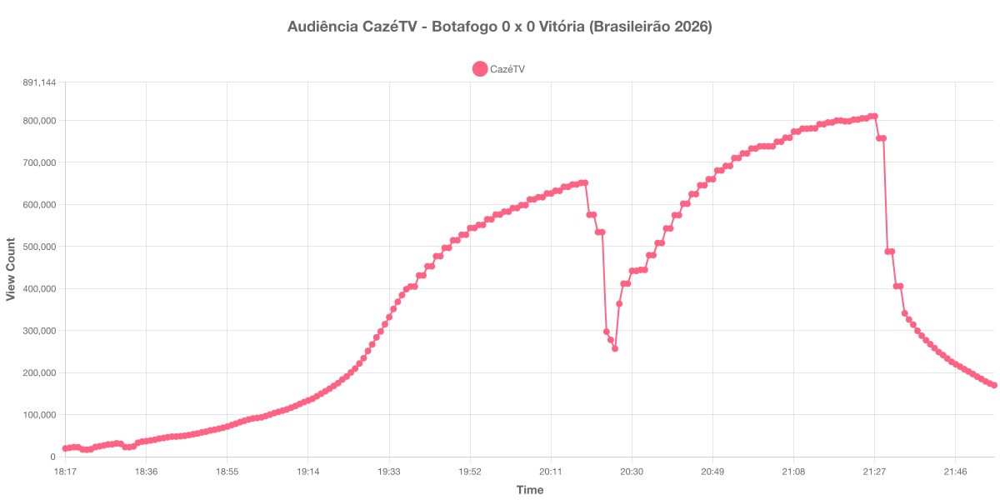

+++
date = 2026-07-26T19:20:00-03:00
draft = false
title = "Confira como foi a audiência de Botafogo X Vitória na CazéTV - 23-07-2026"
author = 'Instituto Cambacica de Audiência'
summary = "Veja como foi a audiência de um jogo sem gols do Brasileirão na CazéTV, com o pico registrado logo após o apito final"
tags = ['YouTube', 'Analytics', 'Audiência', 'CazeTV', 'Botafogo', 'Vitoria', 'Brasileirão']
categories = ['Audiência']
+++

Neste texto, vamos informar os resultados da audiência em tempo real obtidos pela CazéTV, durante a transmissão de Botafogo X Vitória, jogo atrasado da 4ª rodada do Brasileirão de 2026, disputado no Estádio Nilton Santos, no Rio de Janeiro, em 23/07/2026. A partida terminou em 0 a 0, com o Botafogo dominando as ações e esbarrando nas defesas do goleiro Lucas Arcanjo.

A audiência começou a ser medida às 23/07/2026 18:17:55 (Horário de Brasília), no início da live. Como a transmissão começou menos de duas horas antes do apito inicial e a medição foi encerrada antes de completar duas horas do apito final, o gráfico e os números abaixo utilizam o primeiro e o último registro disponíveis. Os principais pontos da audiência são (em aparelhos conectados):

* **Início da Medição (18:17:55): 19.530**
* **Início da partida (19:30:55): 283.883**
* **Final do primeiro tempo (20:17:55): 647.609**
* Durante o intervalo (20:26:55): 256.910
* **Início do segundo tempo (20:32:55): 444.504**
* Durante o segundo tempo (21:00:55): 738.520
* **Final da partida (21:22:55): 801.993**
* Dez minutos depois do final da partida (21:32:55): 405.698
* **Final da Medição (21:55:55): 169.914**

O pico de audiência foi às 21:26:55, logo após o apito final, com **810.130** aparelhos conectados simultâneos.

O intervalo desta partida produziu o vale mais profundo de todas as medições que fizemos nesta semana. A audiência caiu de 647.609 aparelhos conectados no apito que encerrou o primeiro tempo para 256.910 às 20:26:55 — uma perda de 60% em nove minutos — e o trecho mais acentuado se concentrou entre 20:22 e 20:24, quando o contador saiu de 534.307 para 297.405. A recuperação foi igualmente rápida: às 20:30, ainda antes do recomeço, a audiência já havia voltado a 442.099 aparelhos. Vale notar que o mesmo desenho, um "V" estreito e muito profundo, reaparece dois dias depois em Vasco X Mirassol, na mesma CazéTV: é um comportamento de intervalo bem mais brusco do que o que medimos nas transmissões da ge tv e do SBT Sports nesta semana.

Apesar do 0 a 0, o segundo tempo foi o trecho de maior audiência da transmissão, com crescimento contínuo até o apito final e o pico registrado quatro minutos depois dele. Em escala, o número fica bem abaixo do último jogo do Botafogo que medimos na CazéTV, [Botafogo X Santos, em 16/07/2026](/posts/2026-07-16-botafogo-x-santos-cazetv/), que teve pico de 1.387.598 aparelhos conectados — uma diferença que ajuda a lembrar que o adversário e o contexto da rodada pesam tanto quanto o mandante.

No gráfico a seguir, mostramos a evolução da audiência entre o horário do início da medição e o último registro coletado:

Para você verificar os metadados desta medição, você pode consultar o [repositório contendo o CSV com os dados e com os prints do minuto a minuto da medição](https://github.com/institutocambacica/audiencias_20_26_jul_2026).

---

*Para mais informações sobre nossa metodologia, visite nossa página [Sobre](/sobre).*
