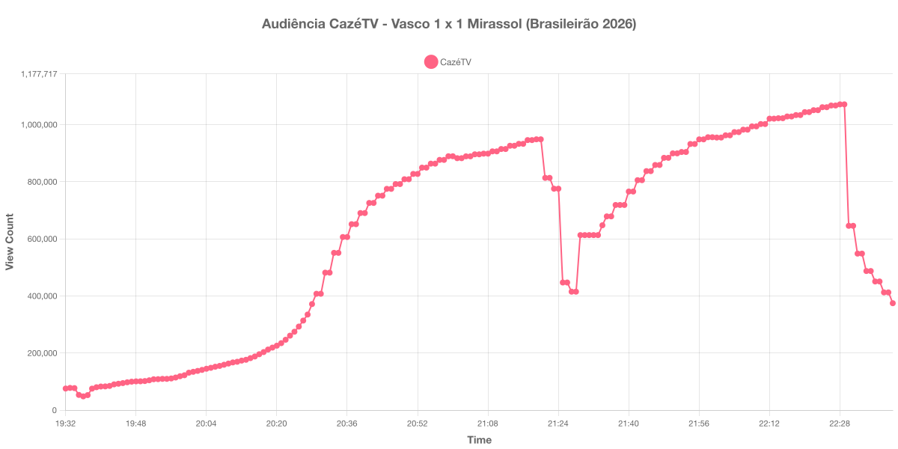

+++
date = 2026-07-26T19:30:00-03:00
draft = false
title = "Confira como foi a audiência de Vasco X Mirassol na CazéTV - 25-07-2026"
author = 'Instituto Cambacica de Audiência'
summary = "Veja como foi a audiência da 20ª rodada do Brasileirão na CazéTV, em um empate que manteve o Vasco na zona de rebaixamento"
tags = ['YouTube', 'Analytics', 'Audiência', 'CazeTV', 'Vasco', 'Mirassol', 'Brasileirão']
categories = ['Audiência']
campeonatos = ['Brasileirao 2026']
data_evento = 2026-07-25
+++

Neste texto, vamos informar os resultados da audiência em tempo real obtidos pela CazéTV, durante a transmissão de Vasco X Mirassol, válido pela 20ª rodada do Brasileirão de 2026, disputado em São Januário, no Rio de Janeiro, em 25/07/2026. A partida terminou em 1 a 1: Igor Formiga abriu o placar para o Mirassol no primeiro tempo e Andrés Gómez empatou para o Vasco na etapa final.

A audiência começou a ser medida às 25/07/2026 19:32:55 (Horário de Brasília), no início da live. Como a transmissão começou menos de duas horas antes do apito inicial e a medição foi encerrada antes de completar duas horas do apito final, o gráfico e os números abaixo utilizam o primeiro e o último registro disponíveis. Os principais pontos da audiência são (em aparelhos conectados):

* **Início da Medição (19:32:55): 75.502**
* **Início da partida (20:30:55): 407.333**
* Após o gol de Igor Formiga, aos 30 minutos do primeiro tempo (21:00:55): 888.954
* **Final do primeiro tempo (21:17:55): 945.552**
* Durante o intervalo (21:27:55): 414.676
* **Início do segundo tempo (21:32:55): 612.852**
* Após o gol de Andrés Gómez, aos 35 minutos do segundo tempo (22:07:55): 982.036
* **Final da partida (22:22:55): 1.050.330**
* **Final da Medição (22:40:55): 374.279**

O pico de audiência foi às 22:28:55, poucos minutos após o apito final, com **1.070.651** aparelhos conectados simultâneos.

A curva desta partida é a mais regular das cinco medições da semana: crescimento praticamente ininterrupto até o fim do primeiro tempo, vale no intervalo e retomada firme no segundo tempo, que ultrapassou a marca da etapa inicial e seguiu subindo até depois do apito final. O empate do Vasco aos 35 minutos do segundo tempo aparece nos dados como aceleração, e não como pico: a audiência ainda ganhou 88.615 aparelhos conectados entre o gol e o pico da medição.

O intervalo custou 56% da audiência — de 945.552 para 414.676 aparelhos conectados —, uma queda mais acentuada que a de São Paulo X Athletico-PR, três dias antes, e menos profunda que a de Botafogo X Vitória. Vale registrar que a coleta foi interrompida às 22:41, com a live ainda no ar, e que o último registro do arquivo não traz valor de audiência; por isso o último dado válido é o das 22:40:55.

No gráfico a seguir, mostramos a evolução da audiência entre o horário do início da medição e o último registro coletado:

Para você verificar os metadados desta medição, você pode consultar o [repositório contendo o CSV com os dados e com os prints do minuto a minuto da medição](https://github.com/institutocambacica/audiencias_20_26_jul_2026).

---

*Para mais informações sobre nossa metodologia, visite nossa página [Sobre](/sobre).*
