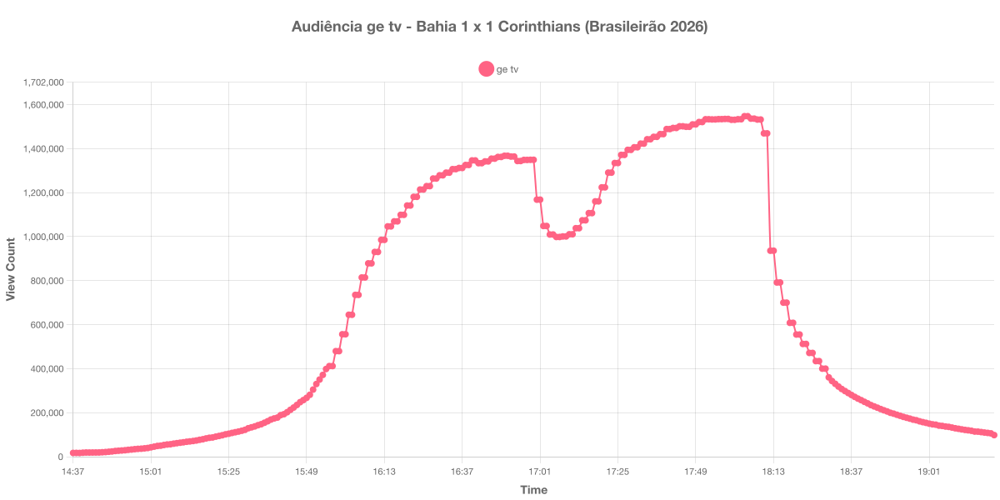

+++
date = 2026-07-26T19:40:00-03:00
draft = false
title = "Confira como foi a audiência de Bahia X Corinthians na ge tv - 26-07-2026"
author = 'Instituto Cambacica de Audiência'
summary = "Veja como foi a audiência da 20ª rodada do Brasileirão na ge tv, em um jogo marcado por confusão generalizada no intervalo"
tags = ['YouTube', 'Analytics', 'Audiência', 'GETV', 'Bahia', 'Corinthians', 'Brasileirão']
categories = ['Audiência']
+++

Neste texto, vamos informar os resultados da audiência em tempo real obtidos pela ge tv, durante a transmissão de Bahia X Corinthians, válido pela 20ª rodada do Brasileirão de 2026, disputado na Arena Fonte Nova, em Salvador, em 26/07/2026. A partida terminou em 1 a 1: Fabrizio Angileri abriu o placar para o Corinthians aos 7 minutos e David Duarte empatou para o Bahia aos 48 minutos do primeiro tempo, em cobrança de escanteio.

A audiência começou a ser medida às 26/07/2026 14:37:56 (Horário de Brasília), no início da live. Como a transmissão começou menos de duas horas antes do apito inicial e a coleta foi encerrada antes de completar duas horas do apito final, o gráfico e os números abaixo utilizam o primeiro e o último registro disponíveis. Os principais pontos da audiência são (em aparelhos conectados):

* **Início da Medição (14:37:56): 16.981**
* **Início da partida (16:00:55): 556.290**
* Após o gol de Angileri, aos 7 minutos do primeiro tempo (16:07:55): 814.352
* Após o gol de David Duarte, aos 48 minutos do primeiro tempo (16:48:55): 1.362.142
* **Final do primeiro tempo (16:50:55): 1.367.424**
* Durante o intervalo (17:06:55): 998.477
* **Início do segundo tempo (17:08:55): 1.000.923**
* Durante o segundo tempo (17:40:55): 1.488.936
* **Final da partida (18:08:55): 1.532.144**
* Doze minutos depois do final da partida (18:20:55): 555.181
* **Final da Medição (19:21:55): 98.101**

O pico de audiência foi às 18:04:55, nos minutos finais da partida, com **1.547.272** aparelhos conectados simultâneos.

Esta partida não seguiu a cronologia usual, e isso aparece com clareza na curva. O primeiro tempo teve 48 minutos, houve dois gols do Bahia anulados por impedimento pela tecnologia semiautomática e, logo depois do apito que encerrou a etapa inicial, uma confusão generalizada envolveu jogadores dos dois times. Por isso, os horários de recomeço e de encerramento da partida listados acima foram ancorados na própria curva de audiência — no fundo do vale do intervalo e no ponto em que o contador passa a cair de forma acentuada — e não na duração regulamentar dos tempos.

O efeito da confusão é visível: entre 16:50 e 16:59 a audiência ficou praticamente parada em torno de 1,35 milhão de aparelhos conectados, sem a queda imediata que normalmente marca o começo do intervalo, e só recuou a partir das 17:00, chegando ao ponto mais baixo às 17:06:55, com 998.477 aparelhos. A perda no intervalo foi de 27%, a menor das cinco medições desta semana. O segundo tempo recuperou tudo e mais: a audiência voltou a crescer de forma contínua e fechou como a maior que medimos na ge tv nesta semana, quase o dobro do pico de São Paulo X Athletico-PR, quatro dias antes, que ficou em 879.787 aparelhos conectados.

No gráfico a seguir, mostramos a evolução da audiência entre o horário do início da medição e o encerramento da live:

Para você verificar os metadados desta medição, você pode consultar o [repositório contendo o CSV com os dados e com os prints do minuto a minuto da medição](https://github.com/institutocambacica/audiencias_20_26_jul_2026).

---

*Para mais informações sobre nossa metodologia, visite nossa página [Sobre](/sobre).*
