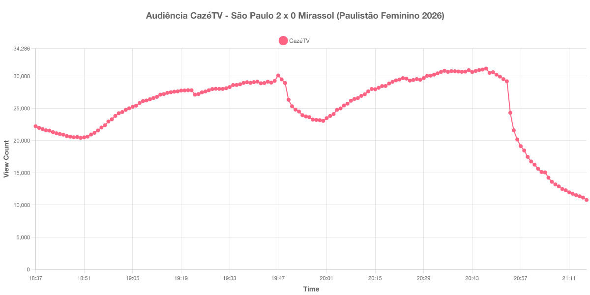

+++
date = 2026-08-01T09:00:00-03:00
draft = false
title = "Confira como foi a audiência de São Paulo X Mirassol na CazéTV - 27-07-2026"
author = 'Instituto Cambacica de Audiência'
summary = "Veja como foi a audiência da 5ª rodada do Paulistão Feminino na CazéTV, a primeira medição de futebol feminino que publicamos"
tags = ['YouTube', 'Analytics', 'Audiência', 'CazeTV', 'Sao Paulo', 'Mirassol', 'Paulistão Feminino']
categories = ['Audiência']
campeonatos = ['Paulistao Feminino 2026']
data_evento = 2026-07-27
+++

Neste texto, vamos informar os resultados da audiência em tempo real obtidos pela CazéTV, durante a transmissão de São Paulo X Mirassol, válido pela 5ª rodada do Campeonato Paulista Feminino de 2026, disputado no Estádio Municipal Prefeito Gabriel Marques da Silva, em Santana de Parnaíba, em 27/07/2026. A partida terminou em 2 a 0 para o São Paulo: Bia Menezes abriu o placar aos 47 minutos do primeiro tempo e Kesia Sena ampliou aos 43 minutos do segundo tempo.

A audiência começou a ser medida às 27/07/2026 18:37:55 (Horário de Brasília), com a transmissão já no ar. Como a coleta começou menos de duas horas antes do apito inicial, o gráfico e os números abaixo partem do primeiro registro disponível. Do outro lado da janela, a live foi encerrada por volta das 21:17 e os registros seguintes despencam para algumas dezenas de aparelhos: eles não são audiência, e por isso o recorte termina no último registro coletado com a transmissão no ar, às 21:16:55. Os principais pontos da audiência são (em aparelhos conectados):

* **Início da Medição (18:37:55): 22.218**
* **Início da partida (19:00:55): 23.815**
* Após o gol de Bia Menezes, aos 47 minutos do primeiro tempo (19:47:55): 30.093
* **Final do primeiro tempo (19:48:55): 29.489**
* Durante o intervalo (20:00:55): 23.053
* **Início do segundo tempo (20:02:55): 23.814**
* Após o gol de Kesia Sena, aos 43 minutos do segundo tempo (20:45:55): 30.940
* **Final da partida (20:52:55): 29.530**
* Dez minutos depois do final da partida (21:02:55): 15.631
* **Final da live (21:16:55): 10.784**

O pico de audiência foi às 20:47:55, nos minutos finais da partida, com **31.169** aparelhos conectados simultâneos.

Esta é a primeira medição de futebol feminino que publicamos, e o que primeiro salta aos olhos é a escala: o pico de 31.169 aparelhos conectados é mais de trinta vezes menor que o de [Vasco X Mirassol](/posts/2026-07-25-vasco-x-mirassol-cazetv/), dois dias antes, na mesma CazéTV, que chegou a 1.070.651. O desenho da curva, porém, é o mesmo dos jogos masculinos que medimos nesta semana — crescimento ao longo do primeiro tempo, vale no intervalo, retomada e pico no fim da partida —, apenas em outra ordem de grandeza. Vale registrar também que a medição pegou o fim da programação anterior: entre 18:37 e 18:50 a audiência ainda caía, chegando ao mínimo de 20.419 aparelhos, e só passou a subir a partir daí, na aproximação do apito inicial.

O intervalo custou 22% da audiência, de 29.489 para 23.053 aparelhos conectados, a queda mais suave de todas as medições que fizemos desde 21 de julho — bem distante dos 60% de [Botafogo X Vitória](/posts/2026-07-23-botafogo-x-vitoria-cazetv/) e dos 56% de Vasco X Mirassol, ambos na própria CazéTV. Os dois gols aparecem com nitidez na curva. O de Bia Menezes, nos acréscimos do primeiro tempo, produziu o único pico isolado do gráfico: a audiência saltou de 29.264 às 19:46:55 para 30.093 no minuto seguinte e recuou assim que o árbitro encerrou a etapa inicial. O de Kesia Sena, também no fim do tempo, veio no trecho de maior audiência da transmissão e foi seguido pelo pico da medição, dois minutos depois.

No gráfico a seguir, mostramos a evolução da audiência entre o primeiro registro da medição e o encerramento da live:

Para você verificar os metadados desta medição, você pode consultar o [repositório contendo o CSV com os dados e com os prints do minuto a minuto da medição](https://github.com/institutocambacica/audiencias_24_31_07_2026).

---

*Para mais informações sobre nossa metodologia, visite nossa página [Sobre](/sobre).*
