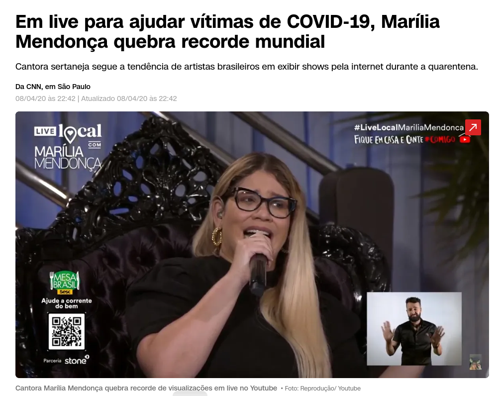
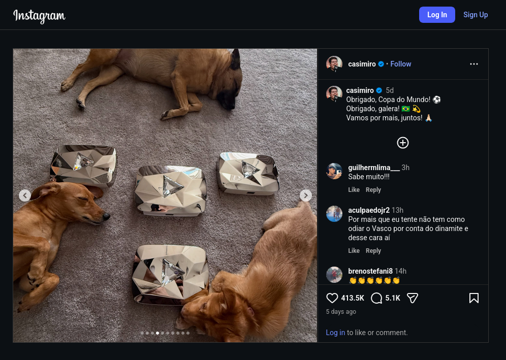

+++
date = 2026-07-27T08:40:00-03:00
draft = false
title = "Um resumo dos números da CazéTV na Copa do Mundo de 2026"
author = 'Instituto Cambacica de Audiência'
summary = "Um resumo dos números obtidos pela CazéTV durante a Copa do Mundo de 2026"
tags = ['YouTube', 'Analytics', 'Audiência', 'CazéTV', 'Copa do Mundo']
categories = ['Documento']
canais = ['CazeTV']
campeonatos = ['Copa do Mundo 2026']
data_evento = 2026-07-27
+++

Este artigo tem como intuito deixar registrado o que infelizmente acabei falhando em registrar. Como foi dito anteriormente [neste artigo](/posts/2026-07-13-nossas-sinceras-desculpas/), problemas pessoais acabaram desmotivando em seguir com esse trabalho, e após as quartas de final, com os números impressionantes obtidos pela CazéTV, o arrependimento acabou acometendo o mantenedor deste projeto, e por isso retomamos com o projeto, e conseguimos registrar o comportamento da audiência da live mais assistida da história - a [semifinal exclusiva da CazéTV entre França e Espanha](/posts/2026-07-14-franca-x-espanha-cazetv/).

Mas os números impressionantes não se resumem a apenas aos conquistados no dia 14/07, foram vários e vários recordes batidos durante os 39 dias de Copa do Mundo, e que continuaram sendo registrados mesmo com a eliminação precoce do selecionado nacional da Copa do Mundo diante da Noruega. Este artigo de documento tem como intuito sintetizar esses números desde bem antes que este projeto foi ao ar e que conseguiu a incrível proeza de ser a primeira empresa de comunicação a não ser detida pelo Grupo Globo (ex-Organizações Globo) a transmitir com exclusividade partidas da Copa do Mundo desde 1970, o evento mais nobre do jornalismo esportivo brasileiro.

Voltemos a Outubro de 2022, antes da Livemode decidir em iniciar um projeto (que seria efêmero) de transmissões esportivas com o streamer Casemiro Miguel, para usar os direitos digitais do Mundial do Catar que ninguém tinha se interessado (apenas a [ESPN comprou os direitos para obter os compactos de 10 minutos dos jogos](https://www.espn.com.br/futebol/copa-do-mundo/artigo/_/id/11244519/disney-adquire-direitos-star+-tera-compactos-todos-64-jogos-copa-do-mundo-fifa-qatar-2022%E2%84%A2), colocar sua narração e [disponibilizar no então streaming Star+](https://archive.is/4Vwub)), a live mais assistida simultaneamente no Youtube foi uma live-show (gênero popular durante a Pandemia de Covid-19) da cantora Marília Mendonça [atingiu 3,2 milhões de aparelhos simultâneos](https://www.cnnbrasil.com.br/pop/em-live-para-ajudar-vitimas-de-covid-19-marilia-mendonca-quebra-recorde-mundial/) ([arquivo](https://archive.is/cNQeE)) [^1]. 

O recorde de 08 de Abril de 2020, parecia inabalável e ficou reinando por quase 2 anos e meio, até 24 de Novembro de 2022, na estreia do Brasil na Copa do Catar, quando o canal do Casemiro atingiu a marca de 3,48 milhões de aparelhos conectados simultâneos naquele dia, como relatado por este [artigo da Veja](https://veja.abril.com.br/coluna/tela-plana/brasil-na-copa-casimiro-quebra-recorde-de-marilia-mendonca-em-live/)[^2].

A partir daí, Casemiro empilharia recorde atrás de recorde, onde seu ápice seria na eliminação do Brasil naquele torneio, diante da Croácia, em 09 de Dezembro de 2022. Naquela live, [Casemiro conseguiria bater a marca de 6,2 milhões de aparelhos simultâneos conectados](https://www.mktesportivo.com/2022/12/casimiro-bate-o-proprio-recorde-no-youtube-com-transmissao-de-brasil-x-croacia/)[^3], quase que dobrando o seu próprio recorde no início do mundial. Os números eram impressionantes, [mas ainda não faziam cócegas na Globo](https://natelinha.uol.com.br/copa-2022/2022/12/06/casimiro-bomba-na-copa-mas-esta-longe-de-incomodar-a-globo-190919.php)[^4].

A Copa encerraria sem nenhum novo recorde, mas o projeto então efêmero virou definitivo, e daí em diante seguriria uma sequência de eventos em que o projeto - agora batizado de CazéTV - viria a transmitir, alguns vindos de direitos pagos integralmente pelo Youtube (Paulistão e Brasileirão - jogos com mando da LFU/FFU), outros pagos em sociedade com Youtube (como a Copa do Mundo de Clubes de 2025) e outros pagos 100% pela Livemode (como diversos eventos de esportes olímpicos, o Panamericano de 2023 e os Jogos Olímpicos de Verão de 2024 e de Inverno de 2026). No dia da final da Copa do Mundo de Clubes de 2025, a CazéTV anunciaria a compra em consórcio do Youtube de todos os jogos daquele mundial - algo que nem a Globo teria, uma façanha inacreditável. Cazé começaria a Copa de 2026 com 28 milhões de inscritos (guarde bem esse número).

Contudo, Cazé antes deste mundial, não tinha mais o recorde de aparelhos conectados. Em 23 de Agosto de 2023, o pouso da [sonda indiana Chandrayaan-3](https://economictimes.indiatimes.com/news/science/chandrayaan-3-moon-landing-live-stream-sets-new-youtube-record-with-over-8-concurrent-million-viewers/articleshow/103676943.cms?from=mdr)[^5] atingiu a marca de [8,06 milhões de aparelhos simultâneos](https://www.deccanherald.com/india/worlds-most-viewed-live-stream-on-youtube-isro-chandrayaan-3-tops-the-list-with-806-million-views-2660659)[^6]. 

Contudo, não demorou tanto para que esse recorde fosse batido. No dia 13 de Junho, na estreia do Brasil na Copa, contra Marrocos, [o canal atingiu 12,3 milhões de aparelhos simultâneos](https://noticiasdatv.uol.com.br/noticia/televisao/com-transmissao-de-brasil-x-marrocos-cazetv-quebra-recorde-mundial-historico-152699)[^7], batendo o recorde de aparelhos simultâneos dos indianos e mais que dobrando o recorde atingido na Copa do Catar. Detalhe, que além da mesma Globo que estava transmitindo o jogo, o jogo também estava sendo transmitido no SBT com Galvão Bueno na narração.

Segundo o Notícias da TV, o ranking das lives mais vistas simultaneamente no Youtube após o dia 13/07 era:

1. Brasil x Marrocos, Copa do Mundo de 2026 – CazéTV: 12,2 milhões — 13/06/2026 (sábado, estreia pelo Grupo C, em Nova York/Nova Jersey)
2. Aterrissagem na Lua, em 2023 – ISRO: 8 milhões — 23/08/2023 (pouso da Chandrayaan-3 no polo sul lunar)
3. Brasil x Croácia, Copa do Mundo de 2022 – CazéTV: 6,1 milhões — 09/12/2022 (quartas de final, no Catar)
4. Boxe, março de 2026 – Ring Royale: 5,9 milhões — 15/03/2026 (primeira edição do Ring Royale, na Arena Monterrey, no México) 
5. Canadá x Bósnia, Copa do Mundo de 2026 – CazéTV: 5,8 milhões — 12/06/2026 (1ª rodada, em Toronto)
6. Flamengo x Bayern de Munique, Mundial de Clubes de 2025 – CazéTV: 5,5 milhões — 29/06/2025 (oitavas de final no Hard Rock Stadium, em Miami; Bayern 4 x 2) 
7. México x África do Sul, Copa do Mundo de 2026 – CazéTV: 5,3 milhões — 11/06/2026 (jogo de abertura, no Estádio Azteca) 
8. Brasil x Croácia, amistoso de 2026 – Ge TV: 5,3 milhões — 31/03/2026 (amistoso preparatório, maior audiência da ge tv no YouTube) 
9. Show alternativo do intervalo do Super Bowl 2026 – Turning Point USA: 5,3 milhões — 08/02/2026 (o "All-American Halftime Show", transmitido em paralelo ao show oficial de Bad Bunny no Super Bowl LX) 
10. Palmeiras x Chelsea, Mundial de Clubes de 2025 – CazéTV: 5,2 milhões — 04/07/2025 (quartas de final, na Filadélfia; Chelsea 2 x 1)

Bem, ao final da Copa, segundo o mesmo [Notícias da TV](https://noticiasdatv.uol.com.br/noticia/televisao/cazetv-termina-a-copa-com-29-das-30-lives-mais-vistas-do-youtube-no-mundo-todo-154297)[^8], pode se constatar que a CazéTV bateria o recorde dos indianos outras 27 VEZES. Após Argentina X Espanha na final da Copa, o ranking das 30 maiores audiências simultâneas em lives do Youtube ficou assim:

1. França x Espanha – 24,2 milhões — 14/07/2026 (semifinal)
2. Noruega x Inglaterra – 21,3 milhões — 11/07/2026 (quartas)
3. Brasil x Japão – 21,1 milhões — 29/06/2026 (16-avos)
4. Espanha x Argentina – 20,9 milhões — 19/07/2026 (final)
5. Inglaterra x Argentina – 20,1 milhões — 15/07/2026 (semifinal)
6. Espanha x Áustria – 19,8 milhões — 02/07/2026 (16-avos)
7. Brasil x Noruega – 18,5 milhões — 05/07/2026 (oitavas)
8. Brasil x Escócia – 18,5 milhões — 24/06/2026 (3ª rodada, Grupo C)
9. Canadá x Marrocos – 17,9 milhões — 04/07/2026 (oitavas)
10. Austrália x Egito – 17,8 milhões — 03/07/2026 (16-avos)
11. Brasil x Haiti – 16,2 milhões — 19/06/2026 (2ª rodada)
12. Argentina x Egito – 16 milhões — 07/07/2026 (oitavas)
13. Costa do Marfim x Noruega – 13,5 milhões — 30/06/2026 (16-avos)
14. Brasil x Marrocos – 12,3 milhões — 13/06/2026 (1ª rodada)
15. Portugal x Espanha – 12,2 milhões — 06/07/2026 (oitavas)
16. Argentina x Argélia – 11,5 milhões — 16/06/2026 (1ª rodada)
17. Argentina x Jordânia – 11,3 milhões — 27/06/2026 (3ª rodada)
18. Inglaterra x Congo – 11,2 milhões — 01/07/2026 (16-avos)
19. Portugal x Congo – 11 milhões — 17/06/2026 (1ª rodada)
20. França x Marrocos – 10,9 milhões — 09/07/2026 (quartas)
21. França x Inglaterra – 10,8 milhões — 18/07/2026 (disputa de 3º lugar)
22. África do Sul x Canadá – 10,1 milhões — 28/06/2026 (16-avos)
23. Portugal x Uzbequistão – 9,2 milhões — 23/06/2026 (2ª rodada)
24. Argentina x Áustria – 9 milhões — 22/06/2026 (2ª rodada)
25. Espanha x Bélgica – 9 milhões — 10/07/2026 (quartas)
26. Espanha x Arábia Saudita – 8,6 milhões — 21/06/2026 (2ª rodada)
27. México x Inglaterra – 8,1 milhões — 05/07/2026 (oitavas)
28. Espanha x Cabo Verde – 8,1 milhões — 15/06/2026 (1ª rodada)
29. Missão espacial indiana – 8 milhões — 23/08/2023 (pouso da Chandrayaan-3)
30. Holanda x Suécia – 7,7 milhões — 20/06/2026 (2ª rodada)

Além disso, a CazéTV, pela seus recordes atingiria no ínicio do mundial a [marca de 30 milhões de inscritos](https://x.com/CazeTVOficial/status/2066191204258365830), e no dia 12 de Julho a marca de 40 milhões de inscritos, rendendo ao projeto a [terceira e a quarta placa de diamante fornecida pelo Youtube](https://www.instagram.com/p/DbE0PDukdDn/?img_index=4), marca esta que foi comemorada pela LiveMode pela [doação de 70 toneladas de alimentos para comunidades carentes](https://www.poder360.com.br/poder-sportsmkt/cazetv-doa-40-toneladas-de-alimentos-apos-bater-40-mi-de-inscritos/)[^9].

O mais impressionante é que no meio deste torneio, a CazéTV enfrentou a maior crise da sua história, graças ao abuso de publicidade de casas de apostas (já presente em transmissões do Campeonato Brasileiro, de maneira piorada) e de divulgação de odds (na maioria das vezes furadas - causando um prejuízo ao apostador) usando narradores e comentaristas para dar um verniz de urgência e de certeza que iria acontecer. Isso causou muitas críticas e mudanças regulatórias (sendo que a maioria delas pífias - veja o tamanho das advertências dos comerciais novos), mas fez a empresa não parar de bater recordes atrás de recordes. Além disso, em muitos desses recordes, os streamings ficaram na frente dos canais abertos no Ibope, como o que aconteceu nos dias 11 e 14 de Julho, durante a transmissão das partidas exclusivas[^10].

Sendo assim, neste ano de 2026, vivemos um dos capítulos mais impressionantes da história da mídia esportiva. Marcos históricos, que dependendo de como as próximas licitações serão compostas, talvez nunca irão se repetir, mas mostrou a força do Youtube, e foi a afirmação definitiva do Youtube como a principal plataforma de transmissões esportivas, o que pode nortear as próximas negociações - e já estão norteando, com a La Liga e a Premier League (Campeonato Inglês) sendo transmitidos pela CazéTV e a partir desta temporada europeia que se inicia, a TNT Sports podendo transmitir com imagens jogos da próxima Liga dos Campeões. Ou seja, cada vez mais o nosso trabalho será importante para arquivar essas novas páginas na história. Sendo assim, se você gostou do nosso conteúdo, favorite o nosso site e acompanhe os nossos próximos passos.

Por fim, se você quiser mais detalhes sobre o que cada detentor de direitos fez nesta Copa de 2026, recomendamos que assista este vídeo do jornalista e especialista em mídia esportiva Allan Simon, que fez uma excelente pesquisa sobre esse assunto:

<iframe src="https://www.youtube.com/embed/sS-Ot-_lBwA" title="HISTÓRIA DA COPA DO MUNDO DE 2026 NA TV! (capítulo ESPECIAL)" frameborder="0" allow="accelerometer; clipboard-write; encrypted-media; gyroscope; picture-in-picture; web-share" referrerpolicy="strict-origin-when-cross-origin" allowfullscreen style="aspect-ratio: 16 / 9; width: 100% !important;"></iframe>

[^1]: Também pode ser consultado neste [artigo do jornal O Globo](https://oglobo.globo.com/cultura/musica/marilia-mendonca-em-numeros-live-recordista-14-bilhoes-de-cliques-no-youtube-mais-) - [arquivo](https://archive.is/mtzOA).
[^2]: Link arquivado pode ser verificado [aqui](https://archive.is/ycZE2)
[^3]: Link arquivado pode ser encontrado [aqui](https://archive.is/AxvOA)
[^4]: Link arquivado pode ser encontrado [aqui](https://archive.is/qZjrC)
[^5]: Link arquivado pode ser encontrado [aqui](2023-the-economic-times.png)
[^6]: Link arquivado pode ser encontrado [aqui](2023-deccan-herald.png)
[^7]: Link arquivado pode ser encontrado [aqui](https://archive.is/hDitI)
[^8]: Link arquivado pode ser encontrado [aqui](https://archive.is/IvwZQ)
[^9]: Link arquivado pode ser encontrado [aqui](https://archive.is/YHnmL)
[^10]: O IBOPE mede os streamings de maneira agrupada, não sendo possível identificar qual streaming está contribuindo mais na audiência.