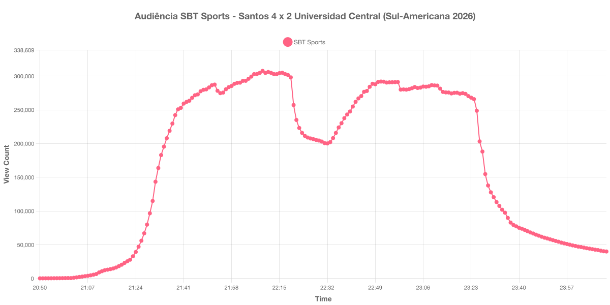

+++
date = 2026-08-01T09:10:00-03:00
draft = false
title = "Confira como foi a audiência de Santos X Universidad Central no SBT Sports - 28-07-2026"
author = 'Instituto Cambacica de Audiência'
summary = "Veja como foi a audiência do jogo de volta do playoff da Sul-Americana no SBT Sports, em uma virada que classificou o Santos"
tags = ['YouTube', 'Analytics', 'Audiência', 'SBT Sports', 'Santos', 'Universidad Central', 'Sul-Americana']
categories = ['Audiência']
+++

Neste texto, vamos informar os resultados da audiência em tempo real obtidos pelo SBT Sports, durante a transmissão de Santos X Universidad Central, jogo de volta do playoff da Copa Sul-Americana de 2026, que valia vaga nas oitavas de final, disputado no Estádio Urbano Caldeira, a Vila Belmiro, em Santos, em 28/07/2026. A partida terminou em 4 a 2 para o Santos, de virada: Samuel Sosa abriu o placar para o Universidad Central logo no primeiro minuto, Miguelito empatou aos 38 do primeiro tempo, Gabriel Barbosa e Gabriel Menino viraram aos 10 e aos 19 do segundo tempo, Mottes descontou aos 26 e Rony fechou a conta nos acréscimos. Com o 4 a 1 do jogo de ida, o Santos avançou com 8 a 3 no placar agregado.

A audiência começou a ser medida às 28/07/2026 20:50:55 (Horário de Brasília), no início da live. Como a transmissão começou menos de duas horas antes do apito inicial, o gráfico e os números abaixo partem do primeiro registro disponível. A live foi encerrada por volta das 00:12 e os registros seguintes ficam travados em um único aparelho conectado: eles não são audiência, e por isso o recorte termina no último registro coletado com a transmissão no ar, às 00:11:55. Os principais pontos da audiência são (em aparelhos conectados):

* **Início da Medição (20:50:55): 348**
* **Início da partida (21:30:55): 115.020**
* Após o gol de Samuel Sosa, do Universidad Central, logo no primeiro minuto (21:31:55): 143.526
* Após o gol de Miguelito, aos 38 minutos do primeiro tempo (22:08:55): 304.897
* **Final do primeiro tempo (22:19:55): 298.218**
* Durante o intervalo (22:26:55): 207.679
* **Início do segundo tempo (22:32:55): 200.310**
* Após o gol de Gabriel Barbosa, aos 10 minutos do segundo tempo (22:42:55): 261.936
* Após o gol de Gabriel Menino, aos 19 minutos do segundo tempo (22:51:55): 292.007
* Após o gol de Mottes, do Universidad Central, aos 26 minutos do segundo tempo (22:58:55): 280.070
* Após o gol de Rony, aos 46 minutos do segundo tempo (23:18:55): 275.465
* **Final da partida (23:22:55): 270.462**
* **Final da live (00:11:55): 40.131**

O pico de audiência foi às 22:09:55, um minuto depois do gol de empate de Miguelito, com **307.826** aparelhos conectados simultâneos.

O ponto mais chamativo desta medição é que o pico ficou no primeiro tempo, e não depois do intervalo: a retomada da etapa final parou em 292.007 aparelhos conectados às 22:51:55, cerca de 5% abaixo do máximo alcançado antes do intervalo. O mesmo já havia acontecido nas duas primeiras medições desta série, em [Universidad Central X Santos](/posts/2026-07-21-universidad-central-x-santos-sbt-sports/) e em [São Paulo X Athletico-PR](/posts/2026-07-22-sao-paulo-x-athletico-pr-getv/), mas nos três jogos seguintes, todos do Brasileirão, o segundo tempo foi o trecho de maior audiência. O gol de Mottes, que recolocou o Universidad Central no jogo aos 26 minutos do segundo tempo, aparece na curva como perda e não como ganho: o contador caiu de 291.310 às 22:57:55 para 280.070 no minuto seguinte, e a audiência não voltou a encostar no pico até o apito final.

O intervalo custou 33% da audiência, de 298.218 para 200.310 aparelhos conectados, praticamente o mesmo comportamento do jogo de ida, [Universidad Central X Santos](/posts/2026-07-21-universidad-central-x-santos-sbt-sports/), em 21 de julho, que perdeu 30% no mesmo trecho. A comparação entre os dois jogos do confronto é o dado mais relevante aqui: o pico da ida, na Venezuela, foi de 211.795 aparelhos conectados; o da volta, na Vila Belmiro, chegou a 307.826 — um crescimento de 45% para a mesma emissora, o mesmo confronto e uma semana de diferença. Vale registrar ainda que a coleta seguiu rodando por horas depois do fim da live, e que a última linha do arquivo, às 06:20:47, não traz valor de audiência.

No gráfico a seguir, mostramos a evolução da audiência entre o início da medição e o encerramento da live:

Para você verificar os metadados desta medição, você pode consultar o [repositório contendo o CSV com os dados e com os prints do minuto a minuto da medição](https://github.com/institutocambacica/audiencias_24_31_07_2026).

---

*Para mais informações sobre nossa metodologia, visite nossa página [Sobre](/sobre).*
