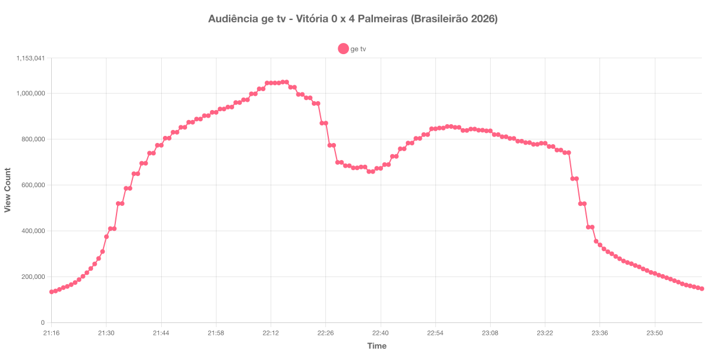

+++
date = 2026-08-01T09:20:00-03:00
draft = false
title = "Confira como foi a audiência de Vitória X Palmeiras na ge tv - 29-07-2026"
author = 'Instituto Cambacica de Audiência'
summary = "Veja como foi a audiência da 21ª rodada do Brasileirão na ge tv, em uma goleada encaminhada ainda no primeiro tempo"
tags = ['YouTube', 'Analytics', 'Audiência', 'GETV', 'Vitoria', 'Palmeiras', 'Brasileirão']
categories = ['Audiência']
canais = ['GETV']
campeonatos = ['Brasileirao 2026']
data_evento = 2026-07-29
+++

Neste texto, vamos informar os resultados da audiência em tempo real obtidos pela ge tv, durante a transmissão de Vitória X Palmeiras, válido pela 21ª rodada do Brasileirão de 2026, disputado no Barradão, em Salvador, em 29/07/2026. A partida terminou em 4 a 0 para o Palmeiras: Maurício abriu o placar aos 46 minutos do primeiro tempo, Fabiano marcou contra aos 50 do primeiro tempo, e Jhon Arias e Ramón Sosa ampliaram aos 24 e aos 38 do segundo tempo. O Vitória terminou a etapa inicial com dois jogadores a menos, após as expulsões de Cacá, aos 37, e de Luan Cândido, aos 39 minutos.

A audiência começou a ser medida às 29/07/2026 21:16:55 (Horário de Brasília), no início da live. A transmissão começou menos de duas horas antes do apito inicial e a coleta foi encerrada às 00:02:55, com a live ainda no ar e 147.069 aparelhos conectados: por isso o gráfico e os números abaixo utilizam o primeiro e o último registro disponíveis, sem completar as duas horas posteriores ao apito final. Os principais pontos da audiência são (em aparelhos conectados):

* **Início da Medição (21:16:55): 133.276**
* **Início da partida (21:30:55): 373.669**
* Após a expulsão de Cacá, aos 37 minutos do primeiro tempo (22:07:55): 996.842
* Após a expulsão de Luan Cândido, aos 39 minutos do primeiro tempo (22:09:55): 1.018.574
* Após o gol de Maurício, aos 46 minutos do primeiro tempo (22:16:55): 1.048.219
* Após o gol contra de Fabiano, aos 50 minutos do primeiro tempo (22:20:55): 994.219
* **Final do primeiro tempo (22:22:55): 979.357**
* Durante o intervalo (22:37:55): 657.799
* **Início do segundo tempo (22:39:55): 671.844**
* Após o gol de Jhon Arias, aos 24 minutos do segundo tempo (23:01:55): 837.203
* Após o gol de Ramón Sosa, aos 38 minutos do segundo tempo (23:15:55): 790.336
* **Final da partida (23:27:55): 740.414**
* **Final da Medição (00:02:55): 147.069**

O pico de audiência foi às 22:15:55, no fim do primeiro tempo e nos instantes que antecederam o gol de Maurício, com **1.048.219** aparelhos conectados simultâneos.

Assim como em [Bahia X Corinthians](/posts/2026-07-26-bahia-x-corinthians-getv/), três dias antes, esta partida não seguiu a cronologia usual: o primeiro tempo se estendeu até os 50 minutos, por causa das duas expulsões e das revisões no árbitro de vídeo. Por isso os horários de encerramento da etapa inicial, de recomeço e de apito final listados acima foram ancorados na própria curva de audiência — no ponto em que o contador começa a cair, no fundo do vale do intervalo e no ponto em que a queda volta a se acentuar — e não na duração regulamentar dos tempos.

O que a curva mostra é que a goleada não construiu audiência: ela a dispersou. O máximo da transmissão foi registrado às 22:15:55, com o jogo ainda em 0 a 0 e o Vitória já com dois a menos; a partir do gol de Maurício, o contador nunca mais voltou àquele patamar. O segundo tempo se recuperou até 854.483 aparelhos conectados às 22:57:55, 18% abaixo do pico, e depois disso caiu de forma contínua, mesmo com os dois gols do Palmeiras — quando Ramón Sosa fez o quarto, aos 38 minutos, a audiência já havia recuado para 790.336. O intervalo, esse sim, se comportou como o esperado: custou 33% da audiência, de 979.357 para 657.799 aparelhos conectados, uma perda maior que a de Bahia X Corinthians, que foi de 27%, e bem menor que os 60% de [Botafogo X Vitória](/posts/2026-07-23-botafogo-x-vitoria-cazetv/) na CazéTV.

No gráfico a seguir, mostramos a evolução da audiência entre o início da medição e o último registro coletado:

Para você verificar os metadados desta medição, você pode consultar o [repositório contendo o CSV com os dados e com os prints do minuto a minuto da medição](https://github.com/institutocambacica/audiencias_24_31_07_2026).

---

*Para mais informações sobre nossa metodologia, visite nossa página [Sobre](/sobre).*
