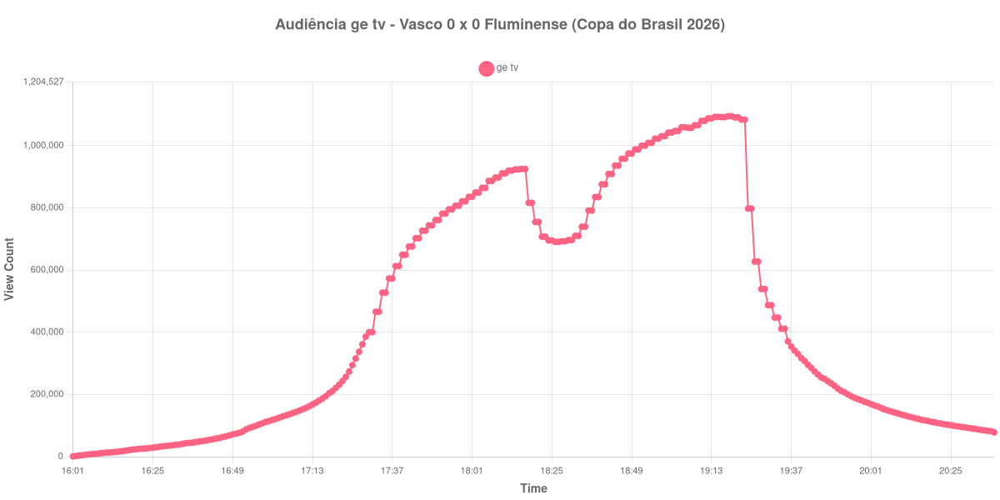

+++
date = 2026-08-07T09:00:00-03:00
draft = false
title = "Confira como foi a audiência de Vasco X Fluminense na ge tv - 01-08-2026"
author = 'Instituto Cambacica de Audiência'
summary = "Veja como foi a audiência da ida das oitavas da Copa do Brasil na ge tv, em um clássico sem gols que mesmo assim passou de um milhão de aparelhos conectados"
tags = ['YouTube', 'Analytics', 'Audiência', 'GETV', 'Vasco', 'Fluminense', 'Copa do Brasil']
categories = ['Audiência']
canais = ['GETV']
campeonatos = ['Copa do Brasil 2026']
data_evento = 2026-08-01
+++

Neste texto, vamos informar os resultados da audiência em tempo real obtidos pela ge tv, durante a transmissão de Vasco X Fluminense, jogo de ida das oitavas de final da Copa do Brasil de 2026, disputado no Maracanã, no Rio de Janeiro, em 01/08/2026. O clássico terminou em 0 a 0, sem gols e sem expulsões, diante de 36.608 torcedores, e deixou a decisão da vaga para o jogo de volta, no mesmo estádio.

A audiência começou a ser medida às 01/08/2026 16:01:55 (Horário de Brasília), no minuto em que a live entrou no ar. A coleta havia começado antes, às 15:11:55, mas até as 16:00:55 o contador do YouTube ainda exibia o número de pessoas aguardando a transmissão, e não de espectadores: esses registros não são audiência e ficaram de fora do recorte, que por isso não completa as duas horas anteriores ao apito inicial. Do outro lado da janela, a live foi encerrada logo depois das 20:38:55 e os registros seguintes despencam para poucas dezenas de aparelhos, de modo que o gráfico termina no último dado coletado com a transmissão no ar. Os principais pontos da audiência são (em aparelhos conectados):

* **Início da Medição (16:01:55): 898**
* **Início da partida (17:30:55): 400.300**
* Durante o primeiro tempo (18:00:55): 835.769
* **Final do primeiro tempo (18:17:55): 925.298**
* Durante o intervalo (18:26:55): 690.987
* **Início do segundo tempo (18:32:55): 710.199**
* Durante o segundo tempo (19:00:55): 1.042.321
* **Final da partida (19:22:55): 1.083.874**
* **Final da Medição (20:38:55): 78.118**

O pico de audiência foi às 19:18:55, nos minutos finais da partida, com **1.095.024** aparelhos conectados simultâneos.

O dado mais interessante desta medição é que um clássico sem gols sustentou audiência crescente do começo ao fim. A curva sobe de forma praticamente contínua ao longo dos 90 minutos, e o máximo aparece justamente no trecho final, quando o placar seguia zerado e a vaga se encaminhava para o jogo de volta. Não houve gol, expulsão ou lance capaz de produzir um pico isolado: o que a transmissão mostra é a soma lenta de espectadores que foram chegando, típica de um jogo eliminatório em aberto.

O intervalo custou 25% da audiência, de 925.298 para 690.987 aparelhos conectados. É uma perda menor que a das outras medições que fizemos nesta série de Copa do Brasil, e bem menor que os 60% que registramos em [Botafogo X Vitória](/posts/2026-07-23-botafogo-x-vitoria-cazetv/) na CazéTV. Com 1.095.024 aparelhos no pico, esta transmissão superou a de [Vitória X Palmeiras](/posts/2026-07-29-vitoria-x-palmeiras-getv/), três dias antes, no mesmo canal, que ficou em 1.048.219, mas segue distante do 1.547.272 de [Bahia X Corinthians](/posts/2026-07-26-bahia-x-corinthians-getv/), em 26 de julho, a maior audiência que medimos na ge tv em 2026.

No gráfico a seguir, mostramos a evolução da audiência entre o início da live e o último registro coletado com a transmissão no ar:

Para você verificar os metadados desta medição, você pode consultar o [repositório contendo o CSV com os dados e com os prints do minuto a minuto da medição](https://github.com/institutocambacica/audiencias_01_06_08_2026).

---

*Para mais informações sobre nossa metodologia, visite nossa página [Sobre](/sobre).*
