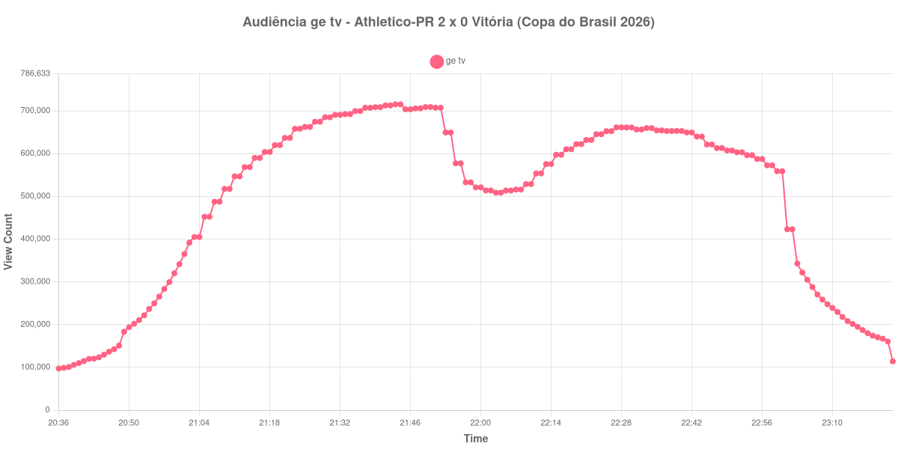

+++
date = 2026-08-07T09:20:00-03:00
draft = false
title = "Confira como foi a audiência de Athletico-PR X Vitória na ge tv - 03-08-2026"
author = 'Instituto Cambacica de Audiência'
summary = "Veja como foi a audiência da ida das oitavas da Copa do Brasil na ge tv, na única medição desta série em que o pico ficou no primeiro tempo"
tags = ['YouTube', 'Analytics', 'Audiência', 'GETV', 'Athletico-PR', 'Vitoria', 'Copa do Brasil']
categories = ['Audiência']
+++

Neste texto, vamos informar os resultados da audiência em tempo real obtidos pela ge tv, durante a transmissão de Athletico-PR X Vitória, jogo de ida das oitavas de final da Copa do Brasil de 2026, disputado na Arena da Baixada, em Curitiba, em 03/08/2026. A partida terminou em 2 a 0 para o Athletico-PR: João Cruz abriu o placar aos 9 minutos do primeiro tempo e Dudu Kogitzki ampliou aos 33 minutos do segundo tempo, depois de o Vitória ficar com um jogador a menos, com a expulsão de Emmanuel Martínez, por acúmulo de cartões amarelos, aos 22 minutos da etapa final. O público foi de 23.824 torcedores.

A audiência começou a ser medida às 03/08/2026 20:36:55 (Horário de Brasília), com a transmissão já no ar. Como a coleta começou menos de duas horas antes do apito inicial, o gráfico e os números abaixo partem do primeiro registro disponível. Na outra ponta, a coleta prosseguiu por quase dez horas depois do encerramento da live: entre 23:22:55 e 23:23:55 o contador do YouTube cai de 113.940 para 6.107, chega a valores de um dígito poucos minutos depois e deixa de refletir audiência. Descartamos esses registros — 597 das 764 linhas do arquivo — e encerramos a janela no último dado válido, às 23:22:55. Os principais pontos da audiência são (em aparelhos conectados):

* **Início da Medição (20:36:55): 97.294**
* **Início da partida (21:00:55): 341.251**
* Após o gol de João Cruz, aos 9 minutos do primeiro tempo (21:09:55): 517.386
* **Final do primeiro tempo (21:52:55): 707.278**
* Durante o intervalo (22:03:55): 508.597
* **Início do segundo tempo (22:07:55): 515.876**
* Após a expulsão de Emmanuel Martínez, aos 22 minutos do segundo tempo (22:29:55): 661.082
* Após o gol de Dudu Kogitzki, aos 33 minutos do segundo tempo (22:40:55): 652.881
* **Final da partida (23:00:55): 558.652**
* **Final da live (23:22:55): 113.940**

O pico de audiência foi às 21:43:55, ainda durante o primeiro tempo, com **715.120** aparelhos conectados simultâneos.

Esta é a única das cinco medições desta série em que o máximo ficou antes do intervalo, e a curva explica por quê. O Athletico-PR abriu o placar aos 9 minutos e administrou a vantagem: a audiência subiu até 715.120 aparelhos conectados no fim do primeiro tempo e, depois do intervalo, recuperou-se apenas até 661.304, às 22:27:55 — 8% abaixo do pico. A partir daí caiu de forma contínua, mesmo com a expulsão de Emmanuel Martínez e com o segundo gol do Furacão. Quando Dudu Kogitzki ampliou, aos 33 minutos do segundo tempo, o contador já havia recuado para 652.881, e a queda seguiu até o apito final. Vale registrar que os horários de fim do primeiro tempo, de recomeço e de apito final listados acima foram ancorados na própria curva, porque a partida se estendeu bem além da duração regulamentar dos tempos.

O intervalo custou 28% da audiência, de 707.278 para 508.597 aparelhos conectados. Este foi também o menor pico entre as quatro transmissões de Copa do Brasil que medimos na semana, cerca de dois terços do registrado no clássico carioca de dois dias antes, [Vasco X Fluminense](/posts/2026-08-01-vasco-x-fluminense-getv/), que chegou a 1.095.024. Um detalhe operacional merece nota: nesta mesma noite a ge tv manteve duas lives simultâneas no ar, esta e a de [Flamengo X Corinthians](/posts/2026-08-03-flamengo-x-corinthians-feminino-getv/), pelo Brasileirão Feminino, que só foi encerrada às 20:48 — as duas transmissões dividiram o público do canal entre 19:30 e 20:48.

No gráfico a seguir, mostramos a evolução da audiência entre o primeiro registro da medição e o encerramento da live:

Para você verificar os metadados desta medição, você pode consultar o [repositório contendo o CSV com os dados e com os prints do minuto a minuto da medição](https://github.com/institutocambacica/audiencias_01_06_08_2026).

---

*Para mais informações sobre nossa metodologia, visite nossa página [Sobre](/sobre).*
