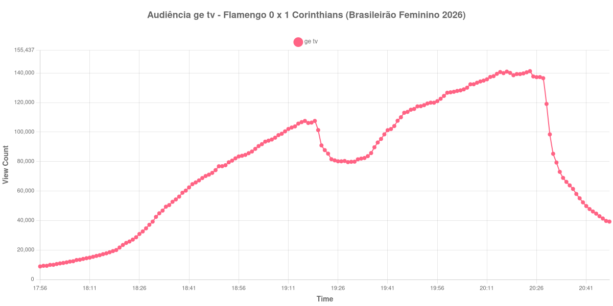

+++
date = 2026-08-07T09:10:00-03:00
draft = false
title = "Confira como foi a audiência de Flamengo X Corinthians na ge tv - 03-08-2026"
author = 'Instituto Cambacica de Audiência'
summary = "Veja como foi a audiência da 14ª rodada do Brasileirão Feminino na ge tv, na vitória que devolveu a liderança ao Corinthians"
tags = ['YouTube', 'Analytics', 'Audiência', 'GETV', 'Flamengo', 'Corinthians', 'Brasileirão Feminino']
categories = ['Audiência']
canais = ['GETV']
campeonatos = ['Brasileirao Feminino 2026']
data_evento = 2026-08-03
+++

Neste texto, vamos informar os resultados da audiência em tempo real obtidos pela ge tv, durante a transmissão de Flamengo X Corinthians, válido pela 14ª rodada do Campeonato Brasileiro Feminino de 2026, disputado no Estádio Luso-Brasileiro, no Rio de Janeiro, em 03/08/2026. A partida terminou em 1 a 0 para o Corinthians: Jhonson marcou aos 11 minutos do primeiro tempo, após passe de Belén Aquino. O Timão ainda terminou o jogo com uma jogadora a menos, com a expulsão de Dayana Rodríguez aos 20 minutos do segundo tempo, e o resultado devolveu a liderança do campeonato à equipe paulista.

A audiência começou a ser medida às 03/08/2026 17:56:55 (Horário de Brasília), com a transmissão já no ar. Como a coleta começou menos de duas horas antes do apito inicial, o gráfico e os números abaixo partem do primeiro registro disponível. Do outro lado da janela, a live foi encerrada logo depois das 20:48:55 e os registros seguintes despencam para poucas dezenas de aparelhos: eles não são audiência, e por isso o recorte termina no último dado coletado com a transmissão no ar. Os principais pontos da audiência são (em aparelhos conectados):

* **Início da Medição (17:56:55): 8.850**
* **Início da partida (18:30:55): 39.227**
* Após o gol de Jhonson, do Corinthians, aos 11 minutos do primeiro tempo (18:41:55): 62.444
* **Final do primeiro tempo (19:19:55): 107.541**
* Durante o intervalo (19:29:55): 79.584
* **Início do segundo tempo (19:34:55): 82.379**
* Após a expulsão de Dayana Rodríguez, do Corinthians, aos 20 minutos do segundo tempo (19:54:55): 119.917
* **Final da partida (20:28:55): 136.512**
* **Final da live (20:48:55): 39.247**

O pico de audiência foi às 20:24:55, nos minutos finais da partida, com **141.306** aparelhos conectados simultâneos.

Esta é a segunda medição de futebol feminino que publicamos, depois de [São Paulo X Mirassol](/posts/2026-07-27-sao-paulo-x-mirassol-feminino-cazetv/), pelo Paulistão, em 27 de julho, e a primeira em um jogo do Brasileirão. A comparação mais direta é com as outras quatro transmissões que medimos nesta semana, todas no mesmo canal e lidas do mesmo contador: o pico de 141.306 aparelhos conectados é cerca de um oitavo do que a ge tv registrou nos clássicos da Copa do Brasil dos mesmos dias. Ainda assim, é quatro vezes e meia o pico do jogo do Paulistão Feminino, que ficou em 31.169.

O desenho da curva é o mesmo dos jogos masculinos: crescimento contínuo no primeiro tempo, vale no intervalo e retomada até o pico no fim da partida. O intervalo custou 26% da audiência, de 107.541 para 79.584 aparelhos conectados. Nem o gol nem a expulsão produziram salto visível no contador — o gol de Jhonson saiu aos 11 minutos, quando a transmissão ainda estava na fase de crescimento inicial, e a expulsão de Dayana Rodríguez, no segundo tempo, apenas acompanha a subida que já estava em curso. O que sustenta a audiência aqui é o jogo em si, com o Flamengo pressionando com uma jogadora a mais atrás do empate: a curva só passa a cair depois do apito final.

No gráfico a seguir, mostramos a evolução da audiência entre o primeiro registro da medição e o encerramento da live:

Para você verificar os metadados desta medição, você pode consultar o [repositório contendo o CSV com os dados e com os prints do minuto a minuto da medição](https://github.com/institutocambacica/audiencias_01_06_08_2026).

---

*Para mais informações sobre nossa metodologia, visite nossa página [Sobre](/sobre).*
