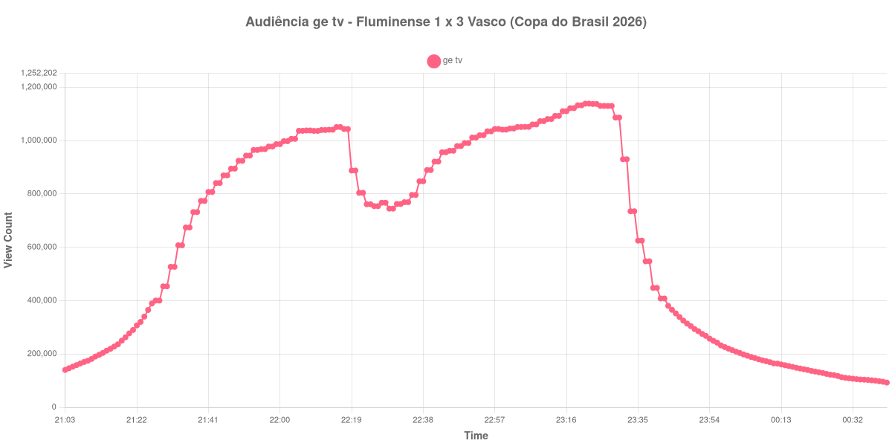

+++
date = 2026-08-07T09:30:00-03:00
draft = false
title = "Confira como foi a audiência de Fluminense X Vasco na ge tv - 05-08-2026"
author = 'Instituto Cambacica de Audiência'
summary = "Veja como foi a audiência da volta das oitavas da Copa do Brasil na ge tv, na maior medição que fizemos nesta série"
tags = ['YouTube', 'Analytics', 'Audiência', 'GETV', 'Fluminense', 'Vasco', 'Copa do Brasil']
categories = ['Audiência']
+++

Neste texto, vamos informar os resultados da audiência em tempo real obtidos pela ge tv, durante a transmissão de Fluminense X Vasco, jogo de volta das oitavas de final da Copa do Brasil de 2026, disputado no Maracanã, no Rio de Janeiro, em 05/08/2026. A partida terminou em 3 a 1 para o Vasco: Brenner, ex-jogador do Fluminense, marcou aos 33 minutos do primeiro tempo e aos 6 do segundo, Martinelli descontou aos 31 minutos da etapa final e Puma Rodríguez fechou a conta nos acréscimos. Como a ida, no mesmo estádio, havia terminado em 0 a 0, o Vasco avançou às quartas com 3 a 1 no agregado, diante de 48.794 torcedores.

A audiência começou a ser medida às 05/08/2026 21:03:55 (Horário de Brasília), com a transmissão já no ar. Como a coleta começou menos de duas horas antes do apito inicial, o gráfico e os números abaixo partem do primeiro registro disponível — a linha imediatamente anterior, às 21:02:55, ficou sem valor por falha de leitura na primeira carga da página, e o print correspondente mostra 135.252 aparelhos conectados. Do outro lado da janela, a live foi encerrada logo depois das 00:41:55 e os registros seguintes despencam para poucas dezenas de aparelhos, de modo que o recorte termina no último dado coletado com a transmissão no ar. Os principais pontos da audiência são (em aparelhos conectados):

* **Início da Medição (21:03:55): 140.326**
* **Início da partida (21:30:55): 453.521**
* Após o gol de Brenner, aos 33 minutos do primeiro tempo (22:03:55): 1.006.464
* **Final do primeiro tempo (22:17:55): 1.043.327**
* Durante o intervalo (22:29:55): 744.870
* **Início do segundo tempo (22:32:55): 762.336**
* Após o segundo gol de Brenner, aos 6 minutos do segundo tempo (22:38:55): 847.449
* Após o gol de Martinelli, do Fluminense, aos 31 minutos do segundo tempo (23:03:55): 1.050.810
* Após o gol de Puma Rodríguez, nos acréscimos (23:26:55): 1.130.015
* **Final da partida (23:28:55): 1.129.700**
* **Final da live (00:41:55): 92.952**

O pico de audiência foi às 23:21:55, nos minutos finais da partida, com **1.138.365** aparelhos conectados simultâneos.

Esta foi a maior audiência das cinco medições que fizemos entre 1º e 6 de agosto, e o desenho da curva é o de um jogo que ficou em aberto até o fim. O máximo não aparece depois de nenhum dos gols do Vasco, mas às 23:21:55, com o placar em 2 a 1 e o Fluminense pressionando atrás do empate que levaria a decisão aos pênaltis. O gol de Puma Rodríguez, nos acréscimos, veio quando a audiência já começava a recuar, e o contador registrou 1.130.015 aparelhos logo depois — abaixo, portanto, do pico alcançado cinco minutos antes. O de Martinelli, que recolocara o Tricolor no jogo aos 31 minutos do segundo tempo, é o único que aparece na curva como ganho claro: a partir dele a audiência subiu de forma contínua até o pico.

O intervalo custou 29% da audiência, de 1.043.327 para 744.870 aparelhos conectados, a maior perda proporcional das cinco medições desta série. A comparação com o jogo de ida é o dado mais relevante aqui: [Vasco X Fluminense](/posts/2026-08-01-vasco-x-fluminense-getv/), quatro dias antes e no mesmo estádio, teve pico de 1.095.024 aparelhos conectados, e a volta chegou a 1.138.365 — um crescimento de 4% para o mesmo confronto, na mesma emissora, com a vaga em jogo. Foi também a segunda maior audiência que medimos na ge tv em 2026, atrás apenas do 1.547.272 de [Bahia X Corinthians](/posts/2026-07-26-bahia-x-corinthians-getv/), em 26 de julho — o canal já registrou marcas bem maiores, como os 3.206.213 aparelhos conectados de [Corinthians X Vasco](/posts/2025-12-17-corinthians-x-vasco-getv/), pela ida da final da Copa do Brasil de 2025.

No gráfico a seguir, mostramos a evolução da audiência entre o primeiro registro da medição e o encerramento da live:

Para você verificar os metadados desta medição, você pode consultar o [repositório contendo o CSV com os dados e com os prints do minuto a minuto da medição](https://github.com/institutocambacica/audiencias_01_06_08_2026).

---

*Para mais informações sobre nossa metodologia, visite nossa página [Sobre](/sobre).*
