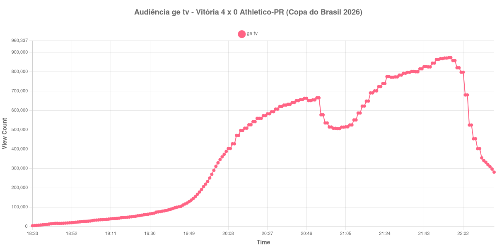

+++
date = 2026-08-07T09:40:00-03:00
draft = false
title = "Confira como foi a audiência de Vitória X Athletico-PR na ge tv - 06-08-2026"
author = 'Instituto Cambacica de Audiência'
summary = "Veja como foi a audiência da volta das oitavas da Copa do Brasil na ge tv, na goleada que virou o confronto no Barradão"
tags = ['YouTube', 'Analytics', 'Audiência', 'GETV', 'Vitoria', 'Athletico-PR', 'Copa do Brasil']
categories = ['Audiência']
+++

Neste texto, vamos informar os resultados da audiência em tempo real obtidos pela ge tv, durante a transmissão de Vitória X Athletico-PR, jogo de volta das oitavas de final da Copa do Brasil de 2026, disputado no Barradão, em Salvador, em 06/08/2026. A partida terminou em 4 a 0 para o Vitória: Renê marcou aos 10 minutos do primeiro tempo e aos 14 do segundo, Erick ampliou aos 49 minutos da etapa inicial e Marinho fechou a conta nos acréscimos. Como havia perdido a ida por 2 a 0, o Vitória reverteu a desvantagem e avançou às quartas com 4 a 2 no agregado.

A audiência começou a ser medida às 06/08/2026 18:33:55 (Horário de Brasília), com a transmissão já no ar. Como a coleta começou menos de duas horas antes do apito inicial, o gráfico e os números abaixo partem do primeiro registro disponível. Esta é a única das cinco medições desta série encerrada com a live ainda no ar: o último valor coletado, às 22:17:55, é audiência real do pós-jogo, e não o fim da transmissão. Por isso a janela também não completa as duas horas posteriores ao apito final. Os principais pontos da audiência são (em aparelhos conectados):

* **Início da Medição (18:33:55): 4.094**
* **Início da partida (20:00:55): 269.997**
* Após o gol de Renê, aos 10 minutos do primeiro tempo (20:10:55): 427.645
* Após o gol de Erick, aos 49 minutos do primeiro tempo (20:49:55): 654.540
* **Final do primeiro tempo (20:52:55): 665.261**
* Durante o intervalo (21:01:55): 505.960
* **Início do segundo tempo (21:07:55): 525.064**
* Após o segundo gol de Renê, aos 14 minutos do segundo tempo (21:21:55): 723.495
* Após o gol de Marinho, nos acréscimos (21:54:55): 870.990
* **Final da partida (21:56:55): 873.033**
* **Final da Medição (22:17:55): 281.112**

O pico de audiência foi às 21:55:55, no apito final, com **873.033** aparelhos conectados simultâneos.

Ao contrário do que vimos em [Vitória X Palmeiras](/posts/2026-07-29-vitoria-x-palmeiras-getv/), em 29 de julho, quando a goleada dispersou a audiência, aqui a vantagem construiu público. A curva sobe sem interrupção durante todo o segundo tempo, de 505.960 aparelhos conectados no fundo do intervalo até o máximo no apito final, e cada gol do Vitória aparece como degrau: 723.495 depois do segundo de Renê, 870.990 depois do de Marinho. A diferença entre os dois jogos é o que estava em disputa — no Barradão a goleada não decidia apenas o placar, mas a classificação, já que o Vitória precisava de três gols de diferença para avançar.

O intervalo custou 24% da audiência, de 665.261 para 505.960 aparelhos conectados, a menor perda proporcional das cinco medições desta série. Assim como no clássico carioca, a volta rendeu mais que a ida: [Athletico-PR X Vitória](/posts/2026-08-03-athletico-pr-x-vitoria-getv/), em 3 de agosto, teve pico de 715.120 aparelhos conectados, e este jogo chegou a 873.033 — 22% a mais para o mesmo confronto e a mesma emissora, com três dias de diferença. Nos dois mata-matas que acompanhamos, portanto, o segundo jogo superou o primeiro, o que é coerente com confrontos que chegaram à volta ainda em aberto.

No gráfico a seguir, mostramos a evolução da audiência entre o primeiro registro da medição e o último registro coletado, com a live ainda no ar:

Para você verificar os metadados desta medição, você pode consultar o [repositório contendo o CSV com os dados e com os prints do minuto a minuto da medição](https://github.com/institutocambacica/audiencias_01_06_08_2026).

---

*Para mais informações sobre nossa metodologia, visite nossa página [Sobre](/sobre).*
