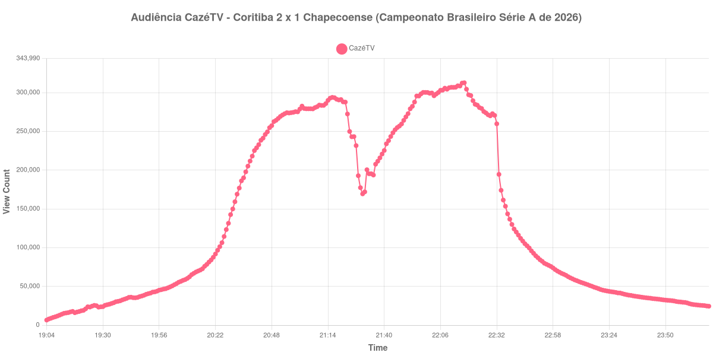

+++
date = 2026-08-20T06:00:00-03:00
draft = false
title = "Confira como foi a audiência de Coritiba X Chapecoense na CazéTV - 08-08-2026"
author = 'Instituto Cambacica de Audiência'
summary = "Veja como foi a audiência da vitória do Coritiba sobre a Chapecoense na CazéTV, numa medição em que a curva só reagiu depois do segundo gol"
tags = ['YouTube', 'Analytics', 'Audiência', 'CazeTV', 'Coritiba', 'Chapecoense', 'Brasileirao']
categories = ['Audiência']
canais = ['CazeTV']
campeonatos = ['Brasileirao 2026']
data_evento = 2026-08-08
+++

Neste texto, vamos informar os resultados da audiência em tempo real obtidos pela CazéTV, durante a transmissão de Coritiba X Chapecoense, partida da 22ª rodada do Campeonato Brasileiro Série A de 2026, disputada no Couto Pereira, em Curitiba, em 08/08/2026. O Coritiba venceu por 2 a 1: Tiago Cóser abriu o placar aos 31 minutos do primeiro tempo, Pedro Rocha ampliou aos 37 do segundo e Túlio Eduardo descontou para a Chapecoense aos 50, já nos acréscimos. Não houve cartões vermelhos. Vale registrar que este é um jogo da primeira divisão: os dois clubes subiram da Série B de 2025, o Coritiba como campeão e a Chapecoense em terceiro.

A audiência começou a ser medida às 08/08/2026 19:04:55 (Horário de Brasília), antes do apito inicial. Como a coleta começou menos de duas horas antes do apito inicial, o gráfico e os números abaixo partem do primeiro registro disponível. A medição terminou antes de completar duas horas após o apito final, de modo que o recorte vai até o último dado coletado. Entre 00:10:55 e o minuto seguinte o contador do YouTube cai de 24.408 para 5.468: a live havia sido encerrada e o contador passou a medir o vídeo gravado. Descartamos esses 6 registros e encerramos a janela no último dado válido. Os principais pontos da audiência são (em aparelhos conectados):

* **Início da Medição (19:04:55): 6.541**
* **Início da partida (20:30:55): 149.922**
* Após o gol de Tiago Cóser, do Coritiba, aos 31 minutos do primeiro tempo (21:01:55): 278.755
* **Final do primeiro tempo (21:18:55): 291.460**
* Durante o intervalo (21:26:55): 243.229
* **Início do segundo tempo (21:33:55): 195.284**
* Após o gol de Pedro Rocha, do Coritiba, aos 37 minutos do segundo tempo (22:09:55): 304.306
* Após o gol de Túlio Eduardo, da Chapecoense, aos 50 minutos do segundo tempo (22:22:55): 284.935
* **Final da live (00:10:55): 24.408**

O pico de audiência foi às 22:17:55, nos minutos finais da partida, com **312.718** aparelhos conectados simultâneos.

Esta curva tem um vale mais longo do que a pausa entre os tempos. A audiência cai 17% do fim do primeiro tempo para o meio do intervalo, de 291.460 para 243.229 aparelhos conectados, e segue caindo mesmo depois do recomeço: às 21:33:55, com a bola já rolando, eram 195.284 aparelhos conectados, abaixo do que a medição registrara durante a pausa. A reação veio com o segundo gol do Coritiba, aos 37 minutos do segundo tempo: 304.306 aparelhos conectados às 22:09:55, e o máximo da medição poucos minutos depois. O gol da Chapecoense, aos 50, já encontrou a curva em queda — 284.935 às 22:22:55, abaixo dos 304.306 do gol anterior.

Entre as 40 medições do lote, este pico ocupa a oitava posição. Do outro lado da mesma 22ª rodada, [Palmeiras X Internacional](/posts/2026-08-09-palmeiras-x-internacional-getv/), na ge tv, chegou a 1.208.776 aparelhos conectados, e os 312.718 daqui ficam 74% abaixo. Dentro do próprio canal, o valor também fica bem atrás dos 810.130 aparelhos conectados de [Botafogo X Vitória](/posts/2026-07-23-botafogo-x-vitoria-cazetv/), em 23 de julho. O fim desta série merece uma nota: às 00:10:55 a live foi encerrada com 24.408 aparelhos conectados e, no minuto seguinte, o contador do YouTube marcava 5.468. Não é audiência que sumiu, e sim a métrica trocando a transmissão ao vivo pelo vídeo gravado — por isso a janela deste post termina em 00:10:55.

No gráfico a seguir, mostramos a evolução da audiência entre o primeiro registro da medição e o encerramento da live:

Para você verificar os metadados desta medição, você pode consultar o [repositório contendo o CSV com os dados e com os prints do minuto a minuto da medição](https://github.com/institutocambacica/audiencias_08_20_08_2026/tree/main/2026-08-08_coritiba-x-chapecoense_z63vnMGM644).

---

*Para mais informações sobre nossa metodologia, visite nossa página [Sobre](/sobre).*
