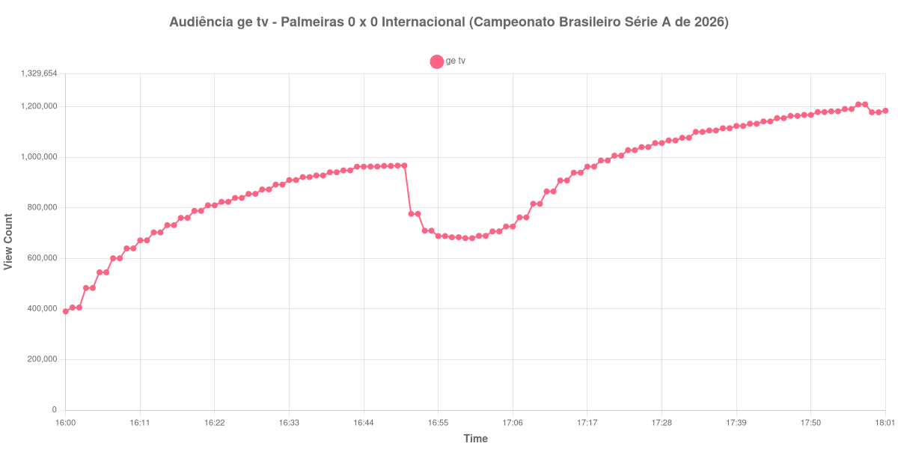

+++
date = 2026-08-20T06:04:00-03:00
draft = false
title = "Confira como foi a audiência de Palmeiras X Internacional na ge tv - 09-08-2026"
author = 'Instituto Cambacica de Audiência'
summary = "Veja como foi a audiência do empate sem gols entre Palmeiras e Internacional na ge tv, numa curva que subiu do apito inicial ao último registro coletado"
tags = ['YouTube', 'Analytics', 'Audiência', 'GETV', 'Palmeiras', 'Internacional', 'Brasileirao']
categories = ['Audiência']
canais = ['GETV']
campeonatos = ['Brasileirao 2026']
data_evento = 2026-08-09
+++

Neste texto, vamos informar os resultados da audiência em tempo real obtidos pela ge tv, durante a transmissão de Palmeiras X Internacional, jogo da 22ª rodada do Campeonato Brasileiro Série A de 2026, no Nubank Parque, em São Paulo, em 09/08/2026. O confronto terminou em 0 a 0. Não houve gols nem cartões vermelhos, e os cartões amarelos ficaram com Murilo, do Palmeiras, e com Paulinho, Aguirre e Matheus Cunha, do Internacional. Como a partida não teve gol, a lista de marcos abaixo não traz nenhum ponto ligado ao placar: apenas os limites da medição e os do intervalo entre os dois tempos.

A audiência começou a ser medida às 09/08/2026 16:00:55 (Horário de Brasília), praticamente junto com o apito inicial. Como a coleta começou menos de duas horas antes do apito inicial, o gráfico e os números abaixo partem do primeiro registro disponível. A medição terminou antes de completar duas horas após o apito final, de modo que o recorte vai até o último dado coletado. A janela cobre, assim, o trecho entre 16:00:55 e 18:01:55, com a live ainda no ar no último registro. Os principais pontos da audiência são (em aparelhos conectados):

* **Início da Medição (16:00:55): 390.074**
* **Final do primeiro tempo (16:48:55): 965.241**
* Durante o intervalo (16:56:55): 688.191
* **Início do segundo tempo (17:03:55): 706.539**
* **Final da partida (17:52:55): 1.178.323**
* **Final da Medição (18:01:55): 1.183.678**

O pico de audiência foi às 17:57:55, no trecho final da medição, já depois do apito final, com **1.208.776** aparelhos conectados simultâneos.

A curva desta medição é quase toda ascendente. Do primeiro registro, 390.074 aparelhos conectados às 16:00:55, até o fim do primeiro tempo, 965.241, a audiência mais que dobra sem nenhuma interrupção. O intervalo é a única queda relevante da série: 29%, dos 965.241 do apito aos 688.191 do fundo da pausa. Depois disso a subida recomeça e não para — dos 706.539 aparelhos conectados do recomeço aos 1.178.323 do apito final, um crescimento de 67%, e o máximo veio ainda mais tarde. É um desenho pouco comum para um jogo sem gols: não há um único degrau de placar na curva e, mesmo assim, a audiência cresceu de ponta a ponta. A janela termina às 18:01:55, com a transmissão ainda no ar, de modo que esta medição não cobre o pós-jogo.

No ranking do lote, este é o quarto maior pico entre as 40 medições que fizemos entre 8 e 19 de agosto, atrás de Flamengo x Cruzeiro (3.412.036), Cruzeiro x Flamengo (2.457.680) e Mirassol x Flamengo (2.307.249). A outra partida da 22ª rodada do Brasileirão que acompanhamos, [Coritiba X Chapecoense](/posts/2026-08-08-coritiba-x-chapecoense-cazetv/), na CazéTV, chegou a 312.718 aparelhos conectados — os 1.208.776 daqui ficam 287% acima disso. Na comparação com o que a própria ge tv já rendeu, o número fica próximo do que medimos em [Fluminense X Vasco](/posts/2026-08-05-fluminense-x-vasco-getv/), em 5 de agosto, com pico de 1.138.365 aparelhos conectados, e abaixo de [Bahia X Corinthians](/posts/2026-07-26-bahia-x-corinthians-getv/), em 26 de julho, que marcou 1.547.272.

No gráfico a seguir, mostramos a evolução da audiência entre o primeiro registro da medição e o último registro coletado:

Para você verificar os metadados desta medição, você pode consultar o [repositório contendo o CSV com os dados e com os prints do minuto a minuto da medição](https://github.com/institutocambacica/audiencias_08_20_08_2026/tree/main/2026-08-09_palmeiras-x-internacional_uVdrqw8H1u8).

---

*Para mais informações sobre nossa metodologia, visite nossa página [Sobre](/sobre).*
