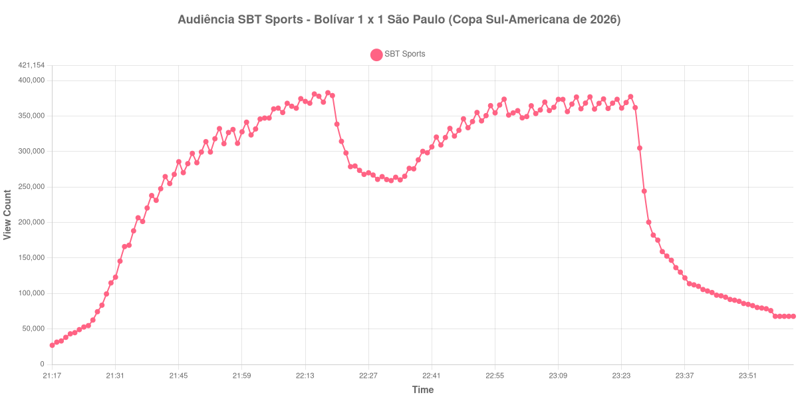

+++
date = 2026-08-20T06:08:00-03:00
draft = false
title = "Confira como foi a audiência de Bolívar X São Paulo na SBT Sports - 11-08-2026"
author = 'Instituto Cambacica de Audiência'
summary = "Veja como foi a audiência da ida das oitavas da Sul-Americana na SBT Sports, no empate do São Paulo com o Bolívar na altitude de La Paz"
tags = ['YouTube', 'Analytics', 'Audiência', 'SBT-Sports', 'Bolivar', 'Sao Paulo', 'Sul-Americana']
categories = ['Audiência']
campeonatos = ['Sul-Americana 2026']
data_evento = 2026-08-11
+++

Neste texto, vamos informar os resultados da audiência em tempo real obtidos pela SBT Sports, durante a transmissão de Bolívar X São Paulo, jogo de ida das oitavas de final da Copa Sul-Americana de 2026, disputado no Estádio Hernando Siles, em La Paz, em 11/08/2026. A partida, a 3.650 metros de altitude, terminou em 1 a 1: Robert Arboleda marcou para o São Paulo aos 23 minutos do primeiro tempo e Carlos Melgar empatou para o Bolívar aos 18 minutos do segundo. O apito inicial foi às 20h30 locais, equivalentes às 21h30 de Brasília, fuso usado em todos os horários deste texto.

A audiência começou a ser medida às 11/08/2026 21:17:55 (Horário de Brasília), com a transmissão já no ar. Como a coleta começou menos de duas horas antes do apito inicial, o gráfico e os números abaixo partem do primeiro registro disponível. A medição terminou antes de completar duas horas após o apito final, de modo que o recorte vai até o último dado coletado. Entre 00:01:55 e o minuto seguinte o contador do YouTube cai de 67.791 para 1: a live havia sido encerrada e o contador passou a medir o vídeo gravado. Descartamos esses 615 registros e encerramos a janela no último dado válido. Os principais pontos da audiência são (em aparelhos conectados):

* **Início da Medição (21:17:55): 26.971**
* **Início da partida (21:30:55): 114.865**
* Após o gol de Robert Arboleda, do São Paulo, aos 23 minutos do primeiro tempo (21:53:55): 318.036
* **Final do primeiro tempo (22:17:55): 369.589**
* Durante o intervalo (22:25:55): 273.457
* **Início do segundo tempo (22:32:55): 259.056**
* Após o gol de Carlos Melgar, do Bolívar, aos 18 minutos do segundo tempo (22:50:55): 342.255
* **Final da partida (23:22:55): 373.607**
* **Final da live (00:01:55): 67.791**

O pico de audiência foi às 22:18:55, no primeiro minuto do intervalo, com **382.867** aparelhos conectados simultâneos.

O ponto mais alto desta medição não caiu com a bola rolando, e sim logo depois do apito que encerrou o primeiro tempo. Dali a audiência recuou 26%, de 369.589 aparelhos conectados no fim da etapa inicial para 273.457 no fundo da pausa. O segundo tempo refez o terreno perdido, de 259.056 aparelhos conectados no recomeço a 373.607 no apito final, uma alta de 44%, com o gol de Carlos Melgar como degrau intermediário, em 342.255. Mesmo assim, a transmissão encerrou a partida abaixo do máximo que havia registrado no intervalo — um desenho diferente do que se vê nos jogos em que a audiência se acumula até o último minuto.

Em escala, é a sétima maior das 40 medições deste lote e a menor das duas que fizemos na SBT Sports. Contra a volta, [São Paulo X Bolívar](/posts/2026-08-18-sao-paulo-x-bolivar-sbt-sports/), no MorumBIS, ficou 21% atrás: 382.867 aparelhos conectados aqui, 484.036 lá. Ainda assim, o número supera as duas medições da SBT Sports que já havíamos publicado, [Santos X Universidad Central](/posts/2026-07-28-santos-x-universidad-central-sbt-sports/), com 307.826 aparelhos conectados, e [Universidad Central X Santos](/posts/2026-07-21-universidad-central-x-santos-sbt-sports/), com 211.795. O esvaziamento do pós-jogo seguiu o padrão das transmissões maiores: meia hora depois do apito final restavam 82.873 aparelhos conectados, 22% dos 373.607 do fim da partida.

No gráfico a seguir, mostramos a evolução da audiência entre o primeiro registro da medição e o encerramento da live:

Para você verificar os metadados desta medição, você pode consultar o [repositório contendo o CSV com os dados e com os prints do minuto a minuto da medição](https://github.com/institutocambacica/audiencias_08_20_08_2026/tree/main/2026-08-11_bolivar-x-sao-paulo_YMC2q2spTMY).

---

*Para mais informações sobre nossa metodologia, visite nossa página [Sobre](/sobre).*
