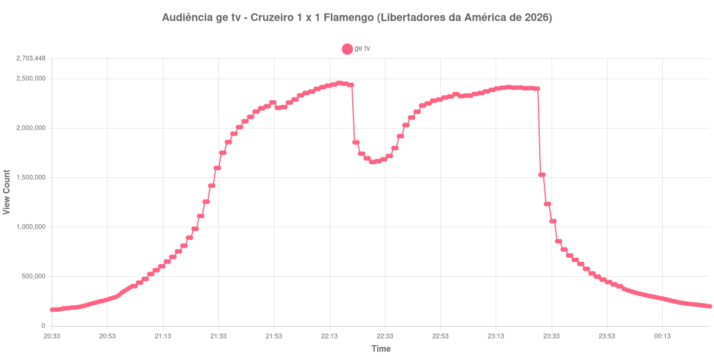

+++
date = 2026-08-20T06:12:00-03:00
draft = false
title = "Confira como foi a audiência de Cruzeiro X Flamengo na ge tv - 12-08-2026"
author = 'Instituto Cambacica de Audiência'
summary = "Veja como foi a audiência da ida das oitavas da Libertadores na ge tv, no empate do Mineirão que deixou o confronto aberto"
tags = ['YouTube', 'Analytics', 'Audiência', 'GETV', 'Cruzeiro', 'Flamengo', 'Libertadores']
categories = ['Audiência']
campeonatos = ['Libertadores 2026']
data_evento = 2026-08-12
+++

Neste texto, vamos informar os resultados da audiência em tempo real obtidos pela ge tv, durante a transmissão de Cruzeiro X Flamengo, jogo de ida das oitavas de final da Libertadores da América de 2026, disputado no Mineirão, em Belo Horizonte, em 12/08/2026. A partida terminou em 1 a 1, diante de 60.046 presentes, o maior público do Mineirão em 2026: Keny Arroyo abriu o placar para o Cruzeiro aos 8 minutos do segundo tempo e Lucas Paquetá empatou para o Flamengo aos 22 minutos da mesma etapa. O confronto ficou aberto para o jogo de volta, no Maracanã.

A audiência começou a ser medida às 12/08/2026 20:33:55 (Horário de Brasília), com a transmissão já no ar. Como a coleta começou menos de duas horas antes do apito inicial, o gráfico e os números abaixo partem do primeiro registro disponível. A medição terminou antes de completar duas horas após o apito final, de modo que o recorte vai até o último dado coletado. Os principais pontos da audiência são (em aparelhos conectados):

* **Início da Medição (20:33:55): 165.643**
* **Início da partida (21:30:55): 1.419.271**
* **Final do primeiro tempo (22:17:55): 2.457.680**
* Durante o intervalo (22:25:55): 1.742.937
* **Início do segundo tempo (22:32:55): 1.686.342**
* Após o gol de Keny Arroyo, do Cruzeiro, aos 8 minutos do segundo tempo (22:40:55): 2.032.584
* Após o gol de Lucas Paquetá, do Flamengo, aos 22 minutos do segundo tempo (22:54:55): 2.310.268
* **Final da partida (23:22:55): 2.411.858**
* **Final da Medição (00:30:55): 199.757**

O pico de audiência foi às 22:16:55, nos instantes finais do primeiro tempo, com **2.457.680** aparelhos conectados simultâneos.

A curva desta transmissão tem dois cumes de altura parecida e um vale fundo entre eles. O primeiro tempo levou a audiência de 1.419.271 aparelhos conectados no apito inicial ao máximo da medição; o intervalo derrubou 29% desse patamar, de 2.457.680 para 1.742.937 aparelhos conectados, e o segundo tempo refez quase todo o caminho, de 1.686.342 no recomeço a 2.411.858 no apito final, uma alta de 43%. Os dois gols aparecem como degraus dentro dessa subida — 2.032.584 depois do de Keny Arroyo e 2.310.268 depois do de Lucas Paquetá —, mas nenhum deles devolveu à transmissão o patamar que ela tinha antes do intervalo.

Em escala, é a segunda maior das 40 medições deste lote, atrás apenas de [Flamengo X Cruzeiro](/posts/2026-08-19-flamengo-x-cruzeiro-getv/), a volta deste mesmo confronto, sete dias depois e no mesmo canal: os 2.457.680 aparelhos conectados daqui ficaram 28% abaixo dos 3.412.036 do jogo do Maracanã. Para a terceira colocada do lote, Mirassol x Flamengo na CazéTV, com 2.307.249 aparelhos conectados, a distância é curta. Entre tudo o que já publicamos, só um jogo de clubes registrou mais: [Corinthians X Vasco](/posts/2025-12-17-corinthians-x-vasco-getv/), em dezembro de 2025, com 3.206.213 aparelhos conectados. O esvaziamento do pós-jogo foi rápido: meia hora após o apito final restavam 469.121 aparelhos conectados, 19% dos 2.411.858 do fim da partida, e uma hora depois, 226.051, ou 9%.

No gráfico a seguir, mostramos a evolução da audiência entre o primeiro registro da medição e o último registro coletado:

Para você verificar os metadados desta medição, você pode consultar o [repositório contendo o CSV com os dados e com os prints do minuto a minuto da medição](https://github.com/institutocambacica/audiencias_08_20_08_2026/tree/main/2026-08-12_cruzeiro-x-flamengo_HT8QACkIe3I).

---

*Para mais informações sobre nossa metodologia, visite nossa página [Sobre](/sobre).*
