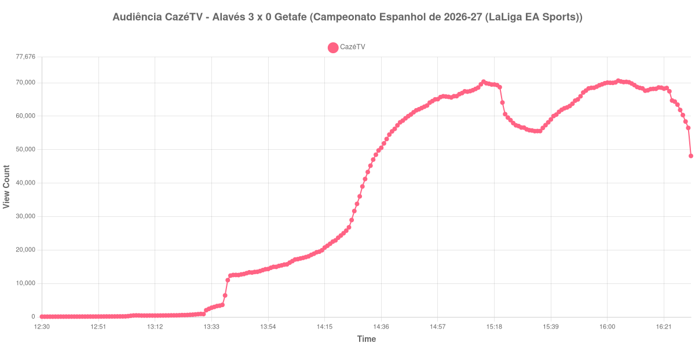

+++
date = 2026-08-20T06:16:00-03:00
draft = false
title = "Confira como foi a audiência de Alavés X Getafe na CazéTV - 15-08-2026"
author = 'Instituto Cambacica de Audiência'
summary = "Veja como foi a audiência do jogo que abriu o Campeonato Espanhol na CazéTV, numa curva que se construiu quase toda antes do intervalo"
tags = ['YouTube', 'Analytics', 'Audiência', 'CazeTV', 'Alaves', 'Getafe', 'LaLiga']
categories = ['Audiência']
+++

Neste texto, vamos informar os resultados da audiência em tempo real obtidos pela CazéTV, durante a transmissão de Alavés X Getafe, jogo de abertura da 1ª rodada do Campeonato Espanhol de 2026-27 (LaLiga EA Sports), disputado no Mendizorroza, em Vitoria-Gasteiz, em 15/08/2026. O Alavés venceu por 3 a 0, jogando com um homem a mais desde os 42 minutos do primeiro tempo, quando Kiko Femenía foi expulso no Getafe. Nahuel Tenaglia abriu o placar aos 73 minutos, e os outros dois gols saíram nos acréscimos do segundo tempo: Mariano Díaz aos 91 e Mikel Rodríguez aos 94.

A audiência começou a ser medida às 15/08/2026 12:30:55 (Horário de Brasília), duas horas antes do apito inicial. A medição terminou antes de completar duas horas após o apito final, de modo que o recorte vai até o último dado coletado. Os principais pontos da audiência são (em aparelhos conectados):

* **Início da Medição (12:30:55): 83**
* **Início da partida (14:30:55): 41.217**
* Após a expulsão de Kiko Femenía, do Getafe, aos 42 minutos do primeiro tempo (15:12:55): 68.555
* **Final do primeiro tempo (15:17:55): 69.463**
* Durante o intervalo (15:25:55): 57.930
* **Início do segundo tempo (15:32:55): 55.718**
* Após o gol de Nahuel Tenaglia, do Alavés, aos 28 minutos do segundo tempo (16:00:55): 70.021
* Após o gol de Mariano Díaz, do Alavés, aos 46 minutos do segundo tempo (16:18:55): 68.176
* Após o gol de Mikel Rodríguez, do Alavés, aos 49 minutos do segundo tempo (16:21:55): 68.224
* **Final da partida (16:22:55): 68.428**
* **Final da Medição (16:31:55): 48.118**

O pico de audiência foi às 16:04:55, poucos minutos depois do gol de Nahuel Tenaglia, com **70.614** aparelhos conectados simultâneos.

Esta curva percorreu quase todo o seu caminho antes do intervalo. Dos 41.217 aparelhos conectados do apito inicial, a transmissão chegou a 69.463 no fim do primeiro tempo, e o máximo alcançado depois, 70.614, ficou pouco acima desse patamar. A pausa custou 17% da audiência, de 69.463 para 57.930 aparelhos conectados; na volta, a curva cresceu 23%, de 55.718 no recomeço a 68.428 no apito final — uma recuperação que basicamente devolveu o que a pausa havia levado. Os dois gols dos acréscimos não moveram o contador: depois do de Mariano Díaz ele marcava 68.176 e, depois do de Mikel Rodríguez, 68.224, ambos abaixo do que a partida já registrara no meio da etapa final.

A CazéTV levou ao ar duas partidas da rodada espanhola neste mesmo sábado, e esta foi a menor delas: [Sevilla X Rayo Vallecano](/posts/2026-08-15-sevilla-x-rayo-vallecano-cazetv/) chegou a 82.973 aparelhos conectados, e os 70.614 daqui ficam 15% abaixo desse valor. Na comparação com as outras cinco transmissões que medimos na primeira rodada do Campeonato Espanhol, a distância é um pouco maior: o pico médio delas foi de 105.899 aparelhos conectados, patamar do qual esta medição ficou 33% abaixo. No conjunto das 40 medições deste lote, Alavés X Getafe ocupa a 23ª posição, na metade inferior da tabela de picos e bem longe das transmissões de clubes brasileiros que lideram o período.

No gráfico a seguir, mostramos a evolução da audiência entre duas horas antes do início da partida e o último registro coletado:

Para você verificar os metadados desta medição, você pode consultar o [repositório contendo o CSV com os dados e com os prints do minuto a minuto da medição](https://github.com/institutocambacica/audiencias_08_20_08_2026/tree/main/2026-08-15_alaves-x-getafe_Jefp-9AK8zM).

---

*Para mais informações sobre nossa metodologia, visite nossa página [Sobre](/sobre).*
