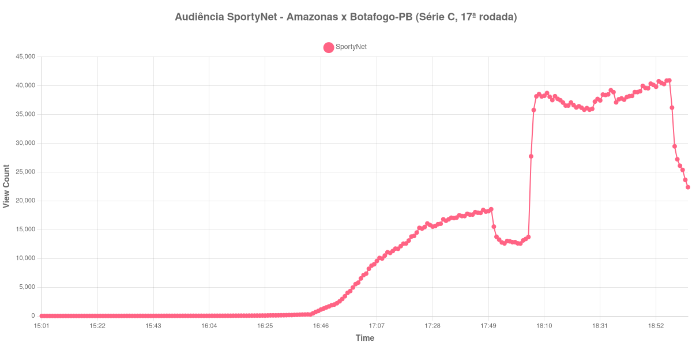

+++
date = 2026-08-20T06:20:00-03:00
draft = false
title = "Confira como foi a audiência de Amazonas X Botafogo-PB na SportyNet - 15-08-2026"
author = 'Instituto Cambacica de Audiência'
summary = "Veja como foi a audiência de um jogo da Série C na SportyNet, numa curva cujo ponto mais alto só chegou depois do apito final"
tags = ['YouTube', 'Analytics', 'Audiência', 'SportyNet', 'Amazonas', 'Botafogo-PB', 'Serie-C']
categories = ['Audiência']
+++

Neste texto, vamos informar os resultados da audiência em tempo real obtidos pela SportyNet, durante a transmissão de Amazonas X Botafogo-PB, partida da 17ª rodada do Campeonato Brasileiro Série C, em 15/08/2026. Foi a primeira das quatro transmissões dessa rodada que acompanhamos, todas no mesmo canal: a bola rolou no fim da tarde de sábado, antes da outra partida da mesma rodada que o canal levou ao ar naquele dia. Não localizamos, em fonte independente, a cronologia da partida, de modo que este texto não traz placar nem gols e se limita ao que a própria medição registra.

A audiência começou a ser medida às 15/08/2026 15:01:55 (Horário de Brasília), exatamente duas horas antes do apito inicial. A medição terminou antes de completar duas horas após o apito final, de modo que o recorte vai até o último dado coletado. Os horários de início e de fim de cada tempo listados abaixo foram ancorados na própria curva de audiência, pelo vale que o intervalo produz, e não em fonte externa. Os principais pontos da audiência são (em aparelhos conectados):

* **Início da Medição (15:01:55): 10**
* **Início da partida (17:01:55): 6.524**
* **Final do primeiro tempo (17:48:55): 18.126**
* Durante o intervalo (17:56:55): 13.031
* **Início do segundo tempo (18:03:55): 13.380**
* **Final da partida (18:53:55): 40.766**
* **Final da Medição (19:04:55): 22.367**

O pico de audiência foi às 18:57:55, já no pós-jogo imediato, com **40.909** aparelhos conectados simultâneos.

Poucas curvas deste lote concentram tanto crescimento depois do intervalo. Até a pausa, a transmissão tinha um porte modesto: 6.524 aparelhos conectados no apito inicial e 18.126 no fim do primeiro tempo, com o intervalo cobrando 28% desse total, até 13.031 no fundo da pausa. O segundo tempo mudou a escala da medição — de 13.380 aparelhos conectados no recomeço a 40.766 no apito final, um crescimento de 205%, ou seja, a audiência triplicou dentro de uma única etapa. O máximo sequer caiu dentro do jogo: veio às 18:57:55, depois do fim da partida, e às 19:04:55 a coleta já registrava 22.367 aparelhos conectados, pouco mais da metade do que havia no apito final.

Entre as quatro medições que fizemos na 17ª rodada da Série C, esta é a de menor escala: as outras três tiveram pico médio de 101.946 aparelhos conectados, e os 40.909 daqui ficam 60% abaixo dessa média. A comparação com o que o mesmo canal transmitiu no mesmo dia vai na mesma direção — [Santa Cruz X Maranhão](/posts/2026-08-15-santa-cruz-x-maranhao-sportynet/) chegou a 157.586 aparelhos conectados, e esta partida ficou 74% abaixo desse valor; [Manchester United X Milan](/posts/2026-08-15-manchester-united-x-milan-sportynet/) chegou a 112.846, e a diferença cai para 64%. Ainda assim, o jogo ocupa a 25ª posição entre as 40 medições do lote, à frente de todas as transmissões da Copa da Itália que acompanhamos no mesmo período.

No gráfico a seguir, mostramos a evolução da audiência entre duas horas antes do início da partida e o último registro coletado:

Para você verificar os metadados desta medição, você pode consultar o [repositório contendo o CSV com os dados e com os prints do minuto a minuto da medição](https://github.com/institutocambacica/audiencias_08_20_08_2026/tree/main/2026-08-15_amazonas-x-botafogo-pb_rswCm4MMBlA).

---

*Para mais informações sobre nossa metodologia, visite nossa página [Sobre](/sobre).*
