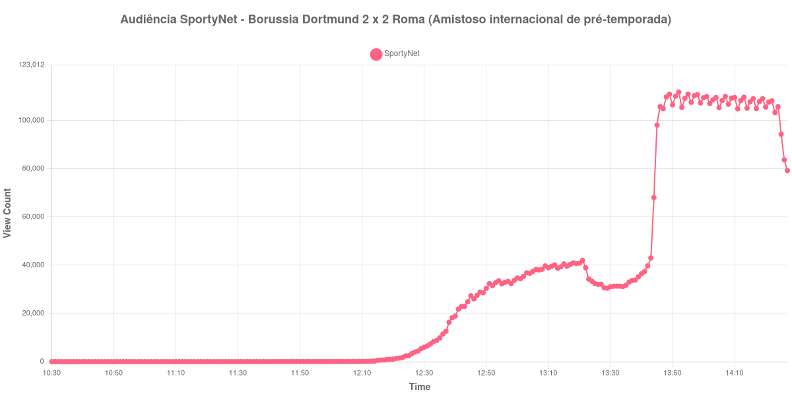

+++
date = 2026-08-20T06:24:00-03:00
draft = false
title = "Confira como foi a audiência de Borussia Dortmund X Roma na SportyNet - 15-08-2026"
author = 'Instituto Cambacica de Audiência'
summary = "Veja como foi a audiência do amistoso entre Borussia Dortmund e Roma na SportyNet, numa curva que só ganhou volume no segundo tempo"
tags = ['YouTube', 'Analytics', 'Audiência', 'SportyNet', 'Borussia Dortmund', 'Roma', 'Amistoso']
categories = ['Audiência']
canais = ['SportyNet']
campeonatos = ['Amistosos 2026']
data_evento = 2026-08-15
+++

Neste texto, vamos informar os resultados da audiência em tempo real obtidos pela SportyNet, durante a transmissão de Borussia Dortmund X Roma, amistoso internacional de pré-temporada disputado no Signal Iduna Park, em Dortmund, em 15/08/2026, diante de um público de 81.365. A partida terminou em 2 a 2, com os quatro gols saindo ainda no primeiro tempo: Paulo Dybala abriu o placar para a Roma aos 4 minutos e Bryan Cristante ampliou aos 9, mas Julian Ryerson descontou aos 12 e Serhou Guirassy empatou aos 28. Era o último teste dos dois times antes do início oficial da temporada 2026/27.

A audiência começou a ser medida às 15/08/2026 10:30:55 (Horário de Brasília), duas horas antes do apito inicial. A medição terminou antes de completar duas horas após o apito final, de modo que o recorte vai até o último dado coletado. Os principais pontos da audiência são (em aparelhos conectados):

* **Início da Medição (10:30:55): 13**
* **Início da partida (12:30:55): 6.014**
* Após o gol de Paulo Dybala, da Roma, aos 4 minutos do primeiro tempo (12:34:55): 8.814
* Após o gol de Bryan Cristante, da Roma, aos 9 minutos do primeiro tempo (12:39:55): 18.245
* Após o gol de Julian Ryerson, do Borussia Dortmund, aos 12 minutos do primeiro tempo (12:42:55): 22.884
* Após o gol de Serhou Guirassy, do Borussia Dortmund, aos 28 minutos do primeiro tempo (12:58:55): 32.385
* **Final do primeiro tempo (13:19:55): 40.687**
* Durante o intervalo (13:27:55): 32.138
* **Início do segundo tempo (13:34:55): 31.163**
* **Final da partida (14:22:55): 108.158**
* **Final da Medição (14:27:55): 79.263**

O pico de audiência foi às 13:52:55, já durante o segundo tempo, com **111.829** aparelhos conectados simultâneos.

A parte mais expressiva do movimento não veio dos gols. Todos saíram no primeiro tempo, e a audiência respondeu a eles em degraus modestos: 8.814 aparelhos conectados após o gol de Dybala, 32.385 após o de Guirassy. O salto real veio depois, num trecho sem lances: entre o recomeço, com 31.163 aparelhos conectados, e o apito final, com 108.158, o segundo tempo cresceu 247%. Naquela tarde a SportyNet dividia o canal com outras transmissões simultâneas, e esse degrau corresponde à chegada de aparelhos vindos de uma live vizinha encerrada pouco antes, não ao andamento do jogo. O pico, 111.829 aparelhos conectados às 13:52:55, cai justamente nesse trecho, e não nos minutos finais.

O intervalo custou 21% da audiência, de 40.687 aparelhos conectados no fim do primeiro tempo para 32.138 no fundo da pausa. Em escala, a medição ocupa a 18ª posição entre as 40 deste lote e fica 21% acima da média dos outros seis amistosos internacionais que acompanhamos, de 92.723 aparelhos conectados. No mesmo canal e no mesmo dia, [Manchester United X Milan](/posts/2026-08-15-manchester-united-x-milan-sportynet/) chegou a 112.846 aparelhos conectados, e os 111.829 daqui ficam 1% abaixo desse valor — dois amistosos europeus praticamente no mesmo patamar. Quem esteve à frente dos dois foi uma partida brasileira: [Santa Cruz X Maranhão](/posts/2026-08-15-santa-cruz-x-maranhao-sportynet/), pela Série C, marcou 157.586 aparelhos conectados no mesmo canal, e esta medição fica 29% abaixo dela.

No gráfico a seguir, mostramos a evolução da audiência entre duas horas antes do início da partida e o último registro coletado:

Para você verificar os metadados desta medição, você pode consultar o [repositório contendo o CSV com os dados e com os prints do minuto a minuto da medição](https://github.com/institutocambacica/audiencias_08_20_08_2026/tree/main/2026-08-15_borussia-dortmund-x-as-roma_lYeePXeYy3o).

---

*Para mais informações sobre nossa metodologia, visite nossa página [Sobre](/sobre).*
