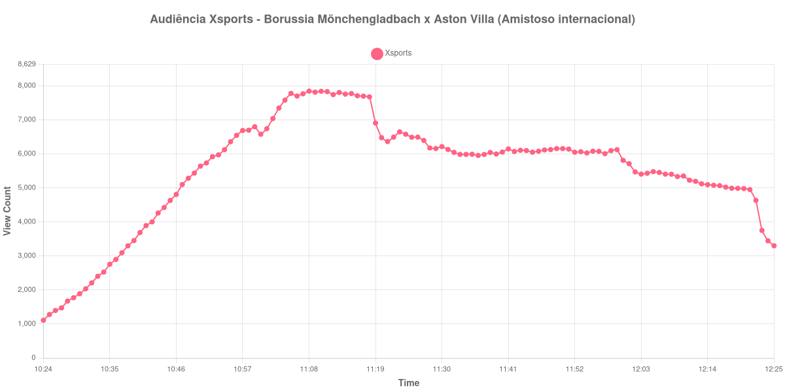

+++
date = 2026-08-20T06:40:00-03:00
draft = false
title = "Confira como foi a audiência de Borussia Mönchengladbach X Aston Villa na Xsports - 15-08-2026"
author = 'Instituto Cambacica de Audiência'
summary = "Veja como foi a audiência de um amistoso internacional na Xsports, numa curva que não chegou a desenhar o vale do intervalo"
tags = ['YouTube', 'Analytics', 'Audiência', 'Xsports', 'Borussia Monchengladbach', 'Aston Villa', 'Amistoso']
categories = ['Audiência']
campeonatos = ['Amistosos 2026']
data_evento = 2026-08-15
+++

Neste texto, vamos informar os resultados da audiência em tempo real obtidos pela Xsports, durante a transmissão de Borussia Mönchengladbach X Aston Villa, amistoso internacional realizado em 15/08/2026. É uma das três medições que fizemos no canal neste lote e a única delas com dois clubes europeus em campo. Não localizamos fonte independente com os horários de início e de fim de cada tempo, e a própria curva de audiência tampouco os revela, de modo que este texto se limita ao que a série coletada mostra, sem placar, sem gols e sem os marcos internos da partida.

A audiência começou a ser medida às 15/08/2026 10:24:55 (Horário de Brasília), com a transmissão já em andamento: o primeiro registro da série já marca 1.109 aparelhos conectados. Não foi possível confirmar a cronologia da partida em fonte independente, de modo que listamos apenas os pontos que a própria medição sustenta. Os principais pontos da audiência são (em aparelhos conectados):

* **Início da Medição (10:24:55): 1.109**
* **Final da Medição (12:25:55): 3.300**

O pico de audiência foi às 11:08:55, com **7.844** aparelhos conectados simultâneos.

Sem os marcos internos, o que resta é o formato bruto da curva, e ele é atípico entre as medições deste lote: não aparece o vale que o intervalo costuma abrir, aquela queda de alguns minutos que, em outras transmissões, marca o fim do primeiro tempo. Aqui não há essa depressão em lugar nenhum da série, e por isso nenhum horário foi ancorado. O máximo ficou em 7.844 aparelhos conectados, às 11:08:55, e o último dado coletado, às 12:25:55, registra 3.300 — bem abaixo do topo, embora acima dos 1.109 com que a medição começou.

No ranking dos 40 picos deste lote, a medição aparece em 35º lugar. Os seis outros amistosos internacionais que acompanhamos tiveram pico médio de 110.054 aparelhos conectados, e os 7.844 daqui ficam 93% abaixo dessa média: é o menor pico entre os amistosos internacionais deste conjunto. Vale registrar também que a coleta pegou a transmissão em andamento: o primeiro registro já traz 1.109 aparelhos conectados, de modo que a formação inicial da audiência ficou fora da janela. O valor de abertura, portanto, é um piso, e não o ponto de partida real desta transmissão.

No gráfico a seguir, mostramos a evolução da audiência entre o primeiro registro da medição e o último registro coletado:

Para você verificar os metadados desta medição, você pode consultar o [repositório contendo o CSV com os dados e com os prints do minuto a minuto da medição](https://github.com/institutocambacica/audiencias_08_20_08_2026/tree/main/2026-08-15_monchegladbach-x-aston-villa_HRKWr0b2SOk).

---

*Para mais informações sobre nossa metodologia, visite nossa página [Sobre](/sobre).*
