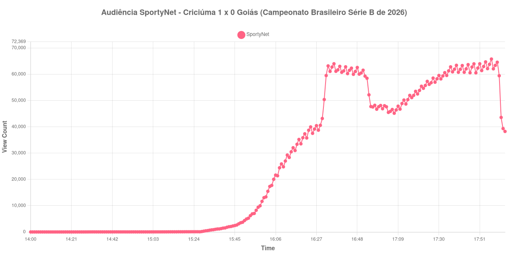

+++
date = 2026-08-20T06:28:00-03:00
draft = false
title = "Confira como foi a audiência de Criciúma X Goiás na SportyNet - 15-08-2026"
author = 'Instituto Cambacica de Audiência'
summary = "Veja como foi a audiência da vitória do Criciúma sobre o Goiás na SportyNet, numa medição em que o máximo veio depois do apito final"
tags = ['YouTube', 'Analytics', 'Audiência', 'SportyNet', 'Criciuma', 'Goias', 'Serie-B']
categories = ['Audiência']
+++

Neste texto, vamos informar os resultados da audiência em tempo real obtidos pela SportyNet, durante a transmissão de Criciúma X Goiás, confronto da 22ª rodada do Campeonato Brasileiro Série B de 2026, no Estádio Heriberto Hülse, em Criciúma, em 15/08/2026. O Criciúma venceu por 1 a 0, com gol de Luciano Castán aos 5 minutos do primeiro tempo, o único da partida. Não houve cartões vermelhos. Com um só gol, e logo no começo, a curva de audiência tem um único degrau ligado ao placar, e ele aparece ainda nos primeiros minutos do jogo.

A audiência começou a ser medida às 15/08/2026 14:00:55 (Horário de Brasília), duas horas antes do apito inicial. A medição terminou antes de completar duas horas após o apito final, de modo que o recorte vai até o último dado coletado. Os principais pontos da audiência são (em aparelhos conectados):

* **Início da Medição (14:00:55): 8**
* **Início da partida (16:00:55): 13.049**
* Após o gol de Luciano Castán, do Criciúma, aos 5 minutos do primeiro tempo (16:05:55): 20.051
* **Final do primeiro tempo (16:50:55): 60.481**
* Durante o intervalo (16:58:55): 46.703
* **Início do segundo tempo (17:05:55): 45.876**
* **Final da partida (17:52:55): 61.408**
* **Final da Medição (18:04:55): 38.253**

O pico de audiência foi às 17:57:55, já no pós-jogo, depois do apito final, com **65.790** aparelhos conectados simultâneos.

Nesta medição, o máximo ficou fora do tempo de jogo. O apito final, às 17:52:55, registrou 61.408 aparelhos conectados, mas a curva continuou subindo por alguns minutos e só chegou ao topo às 17:57:55, com 65.790 — audiência de pós-jogo, com a partida já encerrada e a transmissão ainda no ar. Antes disso, o desenho é o de sempre: o gol de Luciano Castán levou a audiência dos 13.049 aparelhos conectados do apito inicial a 20.051 às 16:05:55, e o crescimento seguiu até o fim do primeiro tempo, em 60.481. O intervalo custou 23%, de 60.481 para 46.703 aparelhos conectados, e o segundo tempo recuperou 34%, dos 45.876 do recomeço aos 61.408 do apito final.

A posição no lote é intermediária: 24ª entre as 40 medições do período. No mesmo dia e no mesmo canal, a SportyNet transmitiu [Santa Cruz X Maranhão](/posts/2026-08-15-santa-cruz-x-maranhao-sportynet/), pela Série C, que chegou a 157.586 aparelhos conectados, e [Manchester United X Milan](/posts/2026-08-15-manchester-united-x-milan-sportynet/), um amistoso internacional, com 112.846 — os 65.790 daqui ficam 58% e 42% abaixo, respectivamente. Vale registrar a comparação porque ela põe uma partida da Série B atrás tanto de um jogo da Série C quanto de um amistoso de pré-temporada, no mesmo canal e no mesmo dia. A janela se encerra às 18:04:55, com 38.253 aparelhos conectados, poucos minutos depois do apito final: esta medição não alcança o esvaziamento completo da transmissão, apenas o começo dele.

No gráfico a seguir, mostramos a evolução da audiência entre duas horas antes do início da partida e o último registro coletado:

Para você verificar os metadados desta medição, você pode consultar o [repositório contendo o CSV com os dados e com os prints do minuto a minuto da medição](https://github.com/institutocambacica/audiencias_08_20_08_2026/tree/main/2026-08-15_criciuma-x-goias_8u1Yzn_pNwU).

---

*Para mais informações sobre nossa metodologia, visite nossa página [Sobre](/sobre).*
