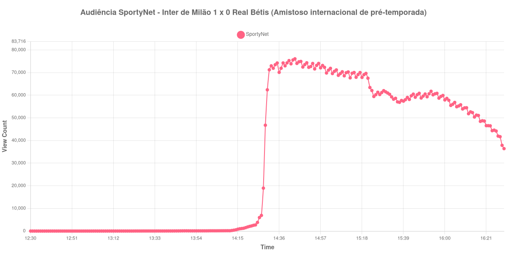

+++
date = 2026-08-20T06:32:00-03:00
draft = false
title = "Confira como foi a audiência de Inter de Milão X Real Bétis na SportyNet - 15-08-2026"
author = 'Instituto Cambacica de Audiência'
summary = "Veja como foi a audiência do amistoso entre Inter de Milão e Real Bétis na SportyNet, numa medição que atingiu o máximo ainda no primeiro tempo"
tags = ['YouTube', 'Analytics', 'Audiência', 'SportyNet', 'Inter de Milao', 'Real Betis', 'Amistoso']
categories = ['Audiência']
canais = ['SportyNet']
campeonatos = ['Amistosos 2026']
data_evento = 2026-08-15
+++

Neste texto, vamos informar os resultados da audiência em tempo real obtidos pela SportyNet, durante a transmissão de Inter de Milão X Real Bétis, amistoso internacional preparatório para a temporada 2026/27, realizado no Estádio San Nicola, em Bari, em 15/08/2026 — apesar de ser a mandante, a Inter levou o jogo para Bari, e não para Milão. A partida terminou em 1 a 0 para a Inter de Milão, com gol de John Stones aos 37 minutos do segundo tempo, de cabeça, após cobrança de falta de Dimarco alçada por Pavard. Foi a estreia do zagueiro inglês pelo clube italiano.

A audiência começou a ser medida às 15/08/2026 12:30:55 (Horário de Brasília), duas horas antes do apito inicial. A medição terminou antes de completar duas horas após o apito final, de modo que o recorte vai até o último dado coletado. Os principais pontos da audiência são (em aparelhos conectados):

* **Início da Medição (12:30:55): 8**
* **Início da partida (14:30:55): 62.407**
* **Final do primeiro tempo (15:20:55): 69.660**
* Durante o intervalo (15:28:55): 61.208
* **Início do segundo tempo (15:35:55): 58.659**
* Após o gol de John Stones, da Inter de Milão, aos 37 minutos do segundo tempo (16:09:55): 53.937
* **Final da partida (16:22:55): 46.563**
* **Final da Medição (16:30:55): 36.426**

O pico de audiência foi às 14:44:55, ainda durante o primeiro tempo, com **76.105** aparelhos conectados simultâneos.

Durante quase toda a janela anterior ao jogo a medição registrou pouco mais do que a dezena: às 12:30:55, primeiro dado coletado, havia 8 aparelhos conectados, e o número permaneceu perto de zero até os minutos que antecederam o apito inicial. Às 14:30:55 já eram 62.407. O salto se concentra nesse curto trecho e não descreve a formação do público do jogo: naquele sábado o canal tinha outras partidas no ar em paralelo, e o degrau marca a passagem de aparelhos que vinham de uma transmissão vizinha, encerrada instantes antes. Catorze minutos depois vem o máximo da medição, 76.105 aparelhos conectados às 14:44:55 — e daí em diante a curva só desce.

O que se segue é um declínio quase ininterrupto. O intervalo custou 12%, de 69.660 aparelhos conectados no fim do primeiro tempo para 61.208 no fundo da pausa, e o segundo tempo perdeu outros 21%, dos 58.659 do recomeço aos 46.563 do apito final. Nem o gol reverteu o movimento: o registro seguinte ao lance de Stones, às 16:09:55, marca 53.937 aparelhos conectados, abaixo do patamar do recomeço. Pelo tamanho, é a 21ª das 40 medições deste lote, com um máximo 23% inferior à média dos outros seis amistosos internacionais do conjunto, de 98.677 aparelhos conectados. No mesmo canal e no mesmo dia, [Manchester United X Milan](/posts/2026-08-15-manchester-united-x-milan-sportynet/) chegou a 112.846 aparelhos conectados, e esta medição fica 33% abaixo desse valor; para [Santa Cruz X Maranhão](/posts/2026-08-15-santa-cruz-x-maranhao-sportynet/), pela Série C, com 157.586, a distância chega a 52%.

No gráfico a seguir, mostramos a evolução da audiência entre duas horas antes do início da partida e o último registro coletado:

Para você verificar os metadados desta medição, você pode consultar o [repositório contendo o CSV com os dados e com os prints do minuto a minuto da medição](https://github.com/institutocambacica/audiencias_08_20_08_2026/tree/main/2026-08-15_inter-de-milao-x-real-betis_vOq9QMpv-_Q).

---

*Para mais informações sobre nossa metodologia, visite nossa página [Sobre](/sobre).*
