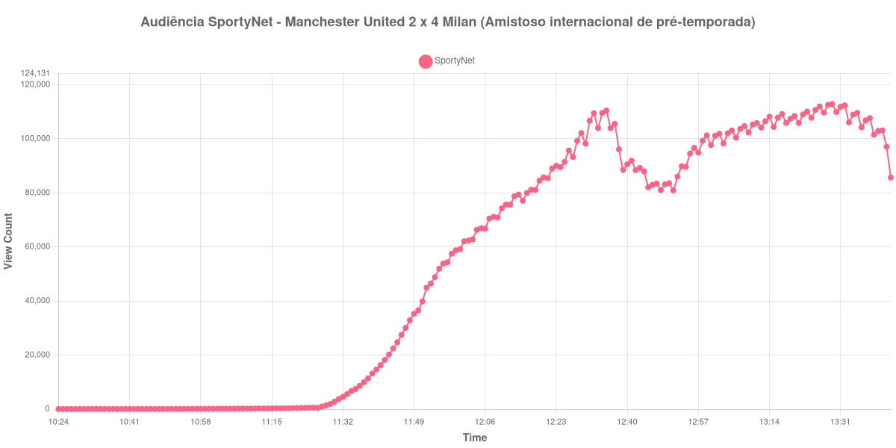

+++
date = 2026-08-20T06:36:00-03:00
draft = false
title = "Confira como foi a audiência de Manchester United X Milan na SportyNet - 15-08-2026"
author = 'Instituto Cambacica de Audiência'
summary = "Veja como foi a audiência do último amistoso de pré-temporada do Manchester United na SportyNet, numa tarde em que o Milan venceu de virada"
tags = ['YouTube', 'Analytics', 'Audiência', 'SportyNet', 'Manchester United', 'Milan', 'Amistoso']
categories = ['Audiência']
campeonatos = ['Amistosos 2026']
data_evento = 2026-08-15
+++

Neste texto, vamos informar os resultados da audiência em tempo real obtidos pela SportyNet, durante a transmissão de Manchester United X Milan, amistoso internacional de pré-temporada realizado em campo neutro, na Tarczyński Arena, em Wrocław, na Polônia, em 15/08/2026, com o Manchester United como mandante nominal. O jogo terminou em 2 a 4: Harry Maguire abriu o placar aos 2 minutos do primeiro tempo e Samuel Chukwueze empatou aos 37; no segundo tempo, Patrick Dorgu recolocou o United à frente aos 6 minutos, e o Milan virou com Alphadjo Cissé aos 12, Gonçalo Ramos aos 23 e Ruben Loftus-Cheek aos 26.

A audiência começou a ser medida às 15/08/2026 10:24:55 (Horário de Brasília), com a transmissão já no ar. Como a coleta começou menos de duas horas antes do apito inicial, o gráfico e os números abaixo partem do primeiro registro disponível. A medição terminou antes de completar duas horas após o apito final, de modo que o recorte vai até o último dado coletado. Os principais pontos da audiência são (em aparelhos conectados):

* **Início da Medição (10:24:55): 54**
* **Início da partida (11:45:55): 24.758**
* Após o gol de Harry Maguire, do Manchester United, aos 2 minutos do primeiro tempo (11:47:55): 30.106
* Após o gol de Samuel Chukwueze, do Milan, aos 37 minutos do primeiro tempo (12:22:55): 89.044
* **Final do primeiro tempo (12:33:55): 104.001**
* Durante o intervalo (12:41:55): 91.925
* **Início do segundo tempo (12:48:55): 81.028**
* Após o gol de Patrick Dorgu, do Manchester United, aos 6 minutos do segundo tempo (12:53:55): 89.869
* Após o gol de Alphadjo Cissé, do Milan, aos 12 minutos do segundo tempo (12:59:55): 101.315
* Após o gol de Gonçalo Ramos, do Milan, aos 23 minutos do segundo tempo (13:10:55): 105.292
* Após o gol de Ruben Loftus-Cheek, do Milan, aos 26 minutos do segundo tempo (13:13:55): 106.516
* **Final da partida (13:37:55): 106.832**
* **Final da Medição (13:43:55): 85.711**

O pico de audiência foi às 13:29:55, nos minutos finais do segundo tempo, com **112.846** aparelhos conectados simultâneos.

A subida é quase contínua, e o trecho mais íngreme está no primeiro tempo: do apito inicial, com 24.758 aparelhos conectados, ao registro seguinte ao gol de Chukwueze, às 12:22:55, com 89.044, a medição mais que triplicou em pouco mais de meia hora. Vale a ressalva de que a SportyNet dividia o canal com outras transmissões simultâneas naquela tarde, o que produz na curva degraus que não correspondem ao andamento da partida. Do intervalo em diante o patamar se estabiliza: 104.001 aparelhos conectados no fim do primeiro tempo, 101.315 após o gol de Cissé, 106.516 após o de Loftus-Cheek e 106.832 no apito final, com o máximo de 112.846 registrado às 13:29:55.

O intervalo custou 12% da audiência, de 104.001 aparelhos conectados para 91.925 no fundo da pausa, e a etapa seguinte devolveu o que fora perdido: dos 81.028 do recomeço aos 106.832 do apito final, o segundo tempo cresceu 32%, com os quatro gols daquela etapa aparecendo como degraus sucessivos. Em escala, a medição ocupa a 17ª posição entre as 40 deste lote e fica 22% acima da média dos outros seis amistosos internacionais que acompanhamos, de 92.554 aparelhos conectados. É o mesmo patamar de [Borussia Dortmund X Roma](/posts/2026-08-15-borussia-dortmund-x-roma-sportynet/), no mesmo canal e no mesmo dia, que chegou a 111.829 aparelhos conectados — 1% de diferença entre os dois. Os dois ficaram atrás de [Santa Cruz X Maranhão](/posts/2026-08-15-santa-cruz-x-maranhao-sportynet/), pela Série C: 157.586 aparelhos conectados, valor do qual esta medição fica 28% abaixo.

No gráfico a seguir, mostramos a evolução da audiência entre o primeiro registro da medição e o último registro coletado:

Para você verificar os metadados desta medição, você pode consultar o [repositório contendo o CSV com os dados e com os prints do minuto a minuto da medição](https://github.com/institutocambacica/audiencias_08_20_08_2026/tree/main/2026-08-15_manchester-united-x-milan_1qG7YpzvgVU).

---

*Para mais informações sobre nossa metodologia, visite nossa página [Sobre](/sobre).*
