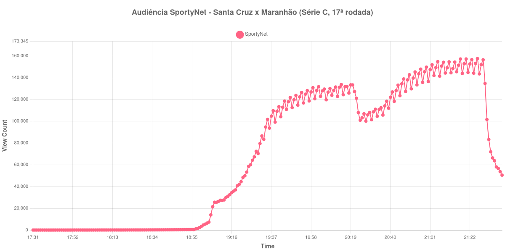

+++
date = 2026-08-20T06:44:00-03:00
draft = false
title = "Confira como foi a audiência de Santa Cruz X Maranhão na SportyNet - 15-08-2026"
author = 'Instituto Cambacica de Audiência'
summary = "Veja como foi a audiência de um jogo da Série C na SportyNet, que superou os dois amistosos europeus levados ao ar pelo mesmo canal no mesmo dia"
tags = ['YouTube', 'Analytics', 'Audiência', 'SportyNet', 'Santa Cruz', 'Maranhao', 'Serie-C']
categories = ['Audiência']
canais = ['SportyNet']
campeonatos = ['Serie C 2026']
data_evento = 2026-08-15
+++

Neste texto, vamos informar os resultados da audiência em tempo real obtidos pela SportyNet, durante a transmissão de Santa Cruz X Maranhão, partida da 17ª rodada do Campeonato Brasileiro Série C, em 15/08/2026. O canal anunciou a transmissão como exclusiva no próprio título do vídeo, e ela dividiu o sábado com dois amistosos internacionais na mesma emissora. A cronologia da partida não pôde ser confirmada em fonte independente, e por isso não há placar nem gols neste texto: o que se descreve abaixo é o que a medição registrou, minuto a minuto.

A audiência começou a ser medida às 15/08/2026 17:31:55 (Horário de Brasília), duas horas antes do início da partida. A medição terminou antes de completar duas horas após o apito final, de modo que o recorte vai até o último dado coletado. Os horários de início e de fim de cada tempo listados abaixo foram ancorados na própria curva de audiência, pelo vale que o intervalo produz, e não em fonte externa. Os principais pontos da audiência são (em aparelhos conectados):

* **Início da Medição (17:31:55): 104**
* **Início da partida (19:31:55): 79.563**
* **Final do primeiro tempo (20:18:55): 125.896**
* Durante o intervalo (20:26:55): 106.889
* **Início do segundo tempo (20:33:55): 104.579**
* **Final da partida (21:23:55): 156.606**
* **Final da Medição (21:39:55): 50.529**

O pico de audiência foi às 21:26:55, três minutos depois do apito final, com **157.586** aparelhos conectados simultâneos.

Em número de aparelhos conectados, esta é a maior das quatro transmissões da 17ª rodada da Série C que acompanhamos, e a 12ª entre as 40 do lote inteiro. As outras três da mesma rodada tiveram pico médio de 63.054 aparelhos conectados, e os 157.586 daqui ficam 150% acima dessa média. A comparação mais direta, porém, é com o que a própria SportyNet levou ao ar no mesmo dia: [Manchester United X Milan](/posts/2026-08-15-manchester-united-x-milan-sportynet/) chegou a 112.846 aparelhos conectados e [Borussia Dortmund X Roma](/posts/2026-08-15-borussia-dortmund-x-roma-sportynet/) a 111.829, e esta partida da terceira divisão brasileira ficou 40% acima do primeiro e 41% acima do segundo. É um resultado que contraria a hierarquia usual entre competição nacional de acesso e amistoso europeu de pré-temporada.

A curva também é das mais estáveis do conjunto. O intervalo custou 15% da audiência, de 125.896 aparelhos conectados no fim do primeiro tempo para 106.889 no fundo da pausa — a menor perda proporcional entre as quatro medições da Série C deste lote. Do recomeço ao apito final a subida é contínua, de 104.579 a 156.606 aparelhos conectados, um crescimento de 50%, e o máximo só chega depois do fim do jogo. A dispersão, quando começa, é rápida: dezesseis minutos após o apito final, no último dado coletado, restavam 50.529 aparelhos conectados.

No gráfico a seguir, mostramos a evolução da audiência entre duas horas antes do início da partida e o último registro coletado:

Para você verificar os metadados desta medição, você pode consultar o [repositório contendo o CSV com os dados e com os prints do minuto a minuto da medição](https://github.com/institutocambacica/audiencias_08_20_08_2026/tree/main/2026-08-15_santa-cruz-x-maranhao_kb0svA-ej1c).

---

*Para mais informações sobre nossa metodologia, visite nossa página [Sobre](/sobre).*
