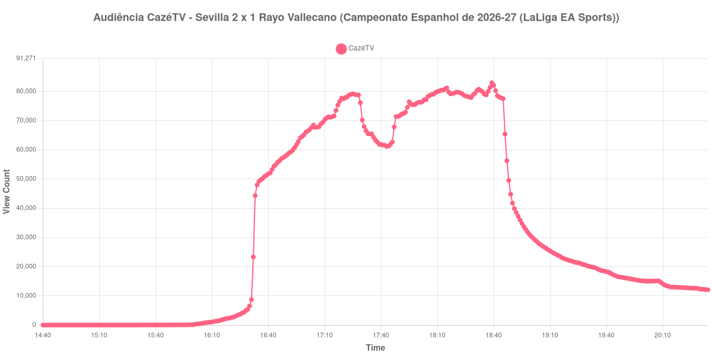

+++
date = 2026-08-20T06:48:00-03:00
draft = false
title = "Confira como foi a audiência de Sevilla X Rayo Vallecano na CazéTV - 15-08-2026"
author = 'Instituto Cambacica de Audiência'
summary = "Veja como foi a audiência da estreia do Sevilla na temporada espanhola na CazéTV, na única medição deste lote que não precisou de nenhum corte de janela"
tags = ['YouTube', 'Analytics', 'Audiência', 'CazeTV', 'Sevilla', 'Rayo Vallecano', 'LaLiga']
categories = ['Audiência']
+++

Neste texto, vamos informar os resultados da audiência em tempo real obtidos pela CazéTV, durante a transmissão de Sevilla X Rayo Vallecano, partida da 1ª rodada do Campeonato Espanhol de 2026-27 (LaLiga EA Sports), realizada no Ramón Sánchez-Pizjuán, em Sevilha, em 15/08/2026. O Sevilla venceu por 2 a 1, de virada. Álvaro García abriu o placar para o Rayo Vallecano logo aos 4 minutos; Jon Guridi empatou de pênalti aos 52; e Peque Fernández, também de pênalti, marcou o gol da vitória aos 97, com a equipe da casa já reduzida a dez jogadores desde a expulsão de Kike Salas, aos 88 minutos.

A audiência começou a ser medida às 15/08/2026 14:40:55 (Horário de Brasília), duas horas antes do apito inicial. O jogo estava marcado para as 16h30 de Brasília, mas atrasou cerca de dez minutos: a LaLiga estreava naquela rodada a bola com chip, o dispositivo falhou e o árbitro só liberou a saída depois de ficar decidido que a partida seria jogada sem ele, de modo que o apito saiu às 16:40 — é esse o horário que adotamos como início. Esta é também a única das 40 medições deste lote cuja janela não precisou de nenhum corte: ela cobre as duas horas anteriores ao apito inicial e as duas horas posteriores ao apito final, sem descarte de registros. Os principais pontos da audiência são (em aparelhos conectados):

* **Início da Medição (14:40:55): 32**
* **Início da partida (16:40:55): 51.806**
* Após o gol de Álvaro García, do Rayo Vallecano, aos 4 minutos do primeiro tempo (16:44:55): 54.960
* **Final do primeiro tempo (17:26:55): 78.987**
* Durante o intervalo (17:34:55): 65.472
* **Início do segundo tempo (17:41:55): 61.627**
* Após o gol de pênalti de Jon Guridi, do Sevilla, aos 7 minutos do segundo tempo (17:49:55): 71.409
* Após a expulsão de Kike Salas, do Sevilla, aos 43 minutos do segundo tempo (18:25:55): 78.416
* Após o gol de pênalti de Peque Fernández, do Sevilla, aos 52 minutos do segundo tempo (18:34:55): 79.900
* **Final da Medição (20:34:55): 12.121**

O pico de audiência foi às 18:39:55, já no pós-jogo, com **82.973** aparelhos conectados simultâneos.

A curva desta partida cresceu em todas as suas fases, com a única exceção do intervalo. O primeiro tempo levou o contador de 51.806 aparelhos conectados no apito inicial a 78.987 no fim da etapa; o intervalo derrubou 17%, de 78.987 para 65.472; e o segundo tempo refez o caminho passo a passo, de 61.627 no recomeço para 71.409 depois do pênalti de Jon Guridi, 78.416 depois da expulsão de Kike Salas e 79.900 depois do pênalti que definiu a virada, já nos acréscimos. O máximo, porém, não caiu dentro da partida: os 82.973 aparelhos conectados foram registrados depois do apito final, com a transmissão ainda no ar, acima dos 79.900 do último gol.

Vale registrar o que esta janela tem de particular. Sem corte no início, sem corte no fim e sem cauda descartada, ela acompanha a transmissão desde os 32 aparelhos conectados das 14:40:55 até os 12.121 das 20:34:55, duas horas depois do fim do jogo — é a única do lote em que isso foi possível. Entre as duas partidas espanholas que a CazéTV exibiu neste sábado, esta foi a maior: [Alavés X Getafe](/posts/2026-08-15-alaves-x-getafe-cazetv/), mais cedo, teve pico de 70.614 aparelhos conectados, e os 82.973 daqui ficam 18% acima desse valor. Ainda assim, a medição ficou 20% abaixo da média de picos das outras cinco transmissões da rodada, 103.427 aparelhos conectados, e aparece na 20ª posição entre as 40 medições do lote.

No gráfico a seguir, mostramos a evolução da audiência entre duas horas antes do início da partida e duas horas após o seu encerramento:

Para você verificar os metadados desta medição, você pode consultar o [repositório contendo o CSV com os dados e com os prints do minuto a minuto da medição](https://github.com/institutocambacica/audiencias_08_20_08_2026/tree/main/2026-08-15_sevilla-x-rayo-vallecano_-Mh2JsSSXh4).

---

*Para mais informações sobre nossa metodologia, visite nossa página [Sobre](/sobre).*
