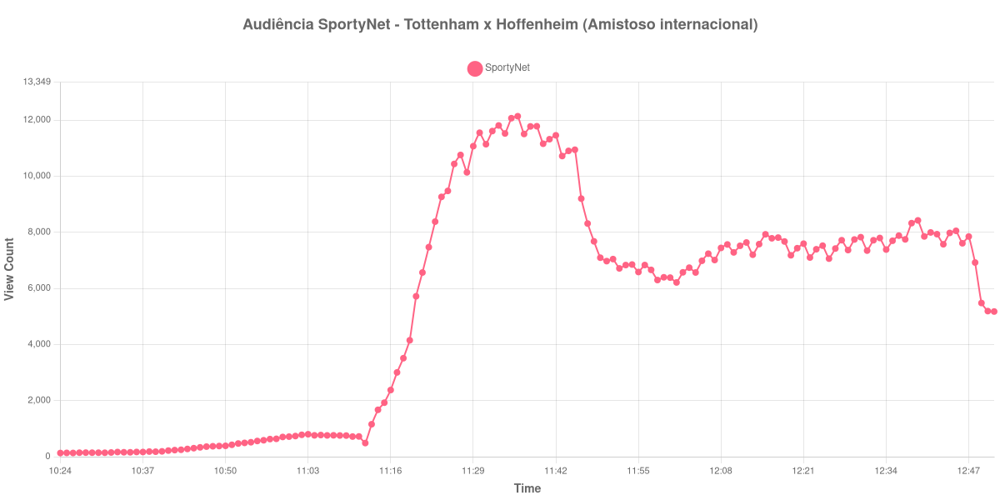

+++
date = 2026-08-20T06:52:00-03:00
draft = false
title = "Confira como foi a audiência de Tottenham X Hoffenheim na SportyNet - 15-08-2026"
author = 'Instituto Cambacica de Audiência'
summary = "Veja como foi a audiência do amistoso entre Tottenham e Hoffenheim na SportyNet, numa medição em que o ponto mais alto veio antes do intervalo"
tags = ['YouTube', 'Analytics', 'Audiência', 'SportyNet', 'Tottenham', 'Hoffenheim', 'Amistoso']
categories = ['Audiência']
campeonatos = ['Amistosos 2026']
data_evento = 2026-08-15
+++

Neste texto, vamos informar os resultados da audiência em tempo real obtidos pela SportyNet, durante a transmissão de Tottenham X Hoffenheim, amistoso internacional realizado em 15/08/2026. A partida entrou numa grade cheia: no mesmo dia, o canal transmitiu também jogos das Séries B e C do Brasileiro e outros amistosos entre clubes europeus, todos igualmente medidos por nós. Como não localizamos fonte independente que descrevesse o jogo, este texto não traz placar nem gols, e os horários de cada tempo vieram do próprio comportamento da audiência.

A audiência começou a ser medida às 15/08/2026 10:24:55 (Horário de Brasília), com a transmissão já no ar. Como a coleta começou menos de duas horas antes do apito inicial, o gráfico e os números abaixo partem do primeiro registro disponível. A medição terminou antes de completar duas horas após o apito final, de modo que o recorte vai até o último dado coletado. Os horários de início e de fim de cada tempo listados abaixo foram ancorados na própria curva de audiência, pelo vale que o intervalo produz, e não em fonte externa. Os principais pontos da audiência são (em aparelhos conectados):

* **Início da Medição (10:24:55): 130**
* **Início da partida (10:55:55): 559**
* **Final do primeiro tempo (11:42:55): 11.454**
* Durante o intervalo (11:50:55): 6.970
* **Início do segundo tempo (11:57:55): 6.658**
* **Final da partida (12:47:55): 7.847**
* **Final da Medição (12:51:55): 5.174**

O pico de audiência foi às 11:36:55, ainda no primeiro tempo, com **12.135** aparelhos conectados simultâneos.

O intervalo é o acidente mais visível desta série. Entre o último registro da primeira etapa, 11.454 aparelhos conectados, e o fundo da pausa, 6.970, a transmissão perdeu 39% do que tinha, e foi esse degrau que serviu de referência para localizar o fim do primeiro tempo. A retomada não repôs o prejuízo: dos 6.658 aparelhos do recomeço aos 7.847 do apito final, o segundo tempo cresceu 18%, e o encerramento do jogo encontrou menos gente conectada do que o fim da etapa inicial. O máximo da medição, 12.135 aparelhos conectados, ficou às 11:36:55, ainda antes da pausa, e não voltou a ser alcançado.

O tamanho desta transmissão fica claro quando a colocamos ao lado do restante da grade: ela é a 30ª das 40 medições do lote e a menor de tudo o que registramos na SportyNet naquele dia. Os 12.135 aparelhos conectados do pico ficam 92% abaixo dos 157.586 de [Santa Cruz X Maranhão](/posts/2026-08-15-santa-cruz-x-maranhao-sportynet/) e 89% abaixo dos 112.846 de [Manchester United X Milan](/posts/2026-08-15-manchester-united-x-milan-sportynet/), este último também um amistoso entre clubes europeus, exibido na mesma grade do mesmo canal. A média de pico dos seis outros amistosos internacionais do lote é de 109.339 aparelhos conectados, e esta medição fica 89% abaixo dela.

No gráfico a seguir, mostramos a evolução da audiência entre o primeiro registro da medição e o último registro coletado:

Para você verificar os metadados desta medição, você pode consultar o [repositório contendo o CSV com os dados e com os prints do minuto a minuto da medição](https://github.com/institutocambacica/audiencias_08_20_08_2026/tree/main/2026-08-15_tottenham-x-hoffenheim_2F5TUuF20Ts).

---

*Para mais informações sobre nossa metodologia, visite nossa página [Sobre](/sobre).*
