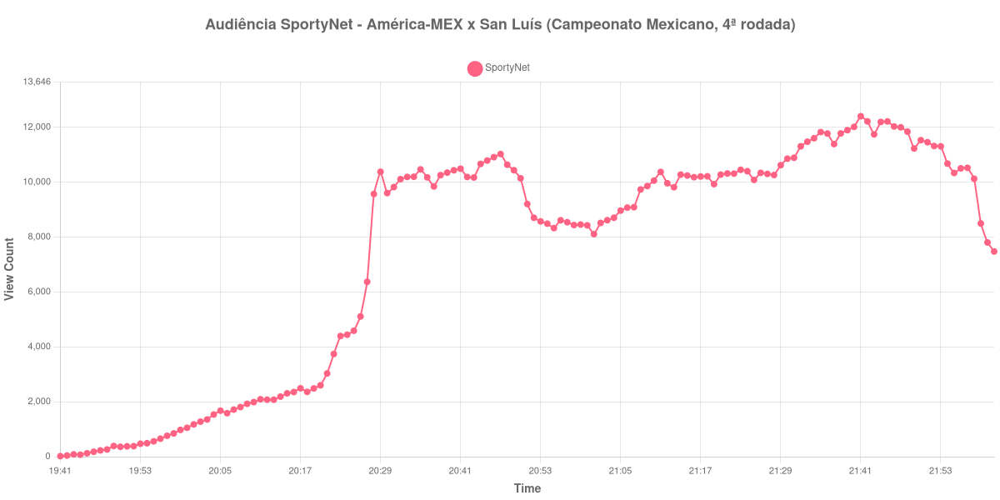

+++
date = 2026-08-20T07:40:00-03:00
draft = false
title = "Confira como foi a audiência de América-MEX X San Luís na SportyNet - 16-08-2026"
author = 'Instituto Cambacica de Audiência'
summary = "Veja como foi a audiência do Campeonato Mexicano na SportyNet, numa curva que só parou de subir no apito final"
tags = ['YouTube', 'Analytics', 'Audiência', 'SportyNet', 'America-MEX', 'San Luis', 'Campeonato Mexicano']
categories = ['Audiência']
+++

Neste texto, vamos informar os resultados da audiência em tempo real obtidos pela SportyNet, durante a transmissão de América-MEX X San Luís, partida da 4ª rodada do Campeonato Mexicano, em 16/08/2026. É a única medição de futebol mexicano deste lote, e todos os horários citados abaixo são de Brasília. Não localizamos fonte independente com o relato da partida, de modo que este texto não traz placar nem gols; o que descrevemos é o desenho da audiência e os horários de cada tempo, marcados a partir da própria série coletada.

A audiência começou a ser medida às 16/08/2026 19:41:55 (Horário de Brasília), com a transmissão já no ar. Como a coleta começou menos de duas horas antes do apito inicial, o gráfico e os números abaixo partem do primeiro registro disponível. A medição terminou antes de completar duas horas após o apito final, de modo que o recorte vai até o último dado coletado. Os horários de início e de fim de cada tempo listados abaixo foram ancorados na própria curva de audiência, pelo vale que o intervalo produz, e não em fonte externa. Os principais pontos da audiência são (em aparelhos conectados):

* **Início da Medição (19:41:55): 19**
* **Início da partida (19:59:55): 975**
* **Final do primeiro tempo (20:46:55): 10.913**
* Durante o intervalo (20:54:55): 8.491
* **Início do segundo tempo (21:01:55): 8.109**
* **Final da partida (21:51:55): 11.457**
* **Final da Medição (22:01:55): 7.477**

O pico de audiência foi às 21:41:55, nos minutos finais da partida, com **12.405** aparelhos conectados simultâneos.

Esta curva tem o desenho de um jogo que segurou quem estava assistindo. A pausa entre os tempos levou 22% da audiência, dos 10.913 aparelhos conectados registrados ao fim da etapa inicial para 8.491 no fundo do intervalo — uma perda contida perto do que outras transmissões deste lote sofreram na mesma passagem. E o segundo tempo não apenas repôs o que havia sumido: dos 8.109 aparelhos do recomeço aos 11.457 do apito final, foram 41% de crescimento. O máximo da medição, às 21:41:55, caiu dentro dessa subida, perto do fim do jogo, e não antes da pausa.

A medição ocupa a 29ª posição entre as 40 do lote. A comparação com o que a própria SportyNet pôs no ar no mesmo dia dá a dimensão do alcance: os 12.405 aparelhos conectados do pico ficam 95% abaixo dos 229.060 de [Real Madrid X Schalke 04](/posts/2026-08-16-real-madrid-x-schalke-04-sportynet/) e 90% abaixo dos 118.349 de [Liverpool X Como](/posts/2026-08-16-liverpool-x-como-sportynet/), ambos amistosos entre clubes europeus levados ao ar pelo mesmo canal no mesmo dia. Depois do apito final, a audiência recuou dos 11.457 aparelhos conectados para os 7.477 do último registro, às 22:01:55 — o recuo de pós-jogo que a maior parte das nossas medições apresenta.

No gráfico a seguir, mostramos a evolução da audiência entre o primeiro registro da medição e o último registro coletado:

Para você verificar os metadados desta medição, você pode consultar o [repositório contendo o CSV com os dados e com os prints do minuto a minuto da medição](https://github.com/institutocambacica/audiencias_08_20_08_2026/tree/main/2026-08-16_america-mex-x-san-luis_U0mQPttBgI8).

---

*Para mais informações sobre nossa metodologia, visite nossa página [Sobre](/sobre).*
