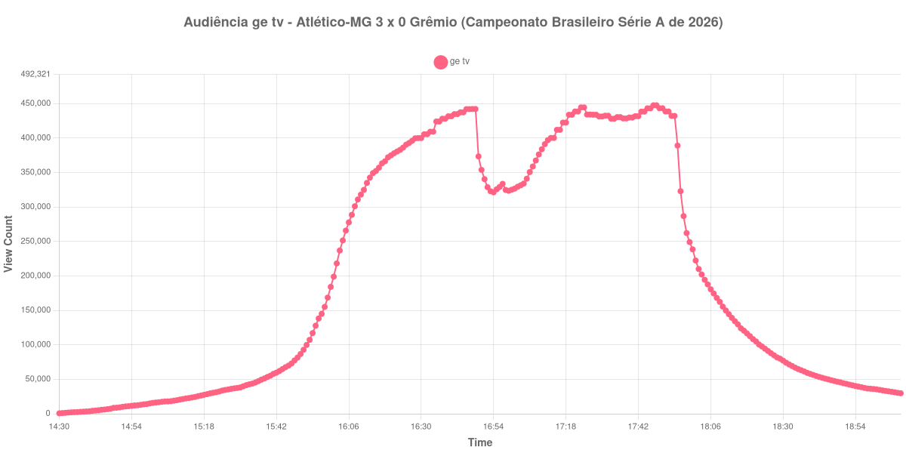

+++
date = 2026-08-20T07:20:00-03:00
draft = false
title = "Confira como foi a audiência de Atlético-MG X Grêmio na ge tv - 16-08-2026"
author = 'Instituto Cambacica de Audiência'
summary = "Veja como foi a audiência da vitória do Atlético-MG sobre o Grêmio na ge tv, numa curva que só atingiu o máximo nos minutos finais do jogo"
tags = ['YouTube', 'Analytics', 'Audiência', 'GETV', 'Atletico-MG', 'Gremio', 'Brasileirao']
categories = ['Audiência']
+++

Neste texto, vamos informar os resultados da audiência em tempo real obtidos pela ge tv, durante a transmissão de Atlético-MG X Grêmio, pela 23ª rodada do Campeonato Brasileiro Série A de 2026, na Arena MRV, em Belo Horizonte, em 16/08/2026. O Atlético-MG venceu por 3 a 0. Vitor Hugo abriu o placar aos 19 minutos do primeiro tempo, de cabeça, em escanteio cobrado por Igor Gomes, e Tomás Cuello marcou duas vezes na etapa final, aos 17 e aos 21 minutos. Não houve cartões vermelhos. O jogo chegou a ser divulgado inicialmente para o sábado, antes de a tabela ser ajustada para o domingo.

A audiência começou a ser medida às 16/08/2026 14:30:55 (Horário de Brasília), antes do apito inicial. Como a coleta começou menos de duas horas antes do apito inicial, o gráfico e os números abaixo partem do primeiro registro disponível. A medição terminou antes de completar duas horas após o apito final, de modo que o recorte vai até o último dado coletado. Os principais pontos da audiência são (em aparelhos conectados):

* **Início da Medição (14:30:55): 619**
* **Início da partida (16:00:55): 184.088**
* Após o gol de Vitor Hugo, do Atlético-MG, aos 19 minutos do primeiro tempo (16:19:55): 372.088
* **Final do primeiro tempo (16:46:55): 442.020**
* Durante o intervalo (16:54:55): 321.272
* **Início do segundo tempo (17:01:55): 326.689**
* Após o gol de Tomás Cuello, do Atlético-MG, aos 17 minutos do segundo tempo (17:19:55): 433.826
* Após o gol de Tomás Cuello, do Atlético-MG, aos 21 minutos do segundo tempo (17:23:55): 444.515
* **Final da partida (17:52:55): 438.604**
* **Final da Medição (19:09:55): 29.755**

O pico de audiência foi às 17:47:55, nos minutos finais da partida, com **447.564** aparelhos conectados simultâneos.

A audiência desta transmissão cresceu em etapas bem marcadas. Da abertura da medição, 619 aparelhos conectados às 14:30:55, até o apito inicial, 184.088 às 16:00:55, a curva sobe de forma contínua. O gol de Vitor Hugo dobra esse patamar: 372.088 aparelhos conectados às 16:19:55. O intervalo custou 27%, de 442.020 para 321.272 aparelhos conectados, e o segundo tempo devolveu boa parte da perda, com alta de 34% entre os 326.689 do recomeço e os 438.604 do apito final. Os dois gols de Tomás Cuello aparecem como degraus curtos, 433.826 e 444.515, e o máximo da série veio pouco depois deles, ainda com a bola rolando — o apito final já pegou a curva um pouco abaixo do topo.

O número coloca a transmissão em sexto lugar entre os 40 picos que medimos no período. A distância para a outra partida da 23ª rodada do Brasileirão é grande: [Mirassol X Flamengo](/posts/2026-08-16-mirassol-x-flamengo-cazetv/), na CazéTV, no mesmo domingo, chegou a 2.307.249 aparelhos conectados, e os 447.564 daqui ficam 81% abaixo. Na própria ge tv, o valor também é bem menor que o de jogos de mata-mata do mesmo período, como [Vitória X Athletico-PR](/posts/2026-08-06-vitoria-x-athletico-pr-getv/), com 873.033 aparelhos conectados em 6 de agosto. Depois do apito final a curva se esvaziou depressa: meia hora depois restavam 100.514 aparelhos conectados, 23% dos 438.604 do fim do jogo, e uma hora depois, 42.251, ou 10%.

No gráfico a seguir, mostramos a evolução da audiência entre o primeiro registro da medição e o último registro coletado:

Para você verificar os metadados desta medição, você pode consultar o [repositório contendo o CSV com os dados e com os prints do minuto a minuto da medição](https://github.com/institutocambacica/audiencias_08_20_08_2026/tree/main/2026-08-16_atletico-mg-x-gremio_89tPGaf7W4s).

---

*Para mais informações sobre nossa metodologia, visite nossa página [Sobre](/sobre).*
