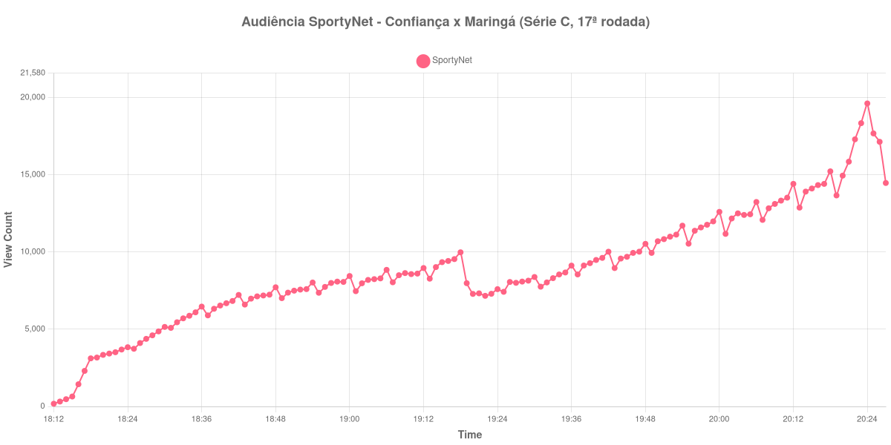

+++
date = 2026-08-20T07:36:00-03:00
draft = false
title = "Confira como foi a audiência de Confiança X Maringá na SportyNet - 16-08-2026"
author = 'Instituto Cambacica de Audiência'
summary = "Veja como foi a audiência de um jogo da Série C na SportyNet, a menor das quatro medições que fizemos na mesma rodada"
tags = ['YouTube', 'Analytics', 'Audiência', 'SportyNet', 'Confianca', 'Maringa', 'Serie-C']
categories = ['Audiência']
campeonatos = ['Serie C 2026']
data_evento = 2026-08-16
+++

Neste texto, vamos informar os resultados da audiência em tempo real obtidos pela SportyNet, durante a transmissão de Confiança X Maringá, partida da 17ª rodada do Campeonato Brasileiro Série C, em 16/08/2026. Entre as quatro medições que fizemos nessa rodada, é a mais curta e a de menor porte: a coleta durou pouco mais de duas horas, entrou com a transmissão já no ar e foi interrompida seis minutos depois do apito final. Nenhuma fonte independente que consultamos registrou a cronologia da partida, de modo que o relato se restringe aos pontos que a medição sustenta, sem placar e sem gols.

A audiência começou a ser medida às 16/08/2026 18:12:55 (Horário de Brasília), com a transmissão já iniciada. Como a coleta começou menos de duas horas antes do apito inicial, o gráfico e os números abaixo partem do primeiro registro disponível. A medição terminou antes de completar duas horas após o apito final, de modo que o recorte vai até o último dado coletado. Os horários de início e de fim de cada tempo listados abaixo foram ancorados na própria curva de audiência, pelo vale que o intervalo produz, e não em fonte externa. Os principais pontos da audiência são (em aparelhos conectados):

* **Início da Medição (18:12:55): 176**
* **Início da partida (18:29:55): 4.859**
* **Final do primeiro tempo (19:16:55): 9.419**
* Durante o intervalo (19:24:55): 7.594
* **Início do segundo tempo (19:31:55): 7.754**
* **Final da partida (20:21:55): 15.847**
* **Final da Medição (20:27:55): 14.468**

O pico de audiência foi às 20:24:55, já no pós-jogo, com **19.618** aparelhos conectados simultâneos.

A comparação mais reveladora aqui é interna à própria rodada. As quatro transmissões da 17ª rodada da Série C saíram todas pelo mesmo canal, em três dias consecutivos, e mesmo assim se espalham por uma faixa larguíssima de audiência: o pico médio das outras três foi de 109.043 aparelhos conectados, e os 19.618 desta partida ficam 82% abaixo desse valor. No lote de 40 medições, o jogo aparece na 28ª posição, enquanto [Santa Cruz X Maranhão](/posts/2026-08-15-santa-cruz-x-maranhao-sportynet/), da mesma rodada e da véspera, aparece na 12ª. Divisão, competição, rodada e canal iguais, portanto, não bastam para prever o tamanho de uma transmissão.

No mesmo domingo, a SportyNet exibiu duas partidas de porte muito maior: [Real Madrid X Schalke 04](/posts/2026-08-16-real-madrid-x-schalke-04-sportynet/), com 229.060 aparelhos conectados, e [Liverpool X Como](/posts/2026-08-16-liverpool-x-como-sportynet/), com 118.349 — esta medição ficou 91% abaixo da primeira e 83% abaixo da segunda. Quanto ao formato da curva, ela é regular: o intervalo custou 19% da audiência, de 9.419 aparelhos conectados no fim do primeiro tempo para 7.594 no fundo da pausa, e o segundo tempo dobrou o número de aparelhos, de 7.754 no recomeço a 15.847 no apito final, um crescimento de 104%. O máximo veio três minutos depois do fim do jogo, e a coleta se encerrou logo em seguida, em 14.468 aparelhos conectados, cedo demais para acompanhar a dispersão do pós-jogo.

No gráfico a seguir, mostramos a evolução da audiência entre o primeiro registro da medição e o último registro coletado:

Para você verificar os metadados desta medição, você pode consultar o [repositório contendo o CSV com os dados e com os prints do minuto a minuto da medição](https://github.com/institutocambacica/audiencias_08_20_08_2026/tree/main/2026-08-16_confianca-x-maringa_deDPvTpTQBM).

---

*Para mais informações sobre nossa metodologia, visite nossa página [Sobre](/sobre).*
